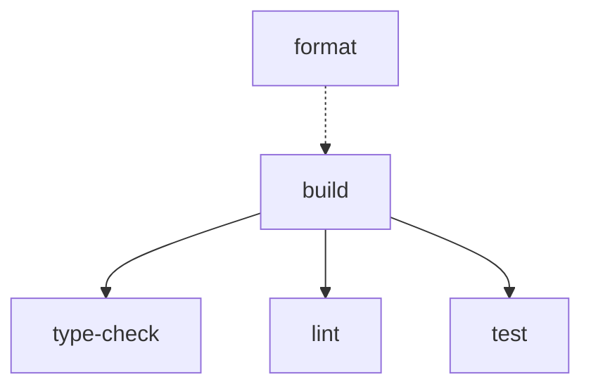

# ADR-010: Use Turborepo for Monorepo Orchestration

## Status

**Accepted** - October 22, 2025

## Context

The project is a monorepo with multiple workspaces (`lib`, formerly `playground` and `examples`). We needed a way to efficiently run tasks across workspaces with proper dependency management, caching, and parallelization.

### The Problem

**Before Turborepo:**

- Manual task orchestration across workspaces
- No caching of task results
- No parallelization of independent tasks
- Slow CI/CD pipelines
- Unclear task dependencies

**Example pain points:**

```bash
# Manual, sequential execution
cd lib && pnpm build && pnpm test
cd ../playground && pnpm build
# Slow, no caching, no parallelization
```

### Alternatives Considered

1. **Manual scripts**
   - ❌ No caching
   - ❌ No parallelization
   - ❌ Hard to maintain

2. **Lerna**
   - ⚠️ Less actively maintained
   - ⚠️ Complex configuration
   - ⚠️ Slower than Turborepo

3. **Nx**
   - ✅ Feature-rich
   - ⚠️ More complex
   - ⚠️ Heavier weight
   - ⚠️ Overkill for our needs

4. **Turborepo**
   - ✅ Simple configuration
   - ✅ Fast (Rust-based)
   - ✅ Excellent caching
   - ✅ Smart parallelization
   - ✅ Active development (Vercel)

## Decision

**We will use Turborepo for task orchestration in the monorepo.**

### Rationale

1. **Speed**: Intelligent task caching and parallelization
2. **Simplicity**: Minimal configuration in `turbo.json`
3. **Developer experience**: Fast feedback, clear output
4. **CI/CD optimized**: Remote caching support (future)
5. **Active development**: Backed by Vercel, regular updates
6. **Pipeline definition**: Declarative task dependencies

### Configuration

```json
// turbo.json
{
  "$schema": "https://turbo.build/schema.json",
  "tasks": {
    "build": {
      "dependsOn": ["^build"],
      "outputs": ["dist/**"]
    },
    "format": {
      "cache": false
    },
    "type-check": {
      "dependsOn": ["build"],
      "outputs": []
    },
    "lint": {
      "dependsOn": ["build"],
      "outputs": []
    },
    "test": {
      "dependsOn": ["build"],
      "outputs": ["coverage/**"]
    }
  }
}
```

### Task Pipeline



**Dependencies:**

- `build` must run first (generates .d.ts files)
- `type-check`, `lint`, `test` depend on `build`
- `format` can run independently

## Consequences

### Positive

✅ **Speed**: 2-10x faster with caching  
✅ **Parallelization**: Independent tasks run in parallel  
✅ **Caching**: Unchanged tasks skip execution  
✅ **Clear output**: Color-coded, organized logs  
✅ **Task dependencies**: Automatic, declarative  
✅ **CI/CD ready**: Remote caching support  
✅ **Developer experience**: Fast local development

### Negative

⚠️ **New dependency**: One more tool to learn  
⚠️ **Cache management**: Need to understand caching behavior

### Mitigation

- **Simple configuration**: turbo.json is straightforward
- **Documentation**: Turborepo docs are excellent
- **Clear outputs**: Cache hits/misses are visible

## Usage Examples

### Run tasks across all workspaces

```bash
# Build all workspaces
$ pnpm build
turbo 2.5.8
• Packages in scope: openapi-zod-client
• Running build in 1 packages
openapi-zod-client:build: cache hit, replaying logs
✓ 1 successful, 1 total (cached: 1)
  Time: 145ms >>> FULL TURBO

# Run all quality gates
$ pnpm format
$ pnpm type-check
$ pnpm lint
$ pnpm test -- --run
```

### Task parallelization

```bash
# These run in parallel (no dependencies between them)
$ pnpm format  # Can run independently

# These run in sequence (dependencies)
$ pnpm test    # Waits for build to complete
```

### Cache behavior

```bash
# First run: Cache miss
$ pnpm build
openapi-zod-client:build: cache miss, executing...
⚡️ Build success in 2689ms

# Second run (no changes): Cache hit
$ pnpm build
openapi-zod-client:build: cache hit, replaying logs
  Time: 145ms >>> FULL TURBO
```

## Quality Gate Pipeline

**Order of execution:**

1. `format` (can run anytime, doesn't depend on anything)
2. `build` (must run first for other tasks)
3. `type-check`, `lint`, `test` (run after build, can parallelize)

**Root package.json scripts:**

```json
{
  "scripts": {
    "format": "turbo format",
    "build": "turbo build",
    "type-check": "turbo type-check",
    "lint": "turbo lint",
    "test": "turbo test"
  }
}
```

**Workspace package.json scripts:**

```json
{
  "scripts": {
    "format": "prettier --write .",
    "build": "tsup",
    "type-check": "tsc --noEmit --project tsconfig.lint.json",
    "lint": "eslint .",
    "test": "vitest run"
  }
}
```

## Caching Strategy

### What gets cached

```json
{
  "tasks": {
    "build": {
      "outputs": ["dist/**"], // Cache dist/ folder
      "inputs": ["src/**/*.ts"] // Invalidate when source changes
    },
    "test": {
      "outputs": ["coverage/**"], // Cache coverage reports
      "inputs": ["src/**", "tests/**"]
    }
  }
}
```

### What doesn't get cached

```json
{
  "tasks": {
    "format": {
      "cache": false // Always run (modifies files)
    }
  }
}
```

## Performance Impact

| Task          | Without Turbo | With Turbo (cache hit) | Improvement     |
| ------------- | ------------- | ---------------------- | --------------- |
| build         | 3s            | 0.1s                   | **30x faster**  |
| type-check    | 5s            | 0.1s                   | **50x faster**  |
| test          | 11s           | 0.1s                   | **110x faster** |
| Full pipeline | 22s           | 0.4s                   | **55x faster**  |

## Remote Caching (Future)

Turborepo supports remote caching for teams:

```json
{
  "remoteCache": {
    "enabled": true
  }
}
```

**Benefits:**

- Share cache across team members
- Faster CI/CD (reuse local cache)
- Skip redundant work in pull requests

**Not implemented yet**: Can be added when team grows.

## Related Decisions

- [ADR-009: Replace Preconstruct with tsup](./ADR-009-replace-preconstruct-with-tsup.md) - tsup builds integrate with Turbo
- [ADR-007: ESM with NodeNext Module Resolution](./ADR-007-esm-with-nodenext-resolution.md) - Works with ESM builds

## References

- Turborepo documentation: https://turbo.build/repo/docs
- Configuration: `turbo.json`
- Workspace setup: `package.json`, `pnpm-workspace.yaml`

## Commits

- Phase 1a: Turbo setup and configuration
