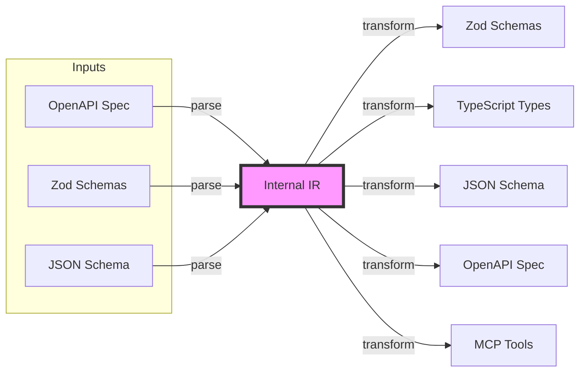
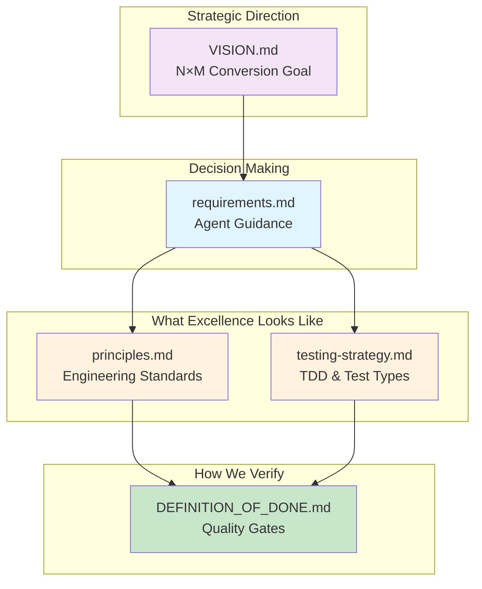

# Coding Standards & Engineering Excellence

This file MUST NOT be edited without prior and explicit user approval.

**Date:** October 2025 (Updated: 2026-03-22)  
**Project:** @engraph/castr  
**Purpose:** Define non-negotiable quality standards, engineering excellence principles, and comprehensive type discipline

No fallbacks, no escape hatches, no compromises, no "pragmatic" solutions, no "good enough" solutions; only architecturally excellent, long-term sustainable solutions.

All code, processes, pipelines, docs, and checks must be strict and complete everywhere, all the time. Fail fast.

---

## 🎯 Core Philosophy: Engineering Excellence Over Speed

> **Mission Statement:** We prioritize long-term stability, maintainability, and type safety over short-term convenience. Excellence is not negotiable. Fail fast, fail hard, and be strict and complete everywhere, all the time.

Types are our friend - they reveal architectural problems that need solving, not nuisances to bypass with escape hatches.

### Strict And Complete Everywhere, All The Time

- Strictness must hold at every boundary, not just most of them.
- Completeness means a claimed supported surface is implemented, validated, documented, and proven end to end.
- Partial implementation, partial validation, partial docs, or partial tests do not count as done; they are drift that must be closed or stated honestly.

**Key Principles:**

1. **Maximize Signal** - The intent of all our tooling (types, linters, dependency-cruisers, madge) is to maximize the signal that reveals architectural truths. Hiding problems by loosening configurations is actively harmful to the repo's health and developer experience (both human and AI).
2. **Types Are Our Friend** - Type errors show us where we've made mistakes, lost type information, or have architectural problems
3. **Clean Breaks Over Hacks** - No compatibility layers, no temporary solutions, no "TODO: fix later"
4. **Fix Root Causes, Not Symptoms** - If types don't match, fix the architecture, don't add type assertions
5. **Library Types First** - Defer to our canonical re-export module (`shared/openapi-types.js`) or other domain expert libraries before creating custom types
6. **Test-Driven Development** - Write failing tests first, always, no exceptions
7. **Comprehensive Documentation** - TSDoc for all public APIs enables professional self-service adoption
8. **Quality Gates Are Absolute** - All gates defined in `.agent/directives/DEFINITION_OF_DONE.md` must pass GREEN, no exceptions, no workarounds

**The Type Discipline:**

During Phase 3, we discovered critical type system violations (7 of 8 quality gates RED). The right response was to **stop all forward progress** and restore type discipline. This taught us:

- Escape hatches (`as`, `any`, `!`) destroy type information permanently
- Compatibility layers become permanent technical debt
- Type widening loses information that can never be recovered
- The type system reveals problems we need to fix, not hide

**This document is THE authority for all code in this project. Deviations require explicit justification and must be temporary with a concrete plan for removal.**

---

## 🎯 Cardinal Rule of This Repository

**The internal representation (IR) is the single source of truth for all processed data.**

This repository follows idiomatic Information Retrieval (IR) architecture. After parsing, the input document is **conceptually discarded**—only the Caster Model matters. See `VISION.md` for the strategic vision.

This includes the constraint that NO CONTENT LOSS is ever acceptable. ALL of our transforms to and from the IR must preserve every aspect of the input document. The format can change, the content cannot.



**Key invariants:**

- **Input is ingestion** - Once parsed, the original format is irrelevant
- **IR is truth** - All operations work on IR, never on raw input
- **Output is rendering** - Transforms read IR, never consult the original document

**If an output is wrong, fix the Caster Model or the transform — never treat the output as authoritative.**

---

## 🔀 Input-Output Pair Compatibility Model

> **GOVERNING PRINCIPLE**: Feature support is defined by **input-output pairs**, and the constraints are primarily set by what the **output format** can represent. The IR is a format-independent superset.

### The Model

Castr transforms data between format pairs: `Input Format → IR → Output Format`. Each pair has its own compatibility surface:

```text
OpenAPI → Zod       (constrained by what Zod can express)
OpenAPI → JSON Schema   (constrained by what JSON Schema can express)
JSON Schema → OpenAPI   (constrained by what OpenAPI can express)
Zod → TypeScript    (constrained by what TypeScript can express)
```

### The Four Rules

1. **ALL features valid in Input Format X MUST be parseable into the IR.** The input constraint is simply "valid for that format." If an input document is valid per its specification, the parser must accept it.

2. **Feature support for a given input-output pair is defined by what the output format can represent.** "Supported" means semantic preservation through a round-trip — not necessarily a one-to-one mapping, but the meaning must be preserved. The output format is the binding constraint.

3. **The IR MUST be capable of representing ALL valid features from ANY supported format.** The IR is the superset. It must never be the bottleneck — if a feature exists in any supported input format, the IR must be able to carry it, regardless of which output format will ultimately consume it.

4. **When the output format CANNOT represent a feature present in the IR, the writer MUST fail fast with a helpful, actionable error.** Fail-fast is reserved for genuinely impossible output mappings — features that the target format has no way to express. It is NOT acceptable as a placeholder for "not yet implemented."

### What "Supported" Means

"Supported" does **not** require a one-to-one keyword mapping. It means **semantic preservation**:

- `if`/`then`/`else` in JSON Schema → might become a union with refinements in Zod → must preserve the conditional semantics
- `patternProperties` in JSON Schema → might become `z.record()` with a `.refine()` in Zod → must preserve the pattern constraint semantics
- `$anchor` in JSON Schema → must resolve references correctly in any output format

### What Fail-Fast Means Under This Model

Fail-fast is for **genuinely impossible** output mappings:

- ✅ **Correct fail-fast**: `int64` semantics → JSON Schema has no native carrier → fail-fast with "JSON Schema cannot express int64 semantics"
- ✅ **Correct fail-fast**: `patternProperties` → TypeScript → "genuinely impossible" — TypeScript has no regex-keyed index signatures; property names are static, not pattern-matched.
- ✅ **Correct semantic output**: `patternProperties` → Zod → `.refine()` with runtime regex validation — Zod CAN express this semantically.
- ✅ **Correct semantic output**: `booleanSchema: true` → Zod → `z.any()` — the accept-everything schema maps to z.any().
- ❌ **Incorrect fail-fast**: Any IR keyword → Zod → "unsupported" when `.refine()` could express the semantics. This is an implementation gap, not an impossibility.

### Implications for the IR

The IR must never be designed around the limitations of any single output format. If JSON Schema has `$dynamicRef` and Zod cannot express it, the IR must still carry `$dynamicRef` — the Zod writer will fail-fast, but the JSON Schema writer will round-trip it.

---

## ❓ The First Question

Before any work, always ask:

> **Could it be simpler without compromising quality?**

---

## ⚡ Strict-By-Default and Fail-Fast

> **INVIOLABLE PRINCIPLE**: All code must be STRICT by default and FAIL FAST on errors.
> There are NO exceptions. Ever.

### Strict-By-Default

Every component must enforce the strictest possible validation:

- **Objects**: Always strict — closed-world with explicit properties only (see [IDENTITY.md](../IDENTITY.md))
- **Types**: Never allow unknown types to pass silently - validate everything
- **Schemas**: Require all constraints to match exactly, not loosely
- **No Coercion**: Never use implicit type coercion (`z.coerce`) unless explicitly requested

### Fail-Fast

Errors must be thrown IMMEDIATELY when detected, not swallowed or degraded:

- **Unsupported patterns MUST throw** - Never fall back to `z.unknown()` or similar
- **Invalid data MUST throw** - Never produce partial or invalid output
- **Missing requirements MUST throw** - Never assume defaults for required fields
- **Type mismatches MUST throw** - Never silently ignore type incompatibilities

### Deterministic Output

All output must be **deterministic** — byte-for-byte identical given identical input:

- **Stable ordering** in components, endpoints, and metadata maps
- **No non-deterministic iteration** (e.g., `Object.keys()` on unordered maps without sorting)
- **Run generation twice per fixture and assert byte-for-byte equality** in tests

### No Invented Optionality

Never invent optionality or widen types beyond what the input specifies:

- If the input says a field is required, the output MUST treat it as required
- If the input specifies a literal type, the output MUST preserve it
- Never add `| undefined` or `?` to properties that the source declares as mandatory

### Why This Matters

Silent failures are the enemy of reliable software:

```typescript
// ❌ FORBIDDEN: Silent fallback
default:
  writer.write('z.unknown()'); // Hides the problem!

// ✅ REQUIRED: Fail-fast
default:
  throw new Error(`Unsupported schema type: ${type}. Writer cannot proceed.`);
```

**The cost of a strict error today is FAR LESS than the cost of a silent bug in production.**

---

## 📚 Document Relationships



| Document                                       | Purpose                 | Key Question                      |
| ---------------------------------------------- | ----------------------- | --------------------------------- |
| [VISION.md](VISION.md)                         | Strategic direction     | _Where are we going?_             |
| [requirements.md](requirements.md)             | Agent decision guidance | _How should I decide?_            |
| [principles.md](principles.md)                 | Engineering standards   | _What does excellence look like?_ |
| [testing-strategy.md](testing-strategy.md)     | TDD & test types        | _How do we prove correctness?_    |
| [DEFINITION_OF_DONE.md](DEFINITION_OF_DONE.md) | Quality gates           | _How do we verify we're done?_    |

---

## Quality Gates

The quality gates are package.json scripts that are run to verify the codebase is in a desirable state. **Run one gate at a time, in order.**

```bash
# From the repo root
pnpm clean
pnpm install
pnpm build
pnpm type-check
pnpm lint
pnpm format:check
pnpm test           # unit tests
pnpm test:snapshot  # snapshot tests
pnpm test:gen       # test generated code
pnpm character      # character tests -- tests the public API as consumed by external users
pnpm test:transforms # transform tests -- tests the transform pipeline
```

All quality gate issues are blocking at ALL times, regardless of where or why they happen. This rule is absolute and unwavering.

> **See also:** [DEFINITION_OF_DONE.md](DEFINITION_OF_DONE.md) for the full verification script.

**No tolerance policy:** If the system cannot represent something losslessly and deterministically, it MUST fail fast with a helpful error. Silent fallbacks, permissive outputs, and partial success are doctrine violations.

## Testing Standards

### 🎯 **MANDATORY: Test-Driven Development (TDD)**

**ALL code changes MUST follow TDD:**

1. **Write failing tests FIRST** - Before writing any implementation code
2. **Run tests - confirm they fail** - Proves test is actually testing something
3. **Write minimal code to pass** - Implement only what's needed
4. **Run tests - confirm they pass** - Validates implementation works
5. **Refactor if needed** - Clean up while tests protect you
6. **Repeat** - For each new piece of functionality

**Why TDD is mandatory:**

- **Prevents regressions** - Every change is protected by tests
- **Documents behavior** - Tests serve as living documentation
- **Validates tests work** - Seeing tests fail first proves they're effective
- **Forces good design** - Hard-to-test code is usually bad code
- **Builds confidence** - Safe to refactor with test coverage

**Example workflow:**

```typescript
// Step 1: Write failing test FIRST
test('convertOpenAPIToZod converts string type', () => {
  const schema = { type: 'string' };
  const result = convertOpenAPIToZod(schema);
  expect(result).toBe('z.string()');
});

// Step 2: Run tests - EXPECT FAILURE
// ❌ ReferenceError: convertOpenAPIToZod is not defined

// Step 3: Write minimal implementation
export function convertOpenAPIToZod(schema: SchemaObject): string {
  return 'z.string()'; // Minimal code to pass
}

// Step 4: Run tests - EXPECT SUCCESS
// ✅ Test passes

// Step 5: Add next test case
test('convertOpenAPIToZod converts number type', () => {
  const schema = { type: 'number' };
  const result = convertOpenAPIToZod(schema);
  expect(result).toBe('z.number()');
});

// Step 6: Run tests - EXPECT FAILURE (new test fails)
// ✅ string test passes
// ❌ number test fails

// Step 7: Update implementation
export function convertOpenAPIToZod(schema: SchemaObject): string {
  if (schema.type === 'string') return 'z.string()';
  if (schema.type === 'number') return 'z.number()';
  throw new Error(`Unsupported type: ${schema.type}`);
}

// Step 8: Run tests - ALL PASS
// ✅ All tests pass
```

**No exceptions:**

- ❌ "I'll add tests later" - NOT ALLOWED
- ❌ "This is too simple to test" - STILL WRITE THE TEST
- ❌ "I need to prototype first" - Prototype in a test file
- ✅ Tests must be written BEFORE implementation code

---

### Core Principles

#### 1. **All tests must be unit tests of pure functions where possible**

**Why:** Pure functions are deterministic, easy to test, and have no side effects.

**Good:**

```typescript
// Pure function - same input always gives same output
function normalizeString(input: string): string {
  return input.trim().toLowerCase();
}

test('normalizeString removes whitespace and lowercases', () => {
  expect(normalizeString('  HELLO  ')).toBe('hello');
});
```

**Avoid:**

```typescript
// Impure - depends on external state
let globalCounter = 0;
function incrementAndReturn(): number {
  return ++globalCounter;
}

// Hard to test reliably
test('incrementAndReturn increases counter', () => {
  expect(incrementAndReturn()).toBe(1); // Depends on order!
});
```

**When impure is necessary:**

- Clearly separate pure logic from side effects
- Test pure parts independently
- Mock side effects for integration tests

---

#### 2. **All tests must prove something useful**

**Why:** Tests document behavior and catch regressions. Useless tests waste time.

**Good:**

```typescript
test('getZodSchema converts OpenAPI string to z.string()', () => {
  const schema = { type: 'string' as const };
  const result = getZodSchema({ schema });
  expect(result.toString()).toBe('z.string()');
});
```

**Bad:**

```typescript
test('getZodSchema returns something', () => {
  const schema = { type: 'string' as const };
  const result = getZodSchema({ schema });
  expect(result).toBeDefined(); // Too vague, proves nothing
});
```

**Useful tests prove:**

- Correct output for given input
- Edge cases handled
- Errors thrown for invalid input
- Type transformations work
- Format/structure is correct

---

#### 3. **All tests must prove behavior, not implementation**

**Why:** Tests should survive refactoring. Testing implementation creates brittle tests.

**Good - Tests behavior:**

```typescript
test('pathToVariableName converts kebab-case to camelCase', () => {
  expect(pathToVariableName('/user-profile')).toBe('userProfile');
  expect(pathToVariableName('/api/user-data')).toBe('apiUserData');
});
```

**Bad - Tests implementation:**

```typescript
test('pathToVariableName calls replaceHyphenatedPath internally', () => {
  const spy = jest.spyOn(utils, 'replaceHyphenatedPath');
  pathToVariableName('/user-profile');
  expect(spy).toHaveBeenCalled(); // Constrains implementation!
});
```

**Guidelines:**

- Test what the function does, not how it does it
- Test public API, not private helpers
- Refactoring shouldn't break tests
- Focus on inputs and outputs

---

#### 4. **No tests may constrain implementation**

**Why:** Tests should allow refactoring without rewriting tests.

**Examples of constraining tests:**

```typescript
// ❌ Constrains internal structure
expect(result).toHaveProperty('_internalCache');

// ❌ Constrains method calls
expect(mockFn).toHaveBeenCalledTimes(3);

// ❌ Constrains private methods
expect(obj._privateMethod).toBeDefined();

// ✅ Tests behavior
expect(result.output).toBe('expected');
expect(result.errors).toHaveLength(0);
```

**When implementation testing is OK:**

- It isn't. Ever.

---

#### 5. **No tests may trigger filesystem or network I/O**

**Why:** I/O makes tests slow, flaky, and environment-dependent.

**STDIO is fine** - console logs, stdout/stderr for testing CLI output.

**Good:**

```typescript
// Mock filesystem
const mockFs = {
  readFile: vi.fn().mockResolvedValue('content'),
  writeFile: vi.fn().mockResolvedValue(undefined),
};

test('processFile reads and transforms content', async () => {
  const result = await processFile('test.txt', mockFs);
  expect(mockFs.readFile).toHaveBeenCalledWith('test.txt');
  expect(result).toBe('transformed content');
});
```

**Bad:**

```typescript
// ❌ Reads actual filesystem
test('processFile reads actual file', async () => {
  await fs.writeFile('/tmp/test.txt', 'content'); // Slow, fragile
  const result = await processFile('/tmp/test.txt');
  expect(result).toBe('transformed content');
});
```

**Strategies:**

- Mock filesystem operations (`memfs`, custom mocks)
- Mock HTTP clients
- Use in-memory data structures
- Test pure transformation logic separately
- STDIO is fine for CLI output testing

---

#### 6. **All type information must be preserved**

**Why:** TypeScript's strength is types. Tests should verify type correctness.

**Good:**

```typescript
test('getTypescriptFromOpenApi preserves type structure', () => {
  const schema: SchemaObject = {
    type: 'object',
    properties: {
      name: { type: 'string' },
      age: { type: 'number' },
    },
  };

  const result = getTypescriptFromOpenApi({ schema });
  // Type is preserved through the pipeline
  const typed: TypeDefinition = result;
  expect(typed).toBeDefined();
});
```

**Avoid:**

```typescript
// ❌ Loses type information
test('function returns something', () => {
  const result: any = getTypescriptFromOpenApi({ schema });
  expect(result).toBeTruthy();
});
```

**Guidelines:**

- Use proper types in test setup
- Don't use `any` unless testing `any` handling
- Verify type guards work
- Test discriminated unions
- Verify generic type parameters

---

#### 7. **NEVER use type casting (`as`). `as const` is fine.**

**Why:** Type casting bypasses type checking, hiding potential errors. Type escape hatches like `as`, `any`, `!`, etc. are **FORBIDDEN** (see Type System Discipline section for complete rules).

**Good:**

```typescript
// Proper typing
const schema: SchemaObject = {
  type: 'string',
  enum: ['a', 'b', 'c'],
};

// as const is fine - preserves literal types
const methods = ['GET', 'POST', 'PUT'] as const;
type Method = (typeof methods)[number]; // "GET" | "POST" | "PUT"
```

**Avoid:**

```typescript
// ❌ Unsafe casting
const result = getSchema() as OpenAPIObject; // Bypasses checking!

// ❌ Casting to shut up compiler
const value = something as any as SpecificType; // Very dangerous!

// ❌ Narrowing from union type (with guard)
if (isReferenceObject(obj)) {
  const ref = obj as ReferenceObject; // Needless, if the typeguard uses the `is` keyword then the cast is unnecessary.
}
```

**Casting is never acceptable:**

```typescript
// ✅ as const for literal types (not a type assertion)
const config = { readonly: true } as const;

// ❌ Narrowing from unknown AFTER validation - BAD, use a type guard instead
const data: unknown = await response.json();
const validated = UserSchema.parse(data);
return validated as User; // unnecessary, use a type guard instead
```

**Better alternatives:**

- Use type predicates (type guards) that use the `is` keyword
- Proper type annotations
- Generic type parameters
- Discriminated unions
- Runtime validation with type inference

**See "Type System Discipline" section below for comprehensive type safety rules.**

---

## Code Quality Standards

### General Principles

#### 1. **Prefer pure functions**

- No side effects when possible
- Same input → same output
- Easy to test and reason about
- Compose well

#### 2. **Explicit over implicit**

```typescript
// ✅ Good - explicit and clear
function convertSchema(schema: SchemaObject, options: ConversionOptions): string {
  return generateZod(schema, options);
}

// ❌ Bad - implicit dependencies
function convertSchema(schema: SchemaObject): string {
  return generateZod(schema, globalOptions); // Hidden dependency!
}
```

#### 3. **Single Responsibility Principle**

Each function should do one thing well:

```typescript
// ✅ Good - separate concerns
function parseSchema(schema: SchemaObject): ParsedSchema {
  /* ... */
}
function validateSchema(parsed: ParsedSchema): ValidationResult {
  /* ... */
}
function generateCode(parsed: ParsedSchema): string {
  /* ... */
}

// ❌ Bad - does too much
function processSchema(schema: SchemaObject): string {
  // parsing + validation + generation all in one
}
```

#### 4. **Type safety without `any`**

**The `any` type is FORBIDDEN.** It disables all type checking and destroys type information.

```typescript
// ✅ Good - proper typing
function processValue<T>(value: T, transform: (v: T) => T): T {
  return transform(value);
}

// ❌ Bad - loses type safety
function processValue(value: any, transform: any): any {
  return transform(value);
}
```

**When `any` is acceptable (RARE):**

- Interacting with untyped legacy libraries (prefer `unknown` and validate)
- Extremely dynamic situations where no reasonable type exists
- Always document why with detailed comment explaining alternatives considered
- Must have a plan to remove it

**Better alternatives:**

- Use `unknown` and validate at runtime
- Use generic type parameters
- Use union types
- Use discriminated unions
- Use type predicates for validation

#### 5. **Defer Type Definitions to Source Libraries**

Use library types and type guards everywhere. Custom types are forbidden.

**Why:** Library types are maintained by domain experts, are more accurate, and reduce maintenance burden.

**Core Principles:**

1. **Use library types directly** - Import types from our re-export module (`shared/openapi-types.js`), `zod`, etc.
2. **Avoid complex type extractions** - No `Exclude<>`, `Extract<>`, `Pick<>` gymnastics on library types
3. **Don't redefine library concepts** - If the library has it, use it
4. **Accept union types** - If the spec allows `SchemaObject | ReferenceObject`, accept both

**Good:**

```typescript
import type {
  SchemaObject,
  ReferenceObject,
  SchemaObjectType,
} from '../../shared/openapi-types.js';

// Use library's union types directly
function processSchema(schema: SchemaObject | ReferenceObject): Result {
  if (isReferenceObject(schema)) {
    // Handle ref
  }
  // Handle schema
}

// Use library's exact types
function getSchemaType(schema: SchemaObject): SchemaObjectType | SchemaObjectType[] | undefined {
  return schema.type; // Type matches library definition
}
```

**Bad:**

```typescript
// ❌ Redefining library enums
type PrimitiveType = 'string' | 'number' | 'integer' | 'boolean' | 'null';
const primitiveTypeList: readonly PrimitiveType[] = [
  'string',
  'number',
  'integer',
  'boolean',
  'null',
];

// ❌ Complex extractions
type SingleType = Exclude<SchemaObject['type'], unknown[] | undefined>;

// ❌ Claiming narrower types than reality
function handleItems(
  items: SchemaObject, // ❌ Actually receives SchemaObject | ReferenceObject!
): Result {}
```

**Type Guards Over Assertions:**

```typescript
// ✅ Proper type guard - tied to library type with Extract
import type { SchemaObject } from '../../shared/openapi-types.js';

type PrimitiveSchemaType = Extract<
  NonNullable<SchemaObject['type']>,
  'string' | 'number' | 'integer' | 'boolean' | 'null'
>;

const PRIMITIVE_SCHEMA_TYPES: readonly PrimitiveSchemaType[] = [
  'string',
  'number',
  'integer',
  'boolean',
  'null',
] as const;

export function isPrimitiveSchemaType(value: unknown): value is PrimitiveSchemaType {
  if (typeof value !== 'string') return false;
  const typeStrings: readonly string[] = PRIMITIVE_SCHEMA_TYPES;
  return typeStrings.includes(value);
}

// ✅ Type guard from existing library
export function isReferenceObject(obj: unknown): obj is ReferenceObject {
  return obj != null && Object.prototype.hasOwnProperty.call(obj, '$ref');
}

// ❌ Avoid type assertions
const schema = obj as SchemaObject; // Bypasses type safety!

// ❌ Boolean filter pretending to be a type guard
function isPrimitive(type: SchemaObject['type']): boolean {
  // ❌ Input is already typed! This provides NO type narrowing
  return type === 'string' || type === 'number';
}

// ❌ Performative type predicates
function isObject(obj: unknown): obj is Record<string, unknown> {
  // This is just a fancy 'any' - not a meaningful type
}
```

#### Pattern: Literals Tied to Library Types

When defining runtime checks for library types:

```typescript
// 1. Extract the subset from library type (compiler validates)
type MySubset = Extract<LibraryType, 'foo' | 'bar'>;

// 2. Define literals tied to that type
const MY_VALUES: readonly MySubset[] = ['foo', 'bar'] as const;

// 3. Create type predicate that narrows from unknown
export function isMySubset(value: unknown): value is MySubset {
  if (typeof value !== 'string') return false;
  return (MY_VALUES as readonly string[]).includes(value);
}
```

This pattern ensures:

- Compiler validates literals match library types at compile time
- Type guard actually narrows from `unknown` (real type narrowing)
- Refactoring safety: library type changes break our code visibly
- No boolean filters pretending to be type guards

**When Custom Types Are Acceptable:**

- Domain-specific concepts not in libraries
- Aggregating multiple library concepts meaningfully where no reasonable library-native alternative exists
- Helper types that genuinely simplify (must be justified with comment)

#### 6. **Immutability by default**

```typescript
// ✅ Good - immutable
function addItem<T>(array: readonly T[], item: T): T[] {
  return [...array, item];
}

// ❌ Bad - mutates input
function addItem<T>(array: T[], item: T): void {
  array.push(item); // Mutates!
}
```

#### 7. **Clear error handling**

```typescript
// ✅ Good - explicit error handling
function parseOpenAPI(input: string): Result<OpenAPIObject, Error> {
  try {
    const parsed = JSON.parse(input);
    if (!isValidOpenAPI(parsed)) {
      return { success: false, error: new Error('Invalid OpenAPI') };
    }
    return { success: true, value: parsed };
  } catch (error) {
    return { success: false, error: error as Error };
  }
}

// ❌ Bad - swallows errors
function parseOpenAPI(input: string): OpenAPIObject | null {
  try {
    return JSON.parse(input);
  } catch {
    return null; // Lost error information!
  }
}
```

#### 8. **Explicit dependencies only — no transitive dependency reliance**

Every package used in product code or test code must be declared as an explicit dependency in the consuming `package.json`. Relying on a transitive dependency (a package that happens to be installed because another dependency pulls it in) is **forbidden**.

**Why:**

- Transitive dependencies can disappear or change version when the direct dependency updates, breaking code silently.
- Explicit declarations keep the dependency graph honest and auditable.
- `pnpm` strict mode and `knip` can only validate what is declared.

**Good:**

```jsonc
// package.json
{
  "dependencies": {
    "ajv": "^8.12.0", // Used directly in product code
    "ajv-formats": "^3.0.1", // Used directly in product code
  },
}
```

**Bad:**

```typescript
// ❌ Importing a package only available because @scalar/openapi-parser depends on it
import Ajv from 'ajv'; // Not in our package.json! Relies on transitive install.
```

**Rule:** if you `import` it, you must `declare` it.

---

## Type System Discipline

### Core Principle: **Preserve Maximum Type Information**

TypeScript's power comes from its type system. Our goal is to preserve type information through the entire pipeline, from data sources to usage. Every type widening or escape hatch permanently destroys information that cannot be recovered.

### 1. **NEVER use type system escape hatches**

The following constructs ALL disable the type system and are **FORBIDDEN**:

- ❌ `as` (except `as const`)
- ❌ `any`
- ❌ `!` (non-null assertion)
- ❌ `Record<string, unknown>`
- ❌ `{ [key: string]: unknown }`
- ❌ `Object.*` methods (Object.keys, Object.entries, etc.)
- ❌ `Reflect.*` methods

**Why forbidden:**
Each of these tells TypeScript "trust me, I know better" and disables type checking. They hide bugs that the compiler could catch.

**Good:**

```typescript
// Use proper types
function getProperty<T, K extends keyof T>(obj: T, key: K): T[K] {
  return obj[key]; // Type-safe property access
}

// Use discriminated unions
type Result<T> = { success: true; value: T } | { success: false; error: Error };

function process(result: Result<User>): void {
  if (result.success) {
    console.log(result.value.name); // TypeScript knows value exists
  }
}
```

**Bad:**

```typescript
// ❌ Type assertions bypass safety
const user = data as User;

// ❌ Non-null assertion hides potential errors
const name = user.name!;

// ❌ Unsafe property access
const value = (obj as any).someProperty;

// ❌ Destroys type information
const config: Record<string, unknown> = getConfig();

// ❌ Loses all type information
const keys = Object.keys(obj); // Returns string[], not keyof typeof obj
```

**Exceptions:**

- ✅ `as const` for literal types (preserves information)
- ✅ `as` for narrowing from `unknown` AFTER runtime validation
- ✅ `as` in tests when constructing mock data (with comment explaining why)

### 2. **NEVER widen types**

Type information flows from narrow to wide. Once widened, it cannot be recovered.

**The Rule:** If you have a literal type, keep it. Don't accept/assign to broader types like `string` or `number`.

**Good - Preserves literal types:**

```typescript
// Literal type preserved with as const
const API_ENDPOINTS = {
  users: '/api/users',
  posts: '/api/posts',
} as const;

type Endpoint = (typeof API_ENDPOINTS)[keyof typeof API_ENDPOINTS];
// Type: '/api/users' | '/api/posts' (specific literals)

// Function preserves literal types
function fetchFromEndpoint<T extends Endpoint>(endpoint: T): Promise<Response> {
  return fetch(endpoint); // TypeScript knows exact endpoint
}

// Usage preserves literals
fetchFromEndpoint(API_ENDPOINTS.users); // Type knows it's '/api/users'
```

**Bad - Widens types (destroys information):**

```typescript
// ❌ Widens to string - loses literal type
const API_ENDPOINTS = {
  users: '/api/users', // Type: string (not '/api/users')
  posts: '/api/posts', // Type: string (not '/api/posts')
};

// ❌ Accepts any string - loses precision
function fetchFromEndpoint(endpoint: string): Promise<Response> {
  return fetch(endpoint); // TypeScript can't help with typos
}

// ❌ Type information destroyed
fetchFromEndpoint('/api/usres'); // Typo not caught! ❌
```

**More examples:**

```typescript
// ✅ Good - preserves union type
function handleMethod<M extends 'GET' | 'POST'>(method: M): void {
  // TypeScript knows exact method
}

// ❌ Bad - widens to string
function handleMethod(method: string): void {
  // Lost information about valid methods
}

// ✅ Good - preserves literal numbers
const HTTP_STATUS = {
  OK: 200,
  NOT_FOUND: 404,
} as const;
type HttpStatus = (typeof HTTP_STATUS)[keyof typeof HTTP_STATUS];
// Type: 200 | 404

// ❌ Bad - widens to number
const HTTP_STATUS = {
  OK: 200, // Type: number
  NOT_FOUND: 404, // Type: number
};
```

**Critical insight:** Every `: string` or `: number` parameter destroys type information irreversibly. Prefer generic constraints or literal unions.

### 3. **Single source of truth for types**

Define each type ONCE and import it consistently. Type duplication leads to drift and inconsistency.

**Good:**

```typescript
// types.ts - Single definition
export interface User {
  id: string;
  name: string;
  email: string;
}

// api.ts - Import and use
import type { User } from './types.js';
export function getUser(id: string): Promise<User> {
  /* ... */
}

// ui.ts - Import and use
import type { User } from './types.js';
export function UserProfile({ user }: { user: User }) {
  /* ... */
}
```

**Bad:**

```typescript
// ❌ Duplicated type definitions
// api.ts
interface User {
  id: string;
  name: string;
  email: string;
}

// ui.ts
interface User {
  id: string;
  name: string;
  email: string;
} // Drift risk!
```

### 4. **Defer to library types**

See "Defer Type Definitions to Source Libraries" in Code Quality Standards section above. Never redefine types that libraries already provide. Use library types and type guards everywhere. Custom types are forbidden.

### 5. **Validate external boundaries**

Data from external sources (network, files, user input) must be validated and parsed. The boundary between external (untrusted) and internal (type-safe) code must be explicit.

**The boundary:** Internal code is type-safe. External data is `unknown` until validated.

**Good:**

```typescript
import { z } from 'zod';

// Define schema for external data
const UserSchema = z.object({
  id: z.string(),
  name: z.string(),
  email: z.string().email(),
});

type User = z.infer<typeof UserSchema>;

// Validate at boundary
async function fetchUser(id: string): Promise<User> {
  const response = await fetch(`/api/users/${id}`);
  const data: unknown = await response.json(); // unknown until validated

  // Parse and validate - throws on invalid data
  return UserSchema.parse(data); // Now type-safe!
}

// Internal code works with validated types
function processUser(user: User): void {
  console.log(user.email.toLowerCase()); // Type-safe!
}
```

**Bad:**

```typescript
// ❌ Trusts external data without validation
async function fetchUser(id: string): Promise<User> {
  const response = await fetch(`/api/users/${id}`);
  const data = await response.json();
  return data as User; // DANGEROUS! No validation!
}

// ❌ Runtime errors waiting to happen
function processUser(user: User): void {
  console.log(user.email.toLowerCase()); // Crashes if email is undefined
}
```

**Validation locations:**

- ✅ API responses (network boundary)
- ✅ File reads (filesystem boundary)
- ✅ User input (UI boundary)
- ✅ Environment variables (system boundary)
- ✅ Database queries (data boundary)
- ✅ CLI arguments (external input boundary)

**Don't validate:**

- ❌ Internal function calls (types already guaranteed)
- ❌ Data already validated upstream
- ❌ Type-safe transformations

---

## TypeScript Best Practices

### 1. **Use strict mode**

Ensure `tsconfig.json` has:

```json
{
  "compilerOptions": {
    "strict": true,
    "strictNullChecks": true,
    "noImplicitAny": true,
    "noImplicitReturns": true,
    "noFallthroughCasesInSwitch": true
  }
}
```

### 2. **Prefer type inference**

```typescript
// ✅ Good - let TypeScript infer
const name = 'John'; // inferred as string
const age = 30; // inferred as number

// ❌ Unnecessary annotation
const name: string = 'John';
```

### 3. **Use discriminated unions**

```typescript
// ✅ Good
type Result<T, E> = { success: true; value: T } | { success: false; error: E };

function handleResult<T, E>(result: Result<T, E>): void {
  if (result.success) {
    console.log(result.value); // TypeScript knows this exists
  } else {
    console.error(result.error); // TypeScript knows this exists
  }
}
```

### 4. **Avoid enums, use const objects or unions**

```typescript
// ✅ Good - const object with as const
const HttpMethod = {
  GET: 'GET',
  POST: 'POST',
  PUT: 'PUT',
} as const;
type HttpMethod = (typeof HttpMethod)[keyof typeof HttpMethod];

// ✅ Good - union type
type HttpMethod = 'GET' | 'POST' | 'PUT';

// ❌ Avoid - enum has runtime overhead
enum HttpMethod {
  GET = 'GET',
  POST = 'POST',
}
```

---

## Code Organization

### 1. **No unused vars**

**All symbols must be used or removed.** Never, ever prefix something with an underscore in order to pretend it isn't there, it just hides bugs and mistakes.

```typescript
// ❌ Bad - hiding unused variable
const types = schema.anyOf
  .map((prop) => getZodSchema({ schema: prop }))
  .map((type) => {
    let _isObject = true; // Unused! Should be removed
    return type.toString();
  })
  .join(', ');

// ✅ Good - remove unused variable entirely
const types = schema.anyOf
  .map((prop) => getZodSchema({ schema: prop }))
  .map((type) => type.toString())
  .join(', ');
```

**Exceptions:**

NONE. NO EXCEPTIONS.

**Check-disabling directive governance (non-negotiable):**

- `eslint-disable`, `@ts-ignore`, `@ts-expect-error`, and similar check-disabling directives are forbidden in product code EVER, no exceptions.
- The user may decide to add them.
- Ungoverned or blanket check-disabling directives are policy violations and must be removed.

### 2. **File naming**

- Use `kebab-case` for files: `openapi-to-zod.ts`
- Use `PascalCase` for types: `OpenAPIObject`
- Use `camelCase` for functions: `getZodSchema`

### 3. **Import organization**

```typescript
// 1. External dependencies
import type { OpenAPIObject } from '../../shared/openapi-types.js';
import { match } from 'ts-pattern';

// 2. Internal imports (with .js extensions for ESM)
import { isReferenceObject } from './is-reference-object.js';
import type { TemplateContext } from './template-context.js';

// 3. Relative imports
import { utils } from './utils.js';
```

### 4. **Function size**

- Keep functions small (< 50 lines ideal)
- If > 100 lines, consider splitting
- One level of abstraction per function
- Extract complex logic to named functions

---

## Documentation

### 1. **When to add comments**

**Add comments for:**

- Complex algorithms
- Non-obvious business logic
- Workarounds for library bugs
- Performance optimizations
- Public API functions

**Don't comment:**

- Obvious code
- What the code does (code shows that)
- Redundant information

```typescript
// ❌ Bad - obvious
// Increment i by 1
i++;

// ✅ Good - explains why
// Skip empty schemas to avoid generating invalid Zod code
if (Object.keys(schema).length === 0) continue;
```

### 2. **JSDoc for public APIs**

---

## 🎯 **MANDATORY: Comprehensive TSDoc Standards**

**Developer Experience is Priority #1.** All code must be self-documenting through excellent TSDoc that enables automatic generation of professional-quality documentation via TypeDoc, Redocly, or similar tools.

### **Documentation Requirements by Visibility**

#### **Public API (Exported Functions, Classes, Types)** - CRITICAL

**MUST have comprehensive TSDoc including:**

1. **Description** - What it does, why it exists, key behaviors
2. **All parameters** - With types, descriptions, constraints
3. **Return value** - What's returned, format, guarantees
4. **Throws** - All error conditions
5. **Examples** - At least one realistic usage example
6. **See tags** - Links to related functions/types
7. **Remarks** - Important behavior notes, edge cases
8. **Since/Deprecated** - Version info when applicable

**Template for Public Functions:**

````typescript
/**
 * Generates Zod schemas from an OpenAPI specification.
 *
 * Supports OpenAPI 3.0.x, 3.1.x, and native 3.2.x specifications, converting JSON Schema
 * definitions to runtime-validated Zod schemas with TypeScript type inference.
 * Uses fail-fast validation and strict types by default.
 *
 * @param openApiDoc - The OpenAPI document to convert (JSON or programmatic object)
 * @param options - Configuration options for generation behavior
 * @param options.template - Template selector to use: "schemas-with-metadata" or "schemas-only"
 * @param options.distPath - Output file path (required unless disableWriteToFile is true)
 * @param options.disableWriteToFile - When true, returns string instead of writing file
 * @param options.prettierConfig - Prettier configuration for output formatting
 * @returns Generated TypeScript code as string, or object if using group strategy
 *
 * @throws {Error} When OpenAPI document is invalid or missing required fields
 * @throws {Error} When template is not found or invalid
 * @throws {ValidationError} When validation fails at a documented runtime boundary
 *
 * @example Basic usage with schemas and metadata
 * ```typescript
 * import SwaggerParser from "@apidevtools/swagger-parser";
 * import { generateZodClientFromOpenAPI } from "@engraph/castr";
 *
 * const openApiDoc = await SwaggerParser.parse("./api.yaml");
 * await generateZodClientFromOpenAPI({
 *   openApiDoc,
 *   distPath: "./src/api-client.ts",
 * });
 * // Generates Zod schemas and endpoint metadata
 * ```
 *
 * @example SDK generation without HTTP client
 * ```typescript
 * const result = await generateZodClientFromOpenAPI({
 *   openApiDoc,
 *   distPath: "./src/api.ts",
 *   noClient: true, // Use schemas-with-metadata template
 *   withValidationHelpers: true,
 *   withSchemaRegistry: true,
 * });
 * // Generates schemas + validation helpers for custom HTTP clients
 * ```
 *
 * @example MCP-oriented generation
 * ```typescript
 * await generateZodClientFromOpenAPI({
 *   openApiDoc,
 *   distPath: "./src/api.ts",
 *   noClient: true,
 *   withValidationHelpers: true,
 * });
 * // Generates schemas plus metadata; derive MCP tools from the template context or IR APIs
 * ```
 *
 * @see {@link TemplateContext} for available template variables
 * @see {@link GenerateZodClientOptions} for all configuration options
 *
 * @remarks
 * - Auto-enables certain options when using schemas-with-metadata template
 * - `schemas-only` genuinely suppresses endpoint metadata, MCP tool exports, and helper exports
 * - custom template paths are not a supported extension seam; non-built-in CLI `--template` values are accepted for compatibility but ignored by the renderer
 * - Uses .strict() for objects by default (reject unknown keys)
 * - All validation uses .parse() for fail-fast behavior
 *
 * @since 1.0.0
 * @public
 */
export async function generateZodClientFromOpenAPI(
  args: GenerateZodClientFromOpenApiArgs,
): Promise<string | Record<string, string>> {
  // Implementation
}
````

#### **Internal/Private Functions** - REQUIRED

**MUST have TSDoc including:**

1. **Description** - Brief purpose statement
2. **All parameters** - Types and descriptions
3. **Return value** - What's returned
4. **Throws** - If function can throw

**Minimal but sufficient:**

```typescript
/**
 * Sanitizes schema keys for safe programmatic access.
 * Replaces non-alphanumeric characters with underscores.
 *
 * @param key - The schema key to sanitize
 * @returns Sanitized key safe for object property access
 *
 * @internal
 */
function sanitizeSchemaKey(key: string): string {
  return key.replace(/[^A-Za-z0-9_]/g, '_');
}
```

#### **Types, Interfaces, Enums** - REQUIRED

**MUST have TSDoc including:**

1. **Description** - Purpose and usage
2. **All properties** - Individual property descriptions
3. **Examples** - Type usage examples
4. **See tags** - Related types

````typescript
/**
 * Configuration options for Zod client generation.
 *
 * Controls template selection, validation behavior, and output formatting.
 * Options are validated at runtime to ensure compatibility.
 *
 * @example Default template with custom base URL
 * ```typescript
 * const options: GenerateZodClientOptions = {
 *   template: "schemas-with-metadata",
 *   baseUrl: "https://api.example.com",
 *   withAlias: true,
 * };
 * ```
 *
 * @example SDK generation without HTTP client
 * ```typescript
 * const options: GenerateZodClientOptions = {
 *   noClient: true,
 *   withValidationHelpers: true,
 *   withSchemaRegistry: true,
 * };
 * ```
 *
 * @see {@link generateZodClientFromOpenAPI}
 * @public
 */
export interface GenerateZodClientOptions {
  /**
   * Template to use for code generation.
   *
   * - `"schemas-with-metadata"` - Stable current path: schemas plus endpoint metadata
   * - `"schemas-only"` - Genuinely suppresses endpoint metadata, MCP tool exports, and helper exports
   *
   * @defaultValue "schemas-with-metadata"
   */
  template?: 'schemas-only' | 'schemas-with-metadata';

  /**
   * Base URL for API requests.
   *
   * Template-context metadata field retained for compatible downstream generation.
   *
   * @example "https://api.example.com"
   */
  baseUrl?: string;

  /**
   * Select schemas-with-metadata generation explicitly.
   *
   * Useful when pairing generated schemas and endpoint metadata with your own
   * transport layer.
   *
   * @defaultValue false
   */
  noClient?: boolean;

  /**
   * Generate validation helper functions (validateRequest, validateResponse).
   *
   * Only applicable when using schemas-with-metadata template. Helpers use
   * .parse() for fail-fast validation with detailed error messages.
   *
   * @defaultValue false
   * @see {@link validateRequest}
   * @see {@link validateResponse}
   */
  withValidationHelpers?: boolean;
}
````

#### **Constants and Variables** - REQUIRED

**MUST have TSDoc for exported constants:**

````typescript
/**
 * HTTP methods supported by OpenAPI specifications.
 *
 * Covers all standard HTTP methods defined in OpenAPI 3.0.x, 3.1.x, and 3.2.x specs.
 * Used for endpoint definition and validation.
 *
 * @see {@link https://spec.openapis.org/oas/v3.1.0#path-item-object}
 * @public
 */
export const HTTP_METHODS = [
  'get',
  'post',
  'put',
  'patch',
  'delete',
  'options',
  'head',
  'trace',
] as const;

/**
 * Type representing valid HTTP methods.
 *
 * @example
 * ```typescript
 * const method: HttpMethod = "get"; // ✅ Valid
 * const invalid: HttpMethod = "connect"; // ❌ Type error
 * ```
 */
export type HttpMethod = (typeof HTTP_METHODS)[number];
````

### **TSDoc Tag Reference**

#### **Required Tags**

- `@param` - Every parameter (with description)
- `@returns` - Return value (unless void)
- `@throws` - Any thrown errors

#### **Recommended Tags**

- `@example` - Usage examples (CRITICAL for public API)
- `@see` - Related functions/types/docs
- `@remarks` - Important notes, edge cases
- `@defaultValue` - Default parameter values

#### **Situational Tags**

- `@public` - Exported public API
- `@internal` - Internal implementation (not for consumers)
- `@deprecated` - Deprecated functions (with migration path)
- `@since` - Version introduced
- `@typeParam` - Generic type parameters

### **Example Quality Levels**

#### **EXCELLENT (Target for Public API):**

````typescript
/**
 * Validates that an OpenAPI specification is suitable for MCP tool generation.
 *
 * Performs comprehensive validation checking for required fields, security schemes,
 * response definitions, and parameter descriptions. Implements fail-fast philosophy
 * by throwing on critical errors with actionable error messages.
 *
 * @param openApiDoc - The OpenAPI document to validate
 *
 * @throws {Error} When spec has MCP issues with detailed location context
 *
 * @example Validate before generation
 * ```typescript
 * try {
 *   validateMcpReadiness(openApiDoc);
 *   // Spec is MCP-ready, proceed with generation
 * } catch (error) {
 *   console.error("MCP validation failed:", error.message);
 *   // Error shows:
 *   // - Exact location (POST /users)
 *   // - What's wrong (Missing required 'operationId')
 *   // - How to fix (Add: operationId: "createUser")
 * }
 * ```
 *
 * @example Use in CI/CD
 * ```typescript
 * validateMcpReadiness(openApiDoc);
 * ```
 *
 * @see {@link generateZodClientFromOpenAPI} for usage in generation pipeline
 * @see {@link https://anthropic.com/mcp} for MCP specification
 *
 * @remarks
 * - Validates operationId presence (required for MCP tool naming)
 * - Validates success response existence (200 or 201)
 * - Validates security scheme references
 *
 * @since 1.9.0
 * @public
 */
export function validateMcpReadiness(openApiDoc: OpenAPIObject): void {
  // Implementation
}
````

#### **GOOD (Target for Internal API):**

```typescript
/**
 * Extracts security metadata from an OpenAPI operation.
 *
 * Resolves security scheme references and computes helper metadata
 * like requiresAuth and authTypes for easier consumption.
 *
 * @param operation - The operation object to extract security from
 * @param components - The components object containing security scheme definitions
 * @returns Security metadata with resolved schemes and computed helpers
 *
 * @throws {Error} When security scheme is referenced but not defined
 *
 * @internal
 */
function extractSecurityMetadata(
  operation: OperationObject,
  components?: ComponentsObject,
): SecurityMetadata {
  // Implementation
}
```

#### **POOR (Not Acceptable):**

```typescript
// ❌ No JSDoc at all
export function convert(schema: any): string {
  // ...
}

// ❌ Incomplete JSDoc (missing @param, @returns, @example)
/**
 * Converts schema.
 */
export function convertSchema(schema: SchemaObject, options: Options): string {
  // ...
}

// ❌ Useless JSDoc (redundant with types)
/**
 * @param schema - schema
 * @returns string
 */
export function convertSchema(schema: SchemaObject): string {
  // ...
}
```

### **Documentation Sweep Requirements**

Before any major release or phase completion, a **comprehensive documentation sweep** is required:

1. **TSDoc Audit** - Every exported symbol has complete TSDoc
2. **Example Validation** - All @example code blocks are tested and working
3. **Link Validation** - All @see links resolve correctly
4. **TypeDoc Generation** - Generate docs with zero warnings
5. **README Sync** - README examples match actual API
6. **Migration Guides** - Breaking changes documented with upgrade paths

### **Tooling Integration**

**TypeDoc Configuration:**

```json
{
  "entryPoints": ["src/index.ts"],
  "excludePrivate": true,
  "excludeInternal": true,
  "validation": {
    "notExported": true,
    "invalidLink": true,
    "notDocumented": true
  }
}
```

**Quality Checks:**

```bash
# Generate documentation and fail on warnings
pnpm typedoc --treatWarningsAsErrors

# Validate examples in JSDoc
pnpm ts-node scripts/validate-jsdoc-examples.ts

# Check for missing documentation
pnpm eslint --rule 'jsdoc/require-jsdoc: error'
```

---

## Git Commit Standards

### 1. **Commit message format**

```text
type(scope): short description

Longer description if needed, explaining why not what.

- Bullet points for multiple changes
- Reference issues if applicable
```

**Types:**

- `feat`: New feature
- `fix`: Bug fix
- `refactor`: Code change that neither fixes nor adds feature
- `test`: Adding or updating tests
- `docs`: Documentation changes
- `chore`: Tooling, config changes
- `perf`: Performance improvement

### 2. **Atomic commits**

- One logical change per commit
- Commit should leave code in working state
- Easy to review
- Easy to revert if needed

---

## Performance Considerations

### 1. **Avoid premature optimization**

- Make it work first
- Make it right second
- Make it fast if needed

### 2. **When to optimize**

- Profiling shows bottleneck
- User-facing performance issue
- Processing large datasets

### 3. **Measure before optimizing**

```typescript
// Add timing when investigating performance
const start = performance.now();
const result = expensiveOperation();
console.log(`Took ${performance.now() - start}ms`);
```

---

## Summary: Engineering Excellence Checklist

**Core Philosophy:**

- 🎯 **Excellence over speed** - Long-term stability over short-term hacks
- 🎯 **Types are our friend** - They reveal problems, not create them
- 🎯 **Fix root causes** - Not symptoms, no compatibility layers, no escape hatches
- 🎯 **Clean breaks** - No temporary solutions, no "TODO: fix later"

**Key Takeaways:**

1. ✅ **TDD is mandatory** - Write failing tests FIRST, always, no exceptions
2. ✅ **Test behavior, not implementation** - Tests should survive refactoring
3. ✅ **NEVER use type escape hatches** - No `as`, `any`, `!`, `Record<string, unknown>`, `Object.*`, `Reflect.*`
4. ✅ **NEVER widen types** - Preserve literal types, avoid `: string` or `: number` parameters
5. ✅ **Single source of truth** - Define types once, import consistently
6. ✅ **Validate external boundaries** - Parse/validate data from network, files, user input
7. ✅ **Defer to library types** - ALWAYS use canonical shared types everywhere (`shared/openapi-types.js`), custom types are forbidden
8. ✅ **No filesystem/network I/O in tests** - Mock all I/O operations
9. ✅ **Pure functions when possible** - Same input → same output, no side effects
10. ✅ **Explicit over implicit** - No hidden dependencies, no global state
11. ✅ **Immutable by default** - Return new values, don't mutate inputs
12. ✅ **Clear error handling** - Explicit Result types, never swallow errors
13. ✅ **Comprehensive TSDoc** - All public APIs documented with examples
14. ✅ **No unused variables** - Never use underscore prefix to hide them
15. ✅ **All quality gates GREEN** - 8 of 8 must pass, no exceptions, no workarounds

**When in doubt:**

- Ask: "Am I choosing excellence over speed?"
- Ask: "Are types showing me an architectural problem I need to fix?"
- Ask: "Am I using an escape hatch to bypass type safety?"
- Ask: "Does this test prove the code works?"
- Ask: "Will this survive refactoring?"
- Ask: "Am I preserving maximum type information?"
- Ask: "Is this type widening destroying information?"
- Ask: "Should I validate this external data?"
- Ask: "Can I use a library type instead of defining my own?"
- Ask: "Is this as simple as it can be?"
- Ask: "Am I creating a temporary hack that will become permanent?"
- Ask: "What does the type system want to teach me here?"

**Remember:** The type system is not fighting you - it's protecting you. Listen to it. Fix the root cause. Choose excellence.
