# Type Assertion Elimination Analysis

## Type Flow Architecture

```mermaid
graph TD
    A[OpenAPI Input<br/>SchemaObject or ReferenceObject<br/>unknown] --> B[getTypescriptFromOpenApi]

    B --> C{TsConversionOutput<br/>ts.Node or t.TypeDefinitionObject or string}

    C --> D[handleOneOf]
    C --> E[handleAnyOf]
    C --> F[handleTypeArray]
    C --> G[handleAllOf]

    D --> H[Narrow ONCE:<br/>string → t.reference]
    E --> H
    F --> H
    G --> H

    H --> I[ts.Node or t.TypeDefinitionObject]

    I --> J[TANU LIBRARY BOUNDARY<br/>⚠️ Expects t.TypeDefinition]

    J --> K[t.union]
    J --> L[t.intersection]
    J --> M[t.type]

    style A fill:#e1f5ff
    style C fill:#fff4e1
    style I fill:#e8f5e9
    style J fill:#ffebee
    style B fill:#f3e5f5
```



## Domain Boundaries

```mermaid
graph LR
    subgraph "INPUT DOMAIN"
        A1[OpenAPI Schemas<br/>SchemaObject or ReferenceObject]
    end

    subgraph "OUR CONVERSION LAYER - Honest Types"
        B1[getTypescriptFromOpenApi<br/>Returns: TsConversionOutput]
        B2[Helper Functions<br/>handleOneOf/AnyOf/etc]
        B3[Type Composition<br/>convertSchemasToTypes]

        B1 --> B2
        B2 --> B3
    end

    subgraph "EXTERNAL LIBRARY BOUNDARY"
        C1[tanu Library<br/>t.union/intersection/type]
        C2[⚠️ Requires t.TypeDefinition<br/>ts.Node not structurally compatible]
    end

    A1 --> B1
    B3 --> C1
    C1 -.->|Impedance Mismatch| C2

    style A1 fill:#e1f5ff
    style B1 fill:#f3e5f5
    style B2 fill:#f3e5f5
    style B3 fill:#e8f5e9
    style C1 fill:#ffebee
    style C2 fill:#ffcdd2
```



## Type Narrowing Strategy

```mermaid
graph TD
    A[TsConversionOutput<br/>ts.Node or t.TypeDefinitionObject or string]

    A --> B{typeof === 'string'?}

    B -->|Yes| C[Narrow to string<br/>Convert: t.reference]
    B -->|No| D[Keep as<br/>ts.Node or t.TypeDefinitionObject]

    C --> E[Narrowed Type<br/>ts.Node or t.TypeDefinitionObject]
    D --> E

    E --> F[Pass to tanu functions]

    F --> G{Type Compatible?}

    G -->|t.TypeDefinitionObject| H[✅ No assertion needed]
    G -->|ts.Node| I[❌ Assertion required<br/>Structural mismatch]

    style A fill:#fff4e1
    style E fill:#e8f5e9
    style F fill:#ffebee
    style H fill:#c8e6c9
    style I fill:#ffcdd2
```



## Assertion Locations

### Current State (After Refactoring)

| File                             | Line     | Function           | Reason                                             | Can Eliminate?      |
| -------------------------------- | -------- | ------------------ | -------------------------------------------------- | ------------------- |
| `openApiToTypescript.helpers.ts` | 205      | `wrapTypeIfNeeded` | `t.type(name, typeDef)` expects `t.TypeDefinition` | ❌ External library |
| `openApiToTypescript.helpers.ts` | 346      | `handleOneOf`      | Return type mismatch                               | ❌ External library |
| `openApiToTypescript.helpers.ts` | 374      | `handleAnyOf`      | Return type mismatch                               | ❌ External library |
| `openApiToTypescript.helpers.ts` | 406      | `handleTypeArray`  | Return type mismatch                               | ❌ External library |
| `openApiToTypescript.helpers.ts` | 355, 357 | `handleOneOf`      | `t.union()` expects `t.TypeDefinition[]`           | ❌ External library |
| `openApiToTypescript.helpers.ts` | 382, 383 | `handleAnyOf`      | `t.union()` expects `t.TypeDefinition[]`           | ❌ External library |
| `openApiToTypescript.helpers.ts` | 417, 419 | `handleTypeArray`  | `t.union()` expects `t.TypeDefinition[]`           | ❌ External library |
| `openApiToTypescript.ts`         | 122      | `allOf handler`    | `t.intersection()` expects `t.TypeDefinition[]`    | ❌ External library |

### Root Cause

```mermaid
graph TB
    A[ts.Node from TypeScript Compiler API] --> B{Structurally Compatible?}

    B -->|Runtime| C[✅ Yes<br/>Valid TypeNode at runtime]
    B -->|Compile-time| D[❌ No<br/>Missing index signature]

    D --> E[tanu's type definition<br/>Purely structural matching]

    E --> F[TypeScript can't prove<br/>ts.Node extends TypeNode]

    F --> G[Assertion Required<br/>Document runtime invariant]

    style A fill:#e1f5ff
    style C fill:#c8e6c9
    style D fill:#ffcdd2
    style E fill:#fff4e1
    style G fill:#ffebee
```



## Achievements

### ✅ Eliminated in Our Domain

- **cli.ts**: 5 assertions eliminated via type guards
- **openApiToTypescript.ts**: 7 assertions eliminated via honest type flow
- **Type widening**: Zero instances (information preserved)
- **Narrowing strategy**: Single-point narrowing (string → reference)

### ⚠️ Remaining at External Boundary

- **~8 assertions** at tanu library boundary
- All document runtime invariants
- Centralized in helper functions
- Not scattered through codebase

## Critical Insight: We May Be Using Tanu Incorrectly

**Both `t` and `ts` are from tanu** - if they don't gel together, it indicates **incorrect API usage**, not a library limitation.

```typescript
import { t, ts } from "tanu";
```

The type incompatibility between `ts.Node` and `t.TypeDefinition` suggests:

- We're mixing API levels inappropriately
- There may be a conversion function we're missing
- Or we should stay within one API level

**The 5 remaining assertions are UNACCEPTABLE** - they indicate we need to understand how tanu intends `t` and `ts` to compose.

## Recommendations

### Option A: Investigate Tanu API (Correct Approach) ⭐

- **Pros**: Fixes root cause, learns correct API usage
- **Cons**: Requires studying tanu's design
- **Action**: Analyze tanu documentation, find proper `t` ↔ `ts` usage pattern
- **Status**: **PENDING - Diagram analysis needed**

### Option B: ts-morph Migration (Long-term Strategy)

- **Pros**: Replaces tanu entirely, native TypeScript Compiler API wrapper
- **Cons**: Large refactor, not immediate priority
- **Action**: Document as future direction
- **Note**: ts-morph would eliminate all tanu-related issues

### Option C: Temporary Acceptance (Current State)

- **Pros**: Unblocks immediate progress
- **Cons**: Technical debt
- **Action**: Leave 5 assertions temporarily, revisit after tanu API analysis
- **Status**: **CURRENT - Awaiting tanu API investigation**

## Current Status

### ✅ Achievements

- **cli.ts**: 0 assertions (5 eliminated via type guards)
- **openApiToTypescript.ts**: 0 assertions (7 eliminated via honest types)
- **Type flow**: Clean, no widening, information preserved

### ⚠️ Remaining Work

- **5 assertions** at tanu boundary (UNACCEPTABLE, need to fix API usage)
- **4 assertions** at resolver boundary (documented, OpenAPI spec guarantees consistency)

### 🎯 Next Actions

1. Analyze type flow diagram to understand tanu API mismatch
2. Study tanu documentation for `t` ↔ `ts` composition pattern
3. Eliminate remaining 5 tanu assertions with correct API usage

## Conclusion

We've achieved **clean type flow in our domain** with no type widening and honest types throughout. The remaining 5 assertions at the tanu boundary indicate we need to learn the library's intended usage pattern - they are temporary blockers, not permanent limitations.
