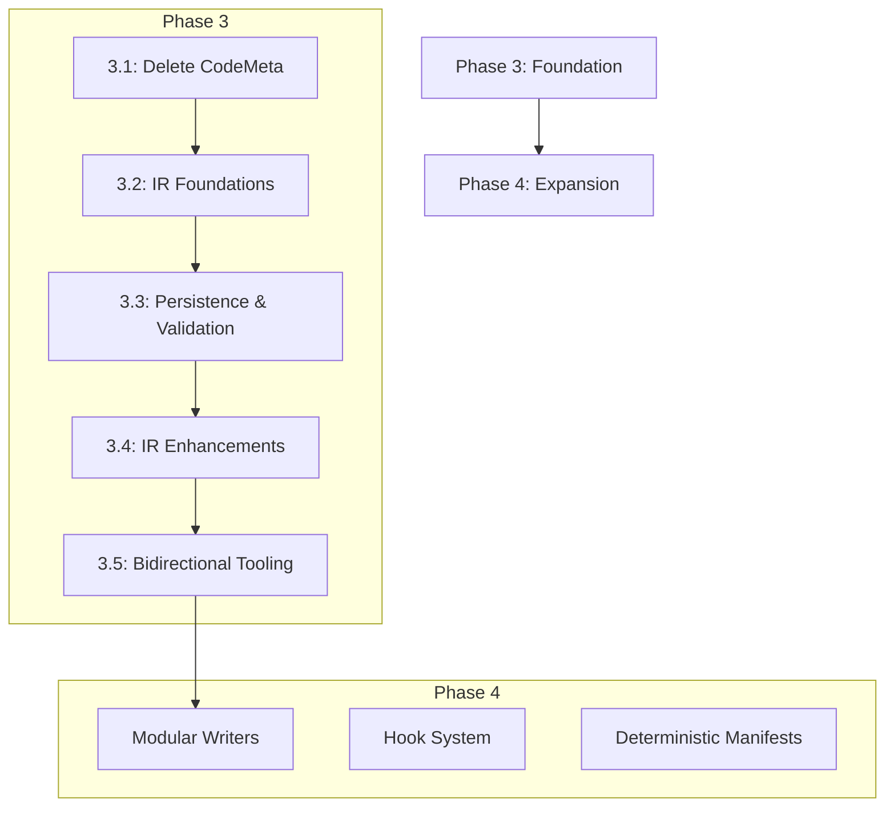

# Phase 3 Plan – Typed IR & Generation Architecture

**Status:** Session 3.3 READY - IR Persistence & Validation Harness
**Prerequisites:** Session 3.2 complete ✅ (IR Schema Foundations & Type Discipline Restoration)
**Reference:** `.agent/reference/openapi-zod-client-emitter-migration.md`
**Quality Gate:** `pnpm format && pnpm build && pnpm type-check && pnpm lint && pnpm test:all && pnpm character`

---

## 🎯 Engineering Excellence & Type Discipline

> **Mission:** Excellence and long-term stability over speed, every time.

This phase represents our unwavering commitment to engineering excellence and comprehensive type discipline.

**Core Principles (from `.agent/RULES.md`):**

1. **Types Are Our Friend** - Type errors reveal architectural problems.
2. **Zero Tolerance for Escape Hatches** - No `as`, `any`, `!`, `Record<string, unknown>`.
3. **Clean Breaks Over Hacks** - No compatibility layers.
4. **Library Types First** - Use `openapi3-ts/oas31` types.
5. **TDD Throughout** - Write failing tests first (Red-Green-Refactor).
6. **Preserve Type Information** - Never widen types unnecessarily.

---

## Strategic Context

### Phase 3 Purpose: Foundation for Phase 4 Expansion

Phase 3 focuses on **eliminating technical debt** and **establishing the Foundation for IR-based generation** (Handlebars removal deferred to Session 3.6).

**Key Shift:** We have moved from a "ts-morph migration" strategy to an **"IR-First"** strategy. The IR (Information Retrieval) layer now serves as the single source of truth, enabling modular writers (whether string-based or AST-based) to generate artifacts without legacy Handlebars templates.

**Phase 3 → Phase 4 Dependency Chain:**



---

## Session Summary

| #       | Session                         | Intent                                                             | Status          |
| :------ | :------------------------------ | :----------------------------------------------------------------- | :-------------- |
| **3.1** | **CodeMeta Elimination**        | Delete CodeMeta, extract pure functions.                           | ✅ **COMPLETE** |
| **3.2** | **IR Foundations**              | Define lossless IR, replace CodeMetaData, restore type discipline. | ✅ **COMPLETE** |
| **3.3** | **IR Persistence & Validation** | Persist IR artifacts, prove round-trip fidelity.                   | 🟢 **READY**    |
| **3.4** | **IR Enhancements**             | Add metadata for specialized writers (Phase 4 prep).               | 📅 Planned      |
| **3.5** | **Bidirectional Tooling**       | Implement reverse transforms (IR → OpenAPI).                       | 📅 Planned      |
| **3.6** | **Handlebars Decommissioning**  | Remove legacy Handlebars infrastructure.                           | 📅 Planned      |
| **3.9** | **Release Prep**                | Documentation, ADRs, final validation.                             | 📅 Planned      |

---

## Completed Sessions (Archive)

### Session 3.1 – CodeMeta Elimination

**Status:** ✅ **COMPLETE** (Nov 11, 2025)
**Summary:** Completely removed the `CodeMeta` abstraction and replaced it with pure functions and plain objects.
**Detailed Record:** [Archive](./archive/PHASE-3-SESSION-1-CODEMETA-ELIMINATION.md) (Note: Original plan file may be archived)

### Session 3.1.5 – Multi-File $ref Resolution

**Status:** ✅ **COMPLETE** (Nov 12, 2025)
**Summary:** Fixed critical blocker regarding Scalar `x-ext` reference resolution.
**Detailed Record:** [PHASE-3-SESSION-1.5-MULTI-FILE-REF-RESOLUTION.md](./PHASE-3-SESSION-1.5-MULTI-FILE-REF-RESOLUTION.md)

### Session 3.2 – IR Schema Foundations

**Status:** ✅ **COMPLETE** (Nov 27, 2025)
**Summary:** Define a lossless information retrieval architecture (IR) that captures all OpenAPI metadata and **replaces CodeMetaData** with richer IR schema metadata. Establishes foundation for Phase 4 modular writer architecture. Implemented `IRSchema`, replaced `CodeMetaData` with `IRSchemaNode`, and restored strict type discipline (0 type assertions).
**Key Deliverables:** `lib/src/context/ir-schema.ts`, `IRBuilder`, 100% Green Quality Gates.
**Detailed Record:** [Archive](./archive/PHASE-3-SESSION-2-IR-SCHEMA-FOUNDATIONS.md)

---

## Active Session

### Session 3.3 – IR Persistence & Validation Harness

**Goal:** Ensure the IR is a stable, serializable artifact that can fully reproduce the current outputs. This proves "Zero Information Loss" and enables future tooling (debugging, reverse-generation).

**Prerequisites:** Session 3.2 ✅

#### 1. Requirements

- **Serialization:** The `IRDocument` must be serializable to JSON (handling any circular references or non-serializable types if present).
- **Persistence:** Add a CLI flag (`--debug-ir` or similar) to write the IR to disk alongside generated files.
- **Fidelity Test:** A new test harness that:
  1. Generates IR from an input spec.
- **Serialization:** The `IRDocument` must be serializable to JSON (handling any circular references or non-serializable types if present).
- **Persistence:** Add a CLI flag (`--debug-ir` or similar) to write the IR to disk alongside generated files.
- **Fidelity Test:** A new test harness that:
  1. Generates IR from an input spec.
- **Serialization:** The `IRDocument` must be serializable to JSON (handling any circular references or non-serializable types if present).
- **Persistence:** Add a CLI flag (`--debug-ir` or similar) to write the IR to disk alongside generated files.
- **Fidelity Test:** A new test harness that:
  1. Generates IR from an input spec.
  2. Serializes -> Deserializes the IR.
  3. Feeds the _deserialized_ IR into the generator.
  4. Asserts the output matches the original output exactly.

#### 2. Implementation Plan (TDD)

- [ ] Create `lib/src/context/ir-serialization.ts`.
- [ ] **TDD:** Write unit tests for `serializeIR(ir: IRDocument): string` and `deserializeIR(json: string): IRDocument`.
- [ ] Handle any `Map` or `Set` conversions if used in IR (currently IR uses arrays/objects, but verify).
- [ ] Ensure `undefined` vs `null` is handled consistently.

### B. Persistence Integration

- [ ] Update `GenerateOptions` to include `debugIR?: boolean`.
- [ ] Update `generateZodClientFromOpenAPI` to write `ir.json` if flag is set.
- [ ] **TDD:** Integration test verifying file creation when flag is true.

### C. Fidelity Harness

- [ ] Create `lib/tests-e2e/ir-fidelity.test.ts`.
- [ ] **TDD:**
  - Load representative fixtures (Petstore, TicTacToe).
  - Generate Code A (Standard).
  - Generate IR -> Serialize -> Deserialize -> Generate Code B.
  - Assert Code A === Code B.

#### 3. Verification

- `pnpm test:all` must pass.
- `pnpm character` must pass (proving no side effects).
- Manual check: Run CLI with `--debug-ir` and inspect the JSON.

---

## Future Sessions

### Session 3.4 – IR Enhancements & Additional Writers

**Intent:** Enrich the IR with metadata required for Phase 4 (e.g., parameter maps, enum catalogs) and implement specialized writers.
**Key Tasks:**

- Add `operationId` normalization metadata.
- Add `parameter` maps (query, path, header, cookie).
- Implement `IR -> Documentation` writer (Markdown).

### Session 3.5 – Bidirectional Tooling & Compliance

**Intent:** Prove the "Lossless" nature of IR by generating OpenAPI specs _back_ from the IR.
**Key Tasks:**

- Implement `IR -> OpenAPI 3.1` generator.
- Validate generated OpenAPI against official schemas.
- Create "Round-Trip" validation suite (OpenAPI -> IR -> OpenAPI).

### Session 3.6 – Handlebars Decommissioning & Release Prep

**Intent:** Finalize documentation, remove legacy Handlebars infrastructure, and release Phase 3.
**Key Tasks:**

- **DELETE** `lib/src/rendering/handlebars.ts` and `lib/src/rendering/handlebars.test.ts`.
- **DELETE** all `.hbs` templates.
- **REMOVE** `handlebars` dependency from `package.json`.
- Update `README.md` with new architecture diagrams.
- Finalize `ADR-015: IR-First Architecture`.
- Release Phase 3.
- Handlebars dependency removed from package.json
- ts-morph is default and only generation path
- All tests passing with no behavioral regressions
- No migration guide needed (no users)

#### Goals (Session 3.6)

1. **Remove Handlebars Infrastructure** (4-6 hours)
   - Delete all `.hbs` template files
   - Remove `handlebars` dependency from `lib/package.json`
   - Remove template-loading logic from `lib/src/rendering/`
   - Update build scripts (remove template compilation)
   - Delete any Handlebars helper functions

2. **Stabilize ts-morph** (2-3 hours)
   - Remove feature flags for ts-morph (now default and only option)
   - Update ADRs documenting completion (ADR-014)
   - Document breaking changes

#### Acceptance Criteria (Session 3.6)

#### Part A: Handlebars Complete Removal

- [ ] All `.hbs` template files deleted (or archived to `.agent/archive/templates/`)
- [ ] `handlebars` dependency removed from `lib/package.json`
- [ ] Template loader code removed from `lib/src/rendering/`
- [ ] Zero imports of `handlebars` anywhere in `lib/src/`
- [ ] Build scripts updated (no template compilation steps)
- [ ] Verification:

  ```bash
  find lib -name "*.hbs" | wc -l  # Must be 0
  grep -r "handlebars" lib/package.json | wc -l  # Must be 0
  grep -r "import.*handlebars" lib/src/ --include="*.ts" | wc -l  # Must be 0
  ```

#### Part B: ts-morph Finalization

- [ ] Feature flags removed (ts-morph is now default and only option)
- [ ] ADR-014 updated to "Completed" status
- [ ] All tests using ts-morph codepath (no Handlebars fallback)
- [ ] Performance benchmarks run (optional: compare with Handlebars baseline)

#### Part C: Quality Gates

- [ ] `pnpm format` → Passes
- [ ] `pnpm build` → Builds successfully (no Handlebars steps)
- [ ] `pnpm type-check` → 0 errors
- [ ] `pnpm lint` → 0 errors
- [ ] `pnpm test:all` → All tests passing
- [ ] `pnpm test:snapshot` → All snapshots passing
- [ ] `pnpm character` → All characterization tests passing

#### Part D: Documentation

- [ ] ADR-014 status: "Completed"
- [ ] CHANGELOG updated with breaking changes (Handlebars removed)
- [ ] README updated (remove any Handlebars mentions)
- [ ] Note: No migration guide needed (no users)

#### Validation Steps (Session 3.6)

#### Step 1: Pre-Removal Audit

```bash
# Document what's being removed
find lib -name "*.hbs" | tee handlebars-templates.txt
grep -r "import.*handlebars" lib/src/ --include="*.ts"
grep -r "CodeMeta" lib/src/ --include="*.ts" | wc -l
# Capture baseline
```

#### Step 2: Handlebars Removal Validation

```bash
# Verify Handlebars gone
find lib -name "*.hbs"  # Should be empty
grep -r "handlebars" lib/package.json  # Should be empty
grep -r "import.*handlebars" lib/src/ --include="*.ts"  # Should be empty

# Run quality gate
pnpm format && pnpm build && pnpm type-check && pnpm lint
```

**Step 3: Integration Testing**

```bash
# Test CLI still works
pnpm build
cd lib
node dist/cli/index.js ../examples/openapi/v3.1/tictactoe.yaml -o /tmp/test-output.ts
cat /tmp/test-output.ts  # Should contain valid Zod schemas

# Test programmatic API
node <<'EOF'
const { generateZodClientFromOpenAPI } = require('./dist/index.js');
const spec = { openapi: '3.1.0', info: { title: 'Test', version: '1.0.0' }, paths: {} };
generateZodClientFromOpenAPI({
  openApiDoc: spec,
  distPath: '/tmp/programmatic-test.ts',
  disableWriteToFile: true
}).then(code => console.log('Generated:', code.length, 'characters'));
EOF
```

**Step 4: Final Quality Gate**

```bash
cd /Users/jim/code/personal/openapi-zod-client

# CRITICAL: Full quality gate must pass
pnpm format && \
pnpm build && \
pnpm type-check && \
pnpm lint && \
pnpm test:all && \
pnpm character

EXIT_CODE=$?
if [ "$EXIT_CODE" -eq 0 ]; then
  echo "✅ PASS: Full quality gate passed"
else
  echo "❌ FAIL: Quality gate failed with exit code $EXIT_CODE"
  exit 1
fi
```

**Step 5: Regression Testing**

```bash
# Run against representative specs
for spec in lib/examples/openapi/v3.1/*.yaml; do
  echo "Testing: $spec"
  node lib/dist/cli/index.js "$spec" -o "/tmp/test-$(basename $spec).ts"
done

# Verify all generated files are valid TypeScript
for file in /tmp/test-*.ts; do
  npx tsc --noEmit "$file" || echo "FAIL: $file"
done

echo "✅ All tests completed"
```

#### Definition of Done (Session 3.6)

#### CRITICAL: Handlebars Complete Removal

- [ ] Zero `.hbs` files in repository
- [ ] `handlebars` dependency removed from `package.json`
- [ ] Zero imports of `handlebars` in source code
- [ ] Verification commands pass:

  ```bash
  find lib -name "*.hbs" | wc -l  # Must be 0
  grep -r "handlebars" lib/package.json | wc -l  # Must be 0
  grep -r "import.*handlebars" lib/src/ --include="*.ts" | wc -l  # Must be 0
  ```

#### ts-morph Finalization

- [ ] Feature flags removed (ts-morph is default and only option)
- [ ] ADR-014 status: "Completed"
- [ ] All tests using ts-morph codepath (no Handlebars fallback)

#### Standard Completion

- [ ] All acceptance criteria met (Parts A, B, C, D)
- [ ] All validation steps executed and passing (Steps 1-5)
- [ ] Quality gate passes: `pnpm format && pnpm build && pnpm type-check && pnpm lint && pnpm test:all && pnpm character`
- [ ] CHANGELOG updated (Handlebars removed, ts-morph is now only generation system)
- [ ] README updated (remove any Handlebars mentions)
- [ ] Code review completed
- [ ] Commit message: `feat(codegen): complete ts-morph migration, delete Handlebars`

**Impact**

- Single code generation system (ts-morph only)
- CodeMeta already deleted (Session 3.1)
- Handlebars infrastructure deleted (~1000+ lines)
- Maintenance burden reduced by 50%
- No users, no migration paths needed

#### Breaking Changes (for v2.0.0)

**Note:** CodeMeta breaking changes already handled in Session 3.1. This session only adds:

1. **Handlebars removed:** No more template-based generation
2. **ts-morph is only option:** Feature flags removed, ts-morph is default and only code generation system

**No public API changes in this session** (all breaking changes happened in Session 3.1)

#### Why This Is Critical

- Completes Phase 3 migration to ts-morph
- Eliminates dual code generation systems (Handlebars + ts-morph)
- Single code generation system (better maintainability)
- Enables Phase 4 (bidirectional tooling, advanced features)
- Clean foundation for future development

#### References

- Session 3.1: CodeMeta Elimination (already completed)
- Sessions 3.2-3.6: IR and ts-morph emitter implementation
- ADR-014: ts-morph Migration
- ADR-013: CodeMeta poor abstraction (already resolved in 3.1)

### Session 3.8 – Bidirectional Tooling & Compliance

- **Intent:** Implement IR → OpenAPI regeneration, optional Zod/runtime → IR adapters, and enforce schema validation gates.
- **Acceptance Criteria:**
  - Reverse generator produces OpenAPI docs that validate against official schemas.
  - Optional runtime adapters documented (even if partial).
  - CI task added for schema validation.
- **Definition of Done:**
  - Reverse pipeline accessible via CLI/programmatic option.
  - Validation suite with official schemas integrated.
  - Characterisation test demonstrates round-trip (OpenAPI → IR → OpenAPI).
- **Validation Steps:**
  1. `pnpm test -- run src/rendering/reverse/*.test.ts`
  2. Schema validation command (AJV) over regenerated specs.
  3. Characterisation round-trip diff ensures stability.

### Session 3.9 – Documentation & Release Prep

**Status:** Not started
**Prerequisites:** Sessions 3.1-3.8 complete (ts-morph migration complete) ✅
**Estimated Effort:** 8-12 hours

#### Intended Impact (Session 3.9)

Finalize all documentation, capture architectural decisions, prepare migration guidance, and ensure Phase 3 deliverables are release-ready with comprehensive v2.0.0 documentation.

#### Goals (Session 3.9)

1. Update all documentation for ts-morph architecture
2. Complete ADRs documenting Phase 3 decisions
3. Prepare v2.0.0 release candidate with migration guide
4. Final quality assurance across all deliverables

#### Acceptance Criteria (Session 3.9)

- [ ] README.md updated with new architecture (IR + ts-morph)
- [ ] CLI documentation updated (help text, examples)
- [ ] API documentation generated (TypeDoc)
- [ ] ADR-014 status: "Completed" with Phase 3 summary
- [ ] Migration guide complete: `docs/MIGRATION-2.0.md`
- [ ] CHANGELOG.md updated with breaking changes
- [ ] Release notes drafted
- [ ] All open questions from sessions triaged or closed

#### Validation Steps (Session 3.9)

#### Step 1: Documentation Completeness

```bash
# Verify all docs updated
ls -la docs/MIGRATION-2.0.md
grep -i "ts-morph" README.md
grep -i "CodeMeta" README.md  # Should mention removal

# Check ADRs
grep "Status:" docs/architectural_decision_records/ADR-014-*.md
```

#### Step 2: API Documentation Generation

```bash
# Generate TypeDoc
pnpm typedoc --treatWarningsAsErrors
# Should generate without errors

# Review generated docs
open docs/api/index.html
```

#### Step 3: Final Quality Gate (CRITICAL)

```bash
# Full quality gate - MUST PASS for release
pnpm format && \
pnpm build && \
pnpm type-check && \
pnpm lint && \
pnpm test:all && \
pnpm character

# Verify exit code
echo "Quality gate status: $?"  # Must be 0
```

#### Step 4: Release Candidate Validation

```bash
# Create release candidate
git tag v2.0.0-rc.1
pnpm pack

# Test installation from tarball
cd /tmp
tar -xzf /path/to/tarball.tgz
cd package
npm install
npm test
```

#### Step 5: Migration Guide Validation

```bash
# Review migration guide
cat docs/MIGRATION-2.0.md
# Should cover:
# - CodeMeta removal
# - New API types
# - Breaking changes
# - Step-by-step migration
```

#### Definition of Done (Session 3.9)

- [ ] All acceptance criteria met
- [ ] All validation steps passing
- [ ] Quality gate passes
- [ ] Release candidate tagged (v2.0.0-rc.1)
- [ ] Documentation reviewed and approved
- [ ] Ready for Phase 3 closure

---

## Handlebars Decommissioning Strategy

This section details the plan for the complete removal of the Handlebars templating engine from the codebase. This is a critical step to simplify the architecture, reduce technical debt, and fully transition to the IR-First, ts-morph-based generation strategy.

### Goals (Handlebars Decommissioning)

1. **Eliminate Handlebars Dependency:** Remove `handlebars` from `package.json` and ensure no runtime dependency.
2. **Delete All Handlebars Artifacts:** Remove all `.hbs` template files and associated rendering logic.
3. **Consolidate to ts-morph:** Ensure `ts-morph` is the sole code generation mechanism.
4. **Maintain Fidelity:** Verify that the generated output remains identical to the previous Handlebars-generated output (where applicable) or the intended ts-morph output.

### Key Tasks (Handlebars Decommissioning)

- **Code Removal:**
  - Delete `lib/src/rendering/handlebars.ts` and its test file.
  - Delete all `.hbs` template files from the repository.
  - Remove any Handlebars helper functions or utility modules.
- **Dependency Management:**
  - Remove `handlebars` from `lib/package.json` and `pnpm-lock.yaml`.
- **Build System Update:**
  - Modify build scripts to remove any Handlebars template compilation steps.
- **Verification:**
  - Run `grep -r "handlebars" lib/src/` to ensure no imports or references remain.
  - Run `find lib -name "*.hbs"` to confirm all template files are gone.
  - Execute full quality gate (`pnpm test:all`, `pnpm character`) to ensure no regressions.

### Rationale (Handlebars Decommissioning)

- **Reduced Complexity:** Eliminates a parallel code generation system, simplifying maintenance and development.
- **Improved Performance:** Removes the overhead of template parsing and rendering.
- **Type Safety:** Fully leverages TypeScript's type system throughout the generation process, as `ts-morph` operates on ASTs.
- **Enables Advanced Features:** A unified AST-based approach is essential for future bidirectional tooling and advanced code transformations.

---

## Session Validation Pattern

**Note:** Sessions 3.3-3.6 and 3.8 (not yet detailed above) MUST follow the same comprehensive validation pattern as Sessions 3.1, 3.2, 3.7, and 3.9:

1. **Intended Impact** - Clear problem/solution/metrics
2. **Goals** - Specific, measurable objectives
3. **Acceptance Criteria** - Detailed checklist with checkboxes
4. **Validation Steps** - Bash commands that can be copy-pasted
5. **Definition of Done** - Explicit completion criteria
6. **Quality Gate** - ALWAYS include: `pnpm format && pnpm build && pnpm type-check && pnpm lint && pnpm test:all && pnpm character`

Each session MUST run the full quality gate at least once (typically at the end), and critical sessions should run it multiple times during implementation to catch regressions early.

---

## Phase 3 Success Criteria

- [ ] All 9 sessions complete with quality gates passing
- [ ] CodeMeta fully removed (prep work in 3.1, completion in 3.1)
- [ ] Handlebars fully removed (3.6)
- [ ] ts-morph is sole code generation system
- [ ] IR enables bidirectional transformations
- [ ] Zero behavioral regressions (characterization tests unchanged)
- [ ] v2.0.0 released with comprehensive migration guide
- [ ] All breaking changes documented
- [ ] ADRs updated (Phase 3 complete)
