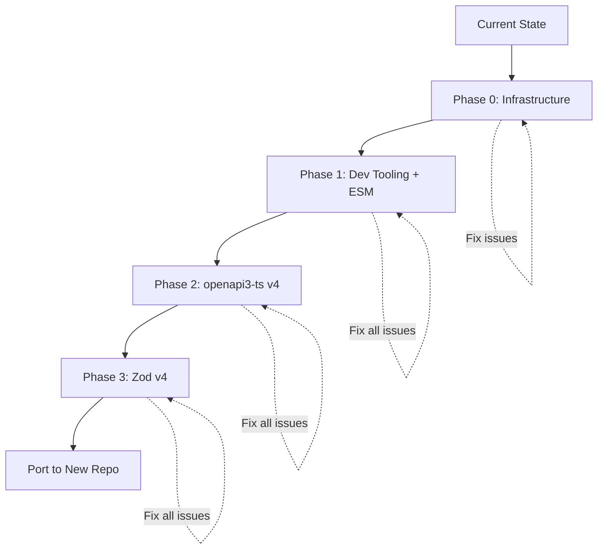

# OpenAPI Zod Client Modernization Plan - Overview

## Executive Summary

This document outlines a comprehensive plan to modernize the `openapi-zod-client` fork by updating its core dependencies to their latest versions and fixing all code issues. The work is divided into four sequential phases. **The goal is to bring the codebase up to modern standards, fix all issues, and prepare it for extracting useful components to the Engraph SDK monorepo.**

**Target Use Case:** This fork will serve as a reference implementation for generating strict Zod schemas and MCP tool validation from OpenAPI 3.0/3.1 specifications. The extracted components will be used in the Engraph SDK to auto-generate request/response validators for MCP tools that wrap Engraph API endpoints.

## Strategy

### Why Three Sequential Phases?

1. **Risk Management**: Each phase addresses a distinct concern with clear boundaries
2. **Systematic Progress**: Build on stable foundations before tackling complex changes
3. **Clear Testing**: Verify each phase works before moving to the next
4. **Code Quality**: Fix all issues incrementally rather than all at once

### Phase Sequence

### Phase Details

#### Phase 0: Infrastructure & Workspace Setup

**Goal**: Establish Turborepo infrastructure and testing standards  
**Type**: Foundation work  
**Plan**: [00-infrastructure.md](./00-infrastructure.md)

**Key Changes**:

- Install and configure Turborepo (latest)
- Standardize scripts across all workspaces (`format`, `type-check`, `lint`, `test`)
- Create root-level orchestration commands
- Set up task dependency pipeline
- Configure caching strategies
- Ensure tests prove functionality (not just types)
- Create coding standards (RULES.md)

**Why First**: Fast feedback loop and consistent tooling before making any code changes

---

#### Phase 1: Developer Tooling Modernization + ESM Migration

**Goal**: Update all development dependencies, tooling, and fix ESM/module issues  
**Type**: Infrastructure modernization  
**Plan**: [01-dev-tooling.md](./01-dev-tooling.md)

**Key Changes**:

- TypeScript 5.1 → 5.7
- Prettier 2.7 → 3.6 (including async format() fixes)
- Vitest 0.22 → 2.1
- ESLint 8.26 → 9.18 with flat config
- Convert to ESM with proper module resolution
- Add .js extensions to all relative imports
- Fix `cac` import issues
- Fix `prettier.format()` async calls
- Fix `tanu/dist/type` module resolution
- Remove unused variables
- Node.js 18.16+ → 18.20+
- Security vulnerability fixes
- Remove unnecessary @types packages

**Why First**: Establishes modern tooling baseline and fixes all infrastructure issues before touching library code

**Current Status**: In progress

- ✅ ESLint v9 flat config implemented
- ✅ TypeScript updated
- ✅ `.js` extensions added to all src files
- ⚠️ Still need to fix:
    - `samples-generator.ts` missing `.js` extension
    - `cli.ts` cac import issue
    - `maybePretty.ts` async format() call
    - `openApiToTypescript.ts` tanu import path
    - Unused variables

---

#### Phase 2: openapi3-ts v4 Update

**Goal**: Update OpenAPI type definitions  
**Type**: Breaking dependency update  
**Plan**: [02-openapi3-ts-v4.md](./02-openapi3-ts-v4.md)

**Key Changes**:

- openapi3-ts 3.1.0 → 4.4.0
- Handle discriminator changes
- Update type assertions
- Fix breaking type changes

**Why Second**: Must be done before Zod v4 due to type dependencies

---

#### Phase 3: Zod v4 Update

**Goal**: Update core validation library  
**Type**: Breaking dependency update  
**Plan**: [03-zod-v4.md](./03-zod-v4.md)

**Key Changes**:

- zod 3.19.1 → 4.0.0+
- @zodios/core compatibility
- Schema generation updates
- Test and verify all functionality

**Why Last**: Most impactful change, needs stable foundation

---

## Success Criteria

For each phase to be considered complete:

**Phase 0 & 1:**

- [x] Build succeeds (tsup CJS + ESM + DTS)
- [x] Type checking passes (0 errors)
- [x] Linting passes (no errors)
- [x] Code formatted with Prettier
- [ ] All tests pass ⚠️ **CURRENT BLOCKER**
- [ ] Examples generate correctly ⚠️ **VERIFY NEEDED**
- [ ] Generated output works as expected ⚠️ **VERIFY NEEDED**
- [ ] No security vulnerabilities (`pnpm audit` clean) ⚠️ **CHECK NEEDED**
- [ ] All dependencies up-to-date (`pnpm -r outdated` clean) ⚠️ **CHECK NEEDED**

**Phase 2:**

- [ ] openapi3-ts v4 installed
- [ ] Support OpenAPI 3.0 AND 3.1
- [ ] All imports updated (~20 files)
- [ ] Type guards updated
- [ ] All tests pass with new types
- [ ] Examples work with both 3.0 and 3.1 specs

**Phase 3:**

- [ ] Zod v4 installed
- [ ] @zodios/core compatible version
- [ ] Schema generation updated for v4 API
- [ ] All test snapshots regenerated (68 files)
- [ ] Examples generate Zod v4 code
- [ ] No breaking changes in generated output structure

---

## Timeline

| Phase | Focus                     | Status     | Estimated Time | Cumulative |
| ----- | ------------------------- | ---------- | -------------- | ---------- |
| 0     | Infrastructure + Turbo    | ✅ Done    | 1-2 days       | 1-2 days   |
| 1a    | Developer Tooling + ESM   | ✅ Done    | 3-4 days       | 4-6 days   |
| 1b    | Test Suite & Verification | 🔧 Current | 1-2 days       | 5-8 days   |
| 2     | openapi3-ts v4            | ⏸️ Blocked | 2-3 days       | 7-11 days  |
| 3     | Zod v4                    | ⏸️ Blocked | 3-5 days       | 10-16 days |

**Total Estimated Time**: 10-16 working days (~2-3 weeks)

_Note: Timeline includes fixing all issues found during each phase_

**Current Focus:** Complete Phase 1b (test suite validation) before starting Phase 2

---

## Quality Standards

### All Phases Must Achieve

✅ **Testing**

- All existing tests pass
- New tests for new functionality (if applicable)
- No regression in functionality

✅ **Code Quality**

- ESLint passes with no errors
- TypeScript compiles with no errors
- Prettier formatting applied
- No unused variables or imports

✅ **Functionality**

- All examples work
- Generated output validated
- CLI functions correctly
- Build produces valid output

✅ **Documentation**

- Plans updated as work progresses
- Code comments maintained
- README accurate

---

## Risk Assessment

### Low Risk (Phase 1)

- Well-understood tooling updates
- No runtime code changes (mostly)
- Issues caught by TypeScript/ESLint
- **Mitigation:** Fix all errors as they appear

### Medium Risk (Phase 2)

- Breaking change but limited scope
- Type-only changes
- Clear migration path
- **Mitigation:** Thorough testing

### High Risk (Phase 3)

- Affects generated output
- Complex refactoring required
- Multiple test snapshots to update
- **Mitigation:** Extensive testing, careful verification

---

## Current State

### Phase 0: ✅ COMPLETED

**Achievements:**

- ✅ Turborepo v2.5.8 installed and configured
- ✅ `turbo.json` created with task pipeline
- ✅ Root scripts standardized
- ✅ All workspace scripts standardized (lib, 3 examples)
- ✅ Playground removed (not core functionality)
- ✅ `.agent/RULES.md` created with comprehensive standards
- ✅ Quality gate order established: build → format → type-check → lint → test

### Phase 1: 🔧 COMPLETING - Type Safety & Test Suite

**Completed:**

- ✅ tsup v8.5.0 installed (replaced preconstruct)
- ✅ ESLint v9 flat config for `lib` workspace
- ✅ TypeScript 5.x with NodeNext module resolution
- ✅ Prettier 3.6.2 with async format() fixes
- ✅ Vitest 3.2.4
- ✅ Added `.js` extensions to 18 files in `lib/src/`
- ✅ Package.json updates (ESM, bin.cjs)
- ✅ All TypeScript compilation errors fixed (0 errors)
- ✅ Build succeeds (CJS + ESM + DTS)

**Remaining Before Phase 2:**

1. **Test Suite Verification** ⚠️ CRITICAL
    - Run full test suite (`pnpm test`)
    - Fix any failing tests
    - Ensure tests prove functionality (not just types)
    - Update snapshots if needed
2. **Example Validation** ⚠️ CRITICAL
    - Verify all 3 examples generate correctly
    - Ensure generated code is valid
    - Test with small OpenAPI specs
3. **Dependency Audit** ⚠️ REQUIRED
    - Run `pnpm -r outdated` and update remaining deps
    - Run `pnpm audit` and fix security issues
    - Ensure no deprecated packages
4. **Functional Verification** ⚠️ REQUIRED
    - CLI generates valid output
    - Generated schemas validate correctly
    - No runtime errors
    - Build artifacts are usable

**Blocker:** Cannot proceed to Phase 2 (openapi3-ts v4) until code is fully type-safe, tested, and functional

---

## Next Steps

1. ✅ Review and approve this plan
2. ✅ Execute Phase 0: Infrastructure & Workspace Setup
3. ✅ Phase 1a: Developer Tooling Modernization (type-check passes)
4. **🔧 Phase 1b: Test Suite & Verification** (CURRENT)
    - [ ] Run full test suite and fix failures
    - [ ] Verify examples generate correctly
    - [ ] Run `pnpm audit` and fix vulnerabilities
    - [ ] Run `pnpm -r outdated` and update dependencies
    - [ ] Functional verification with sample OpenAPI specs
5. **⏸️ Execute Phase 2: openapi3-ts v4** (BLOCKED until Phase 1b complete)
    - Update openapi3-ts to v4.4.0
    - Support both OpenAPI 3.0 and 3.1
    - Update all imports and type guards
    - Verify with Engraph API (3.0.3) and 3.1 test specs
6. **⏸️ Execute Phase 3: Zod v4** (BLOCKED until Phase 2 complete)
    - Update Zod to v4.0+
    - Update @zodios/core for compatibility
    - Update schema generation logic
    - Regenerate all test snapshots
7. **Final State:**
    - Modernized, fully tested codebase
    - All dependencies at latest versions
    - OpenAPI 3.0 and 3.1 support
    - Zod v4 schema generation
    - Zero security vulnerabilities
    - Zero outdated dependencies
    - Ready for component extraction to Engraph SDK

---

## Target Extraction Context

**Destination:** Engraph SDK monorepo  
**Purpose:** Generate MCP tool input/output validators from Engraph OpenAPI spec  
**Current Engraph API:** OpenAPI 3.0.3 (500+ endpoints)  
**Required:** Support for future 3.1 upgrade

**What will be extracted:**

- ✅ `getZodiosEndpointDefinitionList()` - Endpoint metadata with runtime schemas
- ✅ OpenAPI parsing and $ref resolution
- ✅ Type guards and utilities
- 🆕 Strict schema generation (rebuild with `.strict()` default)
- 🆕 MCP tool schema generation (build fresh)

**What will be left behind:**

- ❌ Template system (Handlebars)
- ❌ Permissive schema generation (`.passthrough()`)
- ❌ CLI tool (not needed in SDK)

---

## References

- [TypeScript 5.7 Release Notes](https://devblogs.microsoft.com/typescript/)
- [ESLint v9 Migration Guide](https://eslint.org/docs/latest/use/migrate-to-9.0.0)
- [Prettier 3.0 Release](https://prettier.io/blog/2023/07/05/3.0.0.html)
- [Zod v4 Documentation](https://zod.dev/)
- [openapi3-ts v4 Documentation](https://www.npmjs.com/package/openapi3-ts)

---

**Current Focus:** Complete Phase 1b - verify test suite, examples, and dependencies before starting Phase 2
