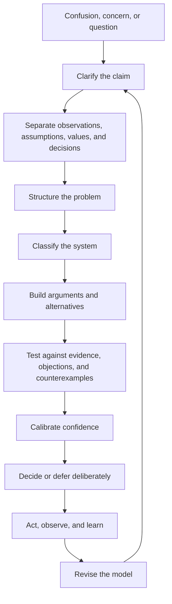

# A Grammar of Thinking

**Type**: Reasoning-discipline reference (portable Practice substance)
**Origin**: promoted from research and re-aimed for the agent-as-thinker (2026-06-22)

This is the deep reference behind the `reason` skill — the outward, structured-thinking
pair to `metacognition`'s inward reflection. `reason` carries the few moves that fire
on everyday analysis and decisions; this document is the full grammar those moves point to, and
the yardstick to read against for complex rewrites and high-stakes planning.

## Purpose

A practical grammar for thinking clearly — drawn from argumentation, critical thinking, systems
thinking, decision theory, and the philosophy of science. Its aim is usefulness, not academic
completeness.

**You are the thinker it addresses.** Read "the team" or "the room" as the owner and your peer
agents; "memory" as the repo's continuity substrate (threads, decision records, the knowledge
loop); "delivery" as comms and handoff. The grammar is otherwise general — it holds wherever
reasoning happens, for any mind.

Good thinking is not merely having intelligent thoughts. It is the disciplined movement from
confusion to structure; from impressions to claims; from claims to reasons; from reasons to
evidence; from evidence to models; from models to decisions; and from decisions back into
learning.

The central idea:

> Thinking is the construction, testing, revision, and communication of maps under conditions
> of uncertainty.

A map may be an argument, a system diagram, a strategy, a model, a judgement, or a plan. The map
is never the territory — but some maps are better: they preserve more important structure, expose
their assumptions, guide action, survive contact with counter-evidence, and improve when they
fail. This document is a grammar for making better maps.

---

## 1. The Fundamental Unit: Claim, Reason, Evidence, Warrant

Most poor reasoning begins before logic enters the room. It begins with unseparated material: intuitions, hopes, anecdotes, conclusions, labels, moral reactions, technical jargon, and status signals all fused together.

The first discipline of thought is separation.

A clear argument has at least four parts:

1. **Claim** — what is being asserted.
2. **Reason** — why someone should accept it.
3. **Evidence** — what makes the reason credible.
4. **Warrant** — the bridge connecting reason to claim.

For example:

> “We should not migrate the system this quarter because the likely operational benefit is smaller than the delivery and morale cost.”

The claim is “we should not migrate this quarter.”
The reason is “benefit is smaller than cost.”
The evidence might include incident data, platform capability, team capacity, roadmap pressure, and previous migration outcomes.
The warrant is the judgement that, given finite capacity, opportunity cost matters more than theoretical infrastructure purity.

The warrant is often where the real argument lives. It contains the values, thresholds, causal assumptions, and trade-offs that make the conclusion follow. Many arguments appear to disagree about evidence but actually disagree about warrants.

A disciplined thinker asks:

* What exactly is being claimed?
* What would make that claim true, false, stronger, weaker, or irrelevant?
* What reasons are being offered?
* Are the reasons independent, or are they the same reason repeated in different language?
* What assumptions connect the reasons to the conclusion?
* What scope does the claim have?
* What exceptions would I accept?
* What would I change my mind about?

The goal is not to make everything formal. The goal is to prevent fog from masquerading as depth.

---

## 2. Distinguish Arguments from Explanations, Descriptions, and Decisions

A description says what is there.
An explanation says why it happened.
An argument says what should be believed.
A decision says what should be done.
A plan says how to do it.
A story says why it matters.

Confusing these categories causes avoidable failure.

A team may spend hours arguing about whether “the architecture is bad” when one person means “the system has high change cost,” another means “the code is aesthetically displeasing,” another means “delivery is risky,” and another means “we need permission to rebuild it.”

Those are different claims.

When thinking feels stuck, ask which mode you are in:

* Are we describing the situation?
* Explaining causes?
* Evaluating quality?
* Predicting future behaviour?
* Choosing an action?
* Persuading people to coordinate?
* Creating shared meaning?

Each mode has different standards.

A good description requires accuracy.
A good explanation requires causal adequacy.
A good argument requires support.
A good decision requires fitness under constraints.
A good plan requires executability.
A good story requires coherence and resonance.

A thought can fail in one mode while succeeding in another. A compelling story may be a bad explanation. A true description may not imply a decision. A valid argument may rest on irrelevant premises. A reasonable decision may be based on incomplete evidence because action cannot wait.

Clear thinking begins by naming the game being played.

---

## 3. The Ladder of Reliability

Not all mental objects deserve the same confidence. A useful discipline is to place them on a ladder.

### Observation

Something was seen, measured, heard, logged, or recorded.

Observations are not pure. They depend on instruments, categories, context, attention, and interpretation. But they are closer to the world than abstract claims.

Ask:

* Who observed it?
* With what instrument or method?
* Under what conditions?
* Was it recorded?
* Could it be independently checked?
* What was excluded by the measurement?

### Data

Observations structured for use.

Data is not reality. It is reality after selection, compression, formatting, and cleaning. Every dataset has a theory of relevance embedded in it.

Ask:

* What was counted?
* What was not counted?
* What is the unit?
* What is the denominator?
* What changed in collection method?
* What incentives shaped the data?

### Interpretation

A proposed meaning of the data.

Interpretation is where patterns are named. This is often useful, but also dangerous. Humans are pattern-making creatures. We can see structure where there is only noise, or miss structure because the wrong frame is active.

Ask:

* What else could this pattern mean?
* Is this signal, noise, bias, delay, or selection effect?
* Does the interpretation survive disaggregation?
* Would someone with different incentives interpret it differently?

### Model

A compressed representation of how something works.

A model may be verbal, mathematical, visual, procedural, or embodied in software. Models are useful because they simplify. They are dangerous for the same reason.

Ask:

* What does this model include?
* What does it ignore?
* What scale is it valid at?
* What failure modes does it hide?
* What does it predict?
* What would falsify or weaken it?

### Judgement

A practical assessment under uncertainty.

Judgement combines evidence, values, models, timing, constraints, risk tolerance, and responsibility. It is not reducible to calculation, but it should not be immune from criticism.

Ask:

* What decision does this judgement support?
* What uncertainty remains?
* What is the cost of being wrong?
* Is the judgement reversible?
* Who bears the downside?
* What would trigger reconsideration?

### Action

A change made in the world.

Action is where thought becomes consequential. It creates new evidence, but also new commitments. Good thinkers treat action as both intervention and experiment.

Ask:

* What do we expect to happen?
* How will we know?
* What should we monitor?
* What is the rollback path?
* What did reality teach us?

The ladder matters because many failures come from climbing too quickly. A few observations become a story. A story becomes a model. A model becomes identity. Identity resists correction.

Good thinking keeps the ladder visible.

---

## 4. The Shape of a Good Argument

A good argument is not simply one that wins. It is one that helps responsible belief or action.

It should be:

### Clear

The central claim should be explicit. Key terms should be defined enough to prevent equivocation. The argument should not depend on emotional force, ambiguity, or hidden assumptions.

### Relevant

The reasons must actually support the claim. True statements can still be irrelevant. “The team worked hard” does not prove the project is valuable. “The technology is popular” does not prove it fits the problem. “The system is old” does not prove it should be replaced.

### Adequate

The evidence must be strong enough for the weight placed on it. Extraordinary claims require stronger support. High-risk actions require more robust justification. Low-risk experiments may justify action with weaker evidence.

### Resistant

The argument should survive serious objections. A fragile argument avoids counterexamples. A strong argument invites them, absorbs what it can, narrows its scope where necessary, and revises.

### Proportionate

The conclusion should not overreach. If the evidence supports “this is plausible,” do not claim “this is proven.” If it supports “this failed in one context,” do not claim “this never works.” If it supports “we should test,” do not claim “we should commit.”

### Ethical

The argument should not manipulate, conceal, or exploit. Persuasion is not inherently corrupt. But good persuasion respects the agency of the audience. It helps people see what is at stake and why the conclusion follows.

A useful formula:

> Claim only what your reasons support.
> Support only what your evidence can bear.
> Expose the assumptions that carry the weight.
> State the confidence level honestly.
> Preserve the dignity of disagreement.

---

## 5. The Core Moves of Critical Thinking

Critical thinking is often described as “thinking about thinking.” That is true but too vague. More practically, critical thinking is the deliberate use of mental moves that reduce error and improve judgement.

### Clarify

Turn vague concerns into explicit claims.

“What are we actually saying?”
“What do we mean by success?”
“What problem are we solving?”
“What would count as failure?”
“What is included in this category?”

### Decompose

Break a problem into parts without losing the whole.

“What are the components?”
“What are the relationships?”
“What can vary independently?”
“What is cause, symptom, constraint, and consequence?”

### Compare

Reason by difference.

“How is this like previous cases?”
“How is it unlike them?”
“What changes between option A and option B?”
“What remains constant?”

### Generalise

Move from cases to patterns, carefully.

“How many cases do we have?”
“Are they representative?”
“What is the base rate?”
“What population are we generalising to?”
“What hidden selection process produced these examples?”

### Test

Expose claims to possible failure.

“What prediction follows?”
“What counterexample would matter?”
“What observation would surprise us?”
“What would we expect to see if this were false?”

### Steelman

Improve an opposing argument before criticising it.

“What is the strongest version of the view I reject?”
“What does it see that I might be missing?”
“What conditions would make it right?”
“What values does it protect?”

### Triangulate

Use multiple imperfect methods.

“What do the data say?”
“What do experienced practitioners say?”
“What does theory predict?”
“What do users do?”
“What do users say?”
“What do incentives imply?”

### Calibrate

Match confidence to evidence.

“How sure am I?”
“What is the probability range?”
“How often have I been wrong in similar cases?”
“What would make me update?”
“Am I treating uncertainty as a weakness, or as part of reality?”

### Decide

Convert reasoning into action.

“What is the next responsible move?”
“Is this a one-way or two-way door?”
“What is the cost of waiting?”
“What is the cost of acting?”
“What can we learn cheaply?”

### Reflect

Close the loop.

“What happened?”
“What did I expect?”
“Where was I surprised?”
“What did I learn?”
“What should change in my model?”

These moves are not linear. Real thinking loops. But when confused, returning to one of these moves usually restores progress.

---

## 6. Structuring Problems

A problem is not merely an undesirable situation. A problem is an undesirable situation framed in a way that makes reasoning and action possible.

Bad problem statements smuggle in solutions:

* “We need a new platform.”
* “We need AI.”
* “We need better communication.”
* “We need to move faster.”
* “We need more process.”

Better problem statements identify a gap, context, and consequence:

* “Teachers cannot reliably find appropriate material within the time available, causing avoidable planning burden.”
* “The current architecture makes small changes require cross-cutting coordination, reducing our ability to adapt safely.”
* “Our planning artefacts encode intent inconsistently, so agents and humans cannot reliably recover why work exists.”
* “The organisation is optimising local delivery while losing global learning.”

A strong problem frame has these parts:

### 1. Situation

What is happening?

Describe the current state without blame or premature abstraction.

### 2. Stakeholders

For whom is it a problem?

Different stakeholders experience different versions of the problem. Users, operators, maintainers, leaders, funders, regulators, and future contributors may all see different failure modes.

### 3. Harm or Opportunity

Why does it matter?

A problem without consequence is not yet a priority. A harm may be direct, such as user failure, or indirect, such as lost optionality.

### 4. Mechanism

Why is it happening?

This is the causal hypothesis. It should be treated as provisional. Many bad solutions come from solving a symptom while the mechanism remains intact.

### 5. Constraints

What cannot easily change?

Constraints include money, time, law, organisational appetite, legacy systems, skill availability, trust, political capital, operational risk, and human energy.

### 6. Success Criteria

What would better look like?

Success criteria should include both outcomes and guardrails. A system can improve one metric while damaging the wider context.

### 7. Intervention Options

What could we try?

Options should include doing nothing, gathering more information, running a small experiment, improving the existing system, replacing part of the system, replacing the whole system, changing incentives, changing process, or reframing the goal.

### 8. Risks

What could go wrong?

Include technical, social, ethical, financial, operational, reputational, and second-order risks.

### 9. Learning Plan

What will this teach us?

Good interventions produce learning even when they fail. Bad interventions consume time and leave confusion behind.

A compact problem template:

```text
We observe [situation].
This matters because [harm/opportunity] for [stakeholders].
Our current best explanation is [mechanism].
The relevant constraints are [constraints].
A better state would be [success criteria and guardrails].
The main options are [options].
The most important uncertainties are [unknowns].
The next responsible move is [action/experiment/decision].
We will know more when [feedback signal].
```

This template prevents the common slide from concern to solution without understanding.

---

## 7. Categorising Systems

To think well about systems, first classify what kind of system you are dealing with. The wrong category produces the wrong method.

### Simple Systems

Simple systems have stable, obvious cause and effect.

Example: a light switch, a form validation rule, a basic checklist.

Use rules, automation, standard operating procedures, and direct fixes.

Failure mode: overcomplicating.

### Complicated Systems

Complicated systems have many parts, but cause and effect are still analysable with expertise.

Example: a search index, a build pipeline, a payroll system, a bridge.

Use expertise, decomposition, modelling, testing, documentation, and review.

Failure mode: underestimating coordination and integration.

### Complex Systems

Complex systems involve adaptation, feedback, emergence, and changing behaviour.

Example: a product ecosystem, an organisation, a market, a classroom, a community, an ecology.

Use probes, experiments, sensing, feedback loops, diversity of perspective, and adaptive strategy.

Failure mode: pretending the system is merely complicated and can be controlled by plan alone.

### Chaotic Conditions

Chaotic conditions have unstable or rapidly changing cause and effect.

Example: an outage, reputational crisis, sudden regulatory change, acute safety incident.

Use rapid stabilisation, clear authority, short feedback loops, and temporary simplification.

Failure mode: analysis paralysis.

### Human Systems

Human systems contain meaning, incentives, identity, power, trust, fear, habit, fatigue, status, and hope.

They cannot be understood only through process diagrams. People do not merely execute rules; they interpret them.

Use listening, narrative, legitimacy, participation, incentives, and attention to informal reality.

Failure mode: designing as if humans are API clients.

### Ecological Systems

Ecological systems involve interdependence, feedback, thresholds, resilience, adaptation, and unintended consequences.

Use humility, observation, local knowledge, diversity, redundancy, and long time horizons.

Failure mode: optimising a single variable until the wider system degrades.

### Technical Systems

Technical systems have explicit structure, but they are embedded in human systems.

Code architecture, infrastructure, data models, documentation, deployment, monitoring, and developer experience all shape future action.

Use modularity, observability, tests, interfaces, contracts, migration paths, and design for change.

Failure mode: treating code quality as aesthetic rather than as future option value.

### Institutional Systems

Institutional systems distribute authority, legitimacy, resources, attention, and accountability.

Use governance analysis, incentive mapping, role clarity, decision records, policy, and ritual.

Failure mode: assuming formal structure explains actual behaviour.

A useful rule:

> Classify the system by the behaviour you need to understand, not by the nouns it contains.

A software platform can be technically complicated, organisationally complex, politically sensitive, and operationally fragile at the same time. The same object can require different modes of thought at different layers.

---

## 8. The Multi-Altitude View

Good thinkers change altitude deliberately.

At low altitude, details matter: code paths, edge cases, user wording, latency, cost, specific evidence.

At medium altitude, relationships matter: workflows, dependencies, incentives, ownership, constraints, feedback loops.

At high altitude, purpose matters: strategy, theory of change, institutional role, public value, ethical direction.

At very high altitude, worldview matters: what kind of future this work participates in, what values it preserves, what forms of life it enables or forecloses.

Confusion often comes from altitude mismatch.

One person argues at implementation altitude:
“Where should this file live?”

Another argues at architecture altitude:
“What boundary does this module represent?”

Another argues at strategy altitude:
“What capability are we trying to create?”

Another argues at institutional altitude:
“What should the organisation be able to remember and govern?”

All may be right, but they are not yet in the same conversation.

A useful discipline is to mark altitude explicitly:

```text
Altitude 0 — Concrete event or artefact
Altitude 1 — Local mechanism
Altitude 2 — System pattern
Altitude 3 — Strategic capability
Altitude 4 — Theory of change
Altitude 5 — Values, identity, legitimacy, future
```

Then ask:

* At what altitude is the current disagreement?
* Does the lower-level decision preserve the higher-level intent?
* Does the higher-level vision constrain actual implementation?
* What information is lost when moving upward?
* What intent is lost when moving downward?

Good thinking moves up to find meaning and down to preserve contact with reality.

---

## 9. Systems Thinking: Feedback, Delay, and Emergence

A system is not just a collection of parts. It is a pattern of relationships that produces behaviour over time.

The most important system concepts are:

### Feedback

Feedback occurs when outputs return as inputs.

Reinforcing feedback amplifies change. Success brings resources, resources bring more success. Fear reduces communication, reduced communication increases mistakes, mistakes increase fear.

Balancing feedback stabilises change. A thermostat corrects temperature. A team notices defects and improves tests. A market attracts competitors when margins rise.

Ask:

* What loops are present?
* Which loops reinforce?
* Which loops stabilise?
* Which loops dominate under stress?

### Delay

Delays separate cause from visible effect.

A decision may look successful before its costs appear. A system may look stable while resilience is being consumed. A team may deliver quickly by borrowing against maintenance, trust, or attention.

Ask:

* When will the consequences appear?
* Are we rewarding early signals while ignoring late costs?
* What slow variables are changing?

### Stocks and Flows

Stocks accumulate. Flows change stocks.

Knowledge, trust, technical debt, morale, soil fertility, public legitimacy, user confidence, institutional memory, and financial reserves are stocks. They are easy to spend and slow to rebuild.

Ask:

* What stock are we drawing down?
* What replenishes it?
* What depletes it?
* Are we mistaking flow for stock?

### Boundaries

Every system model draws a boundary. That boundary is a choice.

If you draw the boundary around code, the problem may look technical. Around the team, it may look organisational. Around users, it may look like unmet need. Around society, it may look like public infrastructure.

Ask:

* What is inside the model?
* What is outside?
* Who benefits from this boundary?
* What becomes invisible?

### Emergence

Emergent behaviour arises from interactions among parts, not from one part alone.

Culture, traffic, markets, ecosystems, software maintainability, and public trust are emergent. You cannot fix them by adjusting only one component unless that component changes the pattern of interaction.

Ask:

* What behaviour emerges from the relationships?
* What local incentives produce global dysfunction?
* What simple rules generate the observed complexity?
* What would change the interaction pattern?

### Leverage

Not all interventions are equal. Some change symptoms. Some change structures. Some change goals. Some change the rules by which the system reproduces itself.

Low leverage: patching repeated symptoms.
Medium leverage: changing process, incentives, information flows, interfaces.
High leverage: changing goals, governance, mental models, ownership, or feedback.

But high leverage is not always best. It may be risky, illegible, or politically impossible. Wisdom is choosing leverage appropriate to responsibility and context.

---

## 10. Scientific Thinking as a General Discipline

Science is not just a body of knowledge. It is a disciplined social method for making reality push back against belief.

Several habits from science generalise well.

### Treat Claims as Models, Not Possessions

A claim should be something you can improve, not something you must defend at all costs.

Instead of:

> “My view is right.”

Prefer:

> “My current model is that X causes Y under conditions Z. Here is what would change my mind.”

This preserves dignity while enabling revision.

### Prefer Risky Predictions

A model that explains everything explains too much. Good models take risks. They imply that some observations would be surprising.

Ask:

* What does this model predict?
* What would it not predict?
* What would make it fail?
* Is it compatible with every possible outcome?

### Use Anomalies Carefully

An anomaly is not automatically a refutation. It may be measurement error, edge case, missing variable, or clue to a better model.

Ask:

* Is the anomaly real?
* Is it important?
* Does it undermine the model or only narrow its scope?
* Are anomalies accumulating?
* Are we inventing excuses to protect the model?

### Distinguish Normal Work from Paradigm Change

Most work happens inside an accepted frame. This is efficient. You do not question every assumption every day.

But sometimes the frame itself becomes the problem. The signs include repeated anomalies, rising explanation cost, defensive complexity, inability to solve important problems, and loss of generative power.

In organisations, the equivalent might be:

* The process works only by exception.
* The architecture works only through heroic effort.
* The strategy works only by ignoring reality.
* The metrics work only by distorting behaviour.
* The plan works only if nothing changes.

At that point, better thinking may require reframing, not optimisation.

### Make Methods Public Enough to Criticise

Private intuition can be valuable, but public reasoning is improvable.

A claim becomes stronger when others can inspect the evidence, method, assumptions, and logic. This is why documentation, decision records, reproducible analysis, and open standards matter. They make thought available for correction.

### Use Iteration Without Losing Theory

“Test and learn” can become an excuse for random motion. Good experimentation has a theory.

A strong experiment states:

* We believe X causes Y.
* We will change X.
* We expect Y to change in this way.
* We will monitor Z guardrails.
* If we see A, we will update toward this model.
* If we see B, we will update away from it.

Experimentation without theory produces activity. Theory without experiment produces insulation. Good inquiry needs both.

---

## 11. Rhetoric: Thinking With and For Other People

Rhetoric is often misused to mean empty persuasion. That is too narrow. At its best, rhetoric is the art of making thought available to an audience.

For you, the audience is the owner, peer agents, and reviewers, and the medium is comms, plans, and handoff. Making your reasoning *travel* — survive the crossing into another mind that does not hold your context — is the exact problem the continuity substrate exists to solve.

Reasoning does not complete itself inside one mind. It has to travel. It has to survive differences in knowledge, attention, incentives, emotion, and trust.

Classical rhetoric gives several useful categories.

### Invention

Finding what can be said.

This includes claims, arguments, examples, analogies, definitions, distinctions, evidence, and objections.

Invention asks:

* What are the available arguments?
* What matters to this audience?
* What values are in play?
* What examples make the structure visible?
* What objections must be addressed?

### Arrangement

Ordering thought.

Arrangement is not decoration. The same ideas in the wrong order may fail.

A useful order:

1. Establish the situation.
2. Name the problem.
3. Explain why it matters.
4. Clarify the criteria.
5. Present the argument.
6. Consider alternatives.
7. Address objections.
8. Recommend action.
9. Define next steps.

### Style

Choosing expression appropriate to purpose.

Style should serve thought. Dense language may be precise or evasive. Simple language may be clear or simplistic. The test is whether style preserves structure and improves understanding.

### Memory

Retaining and reusing shared understanding.

In modern work, memory is often externalised into documents, repositories, diagrams, issue trackers, decision records, and rituals. The question is not merely “where is the file?” but “where does the intent live?”

A system that cannot remember its own reasons cannot reason over time.

### Delivery

Bringing the argument into the world.

Delivery includes timing, medium, tone, confidence, humility, and embodiment. A good argument delivered at the wrong time, to the wrong audience, in the wrong form, may fail.

Ethical rhetoric does not replace truth-seeking. It completes it socially.

---

## 12. Dialogue and Disagreement

Disagreement is not a failure of thinking. It is one of thinking’s main instruments.

Your interlocutors are the owner, peer agents, and the specialist reviewers. The same discipline governs how you weigh a reviewer's verdict, a peer's claim, or your own prior conclusion: locate where the disagreement actually sits before trying to resolve it.

But disagreement only helps when structured.

### Separate Person from Claim

People deserve dignity. Claims deserve scrutiny.

Criticise the claim without humiliating the person. This is not softness. It improves the quality of correction.

### Locate the Disagreement

Disagreements may occur at different levels:

* Facts: what is true?
* Definitions: what do terms mean?
* Causality: what produces what?
* Values: what matters most?
* Thresholds: how much is enough?
* Risk: what downside is acceptable?
* Trust: whose testimony counts?
* Scope: where does this apply?
* Timing: when should action happen?
* Authority: who gets to decide?

Many arguments persist because people debate one level while disagreeing at another.

### Use the Principle of Charity, Then the Principle of Precision

Charity says: interpret the other view in its strongest plausible form.

Precision says: do not let charity blur real differences.

Together:

> “Here is the strongest version of what I think you mean. Here is where I agree. Here is where I think the disagreement actually sits.”

### Ask Questions That Improve the Shared Map

Useful questions include:

* What would make this view wrong?
* What is the strongest objection to your position?
* What are you most uncertain about?
* What trade-off are you accepting?
* What risk worries you least, and why?
* What are you protecting with this view?
* What would you do if you had to own the downside?
* What would change if we extended the time horizon?

Good questions are not ornamental. They are cognitive tools.

---

## 13. Fallacies as Diagnostic Patterns

Fallacies are not merely named sins in logic textbooks. They are recurring failure patterns.

The point of learning fallacies is not to shout “fallacy” at people. It is to notice when reasoning has stopped tracking truth.

### Straw Man

Replacing a view with a weaker version.

Diagnostic question:
“Would the other person recognise this as their actual view?”

### Ad Hominem

Treating a defect in the person as sufficient to reject the claim.

Diagnostic question:
“Even if this person is flawed, does the claim have independent support?”

### False Dilemma

Presenting two options when more exist.

Diagnostic question:
“What options are being excluded by this framing?”

### Slippery Slope

Assuming one step will lead to a chain without showing the mechanism.

Diagnostic question:
“What specific causal path makes the slide likely?”

### Appeal to Authority

Using authority beyond its proper scope.

Diagnostic question:
“Is this authority relevant, reliable, independent, and accurately represented?”

### Hasty Generalisation

Drawing a broad conclusion from insufficient cases.

Diagnostic question:
“What is the sample, and what population does it represent?”

### Post Hoc Reasoning

Assuming that because B followed A, A caused B.

Diagnostic question:
“What else changed, and what comparison would isolate the cause?”

### Motte and Bailey

Defending an easy claim when challenged, then returning to a stronger claim.

Diagnostic question:
“Which version of the claim are we actually deciding on?”

### Category Error

Treating something as the wrong kind of thing.

Diagnostic question:
“Are we applying standards from one domain to another where they do not fit?”

Fallacies matter because they reveal where the map has broken.

---

## 14. Categorisation: Necessary, Powerful, Dangerous

To think is to categorise. Categories allow perception, memory, inference, communication, and action. But categories can also conceal, distort, and dominate.

A category is useful when it preserves relevant differences and suppresses irrelevant ones.

It is harmful when it suppresses relevant differences or invents false similarities.

Good categorisation asks:

* What is the purpose of this category?
* What distinctions does it preserve?
* What distinctions does it erase?
* Who is helped by this grouping?
* Who is harmed?
* What edge cases reveal its limits?
* Is this a natural kind, a practical grouping, a legal category, a moral category, a measurement convenience, or a political frame?

For example, “technical debt” can be a useful category if it means “future cost incurred by present design choices.” It becomes harmful if it becomes a vague label for all disliked code.

“User need” is useful if grounded in observed user goals and constraints. It becomes harmful if it means “what we assume users should want.”

“AI” is useful as a broad technology category. It becomes harmful when it hides differences between automation, prediction, generation, retrieval, decision support, surveillance, and agency.

Strong thinkers treat categories as tools, not prisons.

They also notice when a system needs multiple categorisations at once. A project might be classified by user value, architectural layer, risk level, maturity, strategic thread, ownership, and evidence strength. No single taxonomy will serve every purpose.

The right question is not “what is the true taxonomy?”
It is “what taxonomy preserves the distinctions needed for this decision, while remaining honest about its limits?”

---

## 15. Decision-Making Under Uncertainty

Reasoning does not remove uncertainty. Often it clarifies which uncertainty remains.

A decision framework should include:

### Reversibility

Some decisions are easy to undo. Others are not.

For reversible decisions, move faster and learn.
For irreversible decisions, reason more carefully and preserve options.

### Cost of Delay

Waiting is also a decision. Delay can preserve optionality, but it can also consume time, trust, market position, safety, or morale.

Ask:

* What is the cost of acting now?
* What is the cost of waiting?
* Does waiting produce useful information?
* Or does it merely postpone responsibility?

### Expected Value and Downside

A decision may have positive average value but unacceptable downside.

Ask:

* What is the best case?
* What is the likely case?
* What is the worst credible case?
* Who bears the worst case?
* Can we cap the downside?

### Information Value

Some uncertainty is worth reducing. Some is not.

Ask:

* What would we do differently if we knew?
* How expensive is it to find out?
* How long would it take?
* Can we run a cheap probe?

### Option Value

Some choices preserve future freedom. Others consume it.

Good architecture, documentation, trust, standards, and modularity often matter because they create option value. They make future change cheaper.

### Regret

Regret is not always irrational. It can encode values.

Ask:

* Which mistake would we regret more?
* Which mistake is recoverable?
* Which mistake violates our responsibilities?
* Which mistake merely embarrasses us?

### Decision Record

For important decisions, record:

```text
Decision:
Context:
Options considered:
Reasons:
Evidence:
Assumptions:
Risks:
Rejected alternatives:
Expected outcomes:
Review trigger:
Owner:
Date:
```

A decision record is not bureaucracy when it preserves intent. It allows future people — including future you — to distinguish bad reasoning from good reasoning under unlucky conditions.

---

## 16. The Ethics of Thinking

Thinking is not morally neutral when it affects others.

Bad thinking can waste lives, attention, labour, trust, money, public resources, ecological resilience, and future possibility. It can also launder power through jargon.

Ethical thinking requires several virtues.

### Honesty

Do not claim more than you know. Do not hide uncertainty. Do not pretend values are facts or facts are merely preferences.

### Humility

Reality is larger than your model. Other people see parts of the system you do not. Surprise is not humiliation; it is information.

### Courage

Some truths are inconvenient. Some necessary questions are unwelcome. Some systems reward not noticing. Good thinking sometimes requires social risk.

### Responsibility

The thinker is responsible not only for internal coherence but for consequences. “I was technically right” is not enough if the framing caused avoidable harm.

### Generosity

The aim is not to dominate weaker thinkers. The aim is to improve shared contact with reality.

### Justice

Ask who is missing, who is affected, who gets to define the categories, who bears the downside, and whose knowledge is treated as legitimate.

### Stewardship

Some systems are inherited from the past and held for the future. Public institutions, ecological systems, knowledge commons, codebases, and cultures require care beyond immediate extraction.

The ethical test of thinking is not whether it sounds intelligent. It is whether it helps people act more truthfully, responsibly, and well.

---

## 17. A Practical Thinking Operating System

The following operating system can be used for strategy, architecture, research, product work, policy, personal decisions, or philosophical inquiry.

### Step 1: Name the object

What are we thinking about?

```text
Object:
Context:
Why now:
```

### Step 2: Separate the material

```text
Observations:
Claims:
Questions:
Assumptions:
Values:
Constraints:
Decisions needed:
```

### Step 3: State the central question

A good central question is neither too vague nor too narrow.

Weak:
“What should we do about the platform?”

Better:
“What changes would most reduce future change cost while preserving current delivery and increasing safe innovation capacity?”

### Step 4: Build the argument map

```text
Main claim:
Reason 1:
Evidence:
Assumption:
Objection:

Reason 2:
Evidence:
Assumption:
Objection:

Reason 3:
Evidence:
Assumption:
Objection:
```

### Step 5: Classify the system

```text
System type:
- Simple / complicated / complex / chaotic
- Technical / human / ecological / institutional / hybrid
- Stable / changing / adaptive
- Reversible / irreversible
- Low-risk / high-risk
- Local / systemic
```

### Step 6: Choose the reasoning mode

```text
Needed mode:
- Description
- Explanation
- Prediction
- Evaluation
- Decision
- Persuasion
- Coordination
- Learning
```

### Step 7: Identify the live uncertainties

```text
Known:
Unknown:
Assumed:
Unknowable for now:
Worth finding out:
Not worth finding out:
```

### Step 8: Test the model

```text
What would we expect if this were true?
What would we expect if this were false?
What evidence would change our mind?
What counterexample matters?
What alternative explanation remains plausible?
```

### Step 9: Decide proportionately

```text
Recommended action:
Confidence:
Why this action now:
Risks:
Guardrails:
Rollback:
Review trigger:
```

### Step 10: Learn

```text
Expected:
Observed:
Surprise:
Update:
Next model:
Next action:
```

The point is not to complete every field every time. The point is to know which cognitive moves are available.

---

## 18. A Compact Diagram of Disciplined Thought



This loop matters. Thinking is not a straight path from question to answer. It is an iterative discipline of refinement.

---

## 19. Common Failure Modes

### Premature Solution

Jumping from discomfort to remedy.

Antidote: problem framing before solution selection.

### Hidden Values

Presenting a value judgement as if it were a neutral technical conclusion.

Antidote: name the values and trade-offs.

### Evidence Theatre

Collecting data to legitimise a decision already made.

Antidote: state in advance what evidence would change the decision.

### Overfitting the Last Example

Treating the most recent vivid case as representative.

Antidote: base rates and comparison classes.

### Abstraction Drift

Moving to higher-level language until the claim can no longer be tested.

Antidote: return to concrete examples and predictions.

### Local Optimisation

Improving one part while damaging the whole.

Antidote: system boundary checks and second-order effects.

### Taxonomic Tyranny

Forcing reality into categories that serve the organisation rather than the work.

Antidote: multiple taxonomies and edge-case review.

### Rhetorical Victory

Winning the room while losing contact with reality.

Antidote: decision records, review triggers, and dissent preservation.

### Endless Inquiry

Using uncertainty to avoid action.

Antidote: distinguish uncertainty that matters from uncertainty that does not.

### Identity Capture

Treating a model, method, tool, or theory as part of the self.

Antidote: hold models lightly; let reality revise them.

---

## 20. How to Think

To think well is to keep several commitments at once.

Be clear, but not simplistic.
Be sceptical, but not cynical.
Be confident, but calibrated.
Be imaginative, but testable.
Be persuasive, but not manipulative.
Be systematic, but not rigid.
Be practical, but not shallow.
Be principled, but not brittle.
Be humble, but not passive.

The mature thinker does not merely ask, “Is this argument valid?”
They ask:

* What kind of thing is this?
* What level am I reasoning at?
* What problem is being solved?
* What system produces this behaviour?
* What assumptions carry the weight?
* What values are active?
* What evidence would matter?
* What alternatives exist?
* What would failure look like?
* What should be preserved?
* What should change?
* What can be learned next?

The deepest discipline is not cleverness. It is contact: contact with reality, with consequence, with other minds, with uncertainty, with history, with future possibility.

A good thinker builds maps.
A better thinker tests them.
A wiser thinker knows they are maps.
A responsible thinker asks who must live in the territory.

---

## 21. One-Page Checklist

Use this when a problem, argument, or decision feels important.

```text
1. CLAIM
What exactly is being claimed or decided?

2. MODE
Are we describing, explaining, evaluating, predicting, deciding, persuading, or coordinating?

3. TERMS
Which words need definition?

4. EVIDENCE
What observations or data support the claim?

5. WARRANT
What assumption connects the evidence to the conclusion?

6. ALTERNATIVES
What else could be true?

7. SYSTEM
What kind of system is this: simple, complicated, complex, chaotic, human, technical, ecological, institutional?

8. SCALE
At what altitude are we reasoning: detail, mechanism, system, strategy, theory of change, values?

9. UNCERTAINTY
What do we know, assume, not know, and need to know?

10. OBJECTIONS
What is the strongest objection or counterexample?

11. CONSEQUENCES
What happens if we are wrong?

12. REVERSIBILITY
Can this decision be undone?

13. VALUES
What are we protecting, prioritising, or sacrificing?

14. ACTION
What is the next responsible move?

15. LEARNING
What will we observe, and when will we update?
```

---

## Closing

Thinking is a craft. It improves through practice, friction, feedback, and better tools.

The craft has many traditions: logic teaches structure; rhetoric teaches audience and arrangement; philosophy teaches precision and doubt; science teaches disciplined contact with reality; systems thinking teaches feedback and emergence; ethics teaches responsibility.

Integrated well, these traditions become something more than argument technique. They become a way of moving through uncertainty without surrendering either rigour or imagination.

The aim is not to be unassailable.

The aim is to be corrigible, coherent, courageous, and useful.
