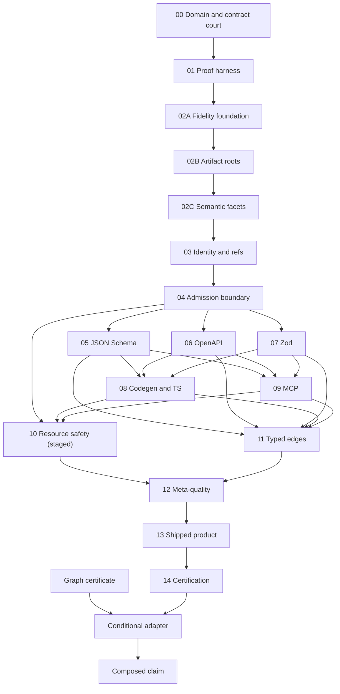
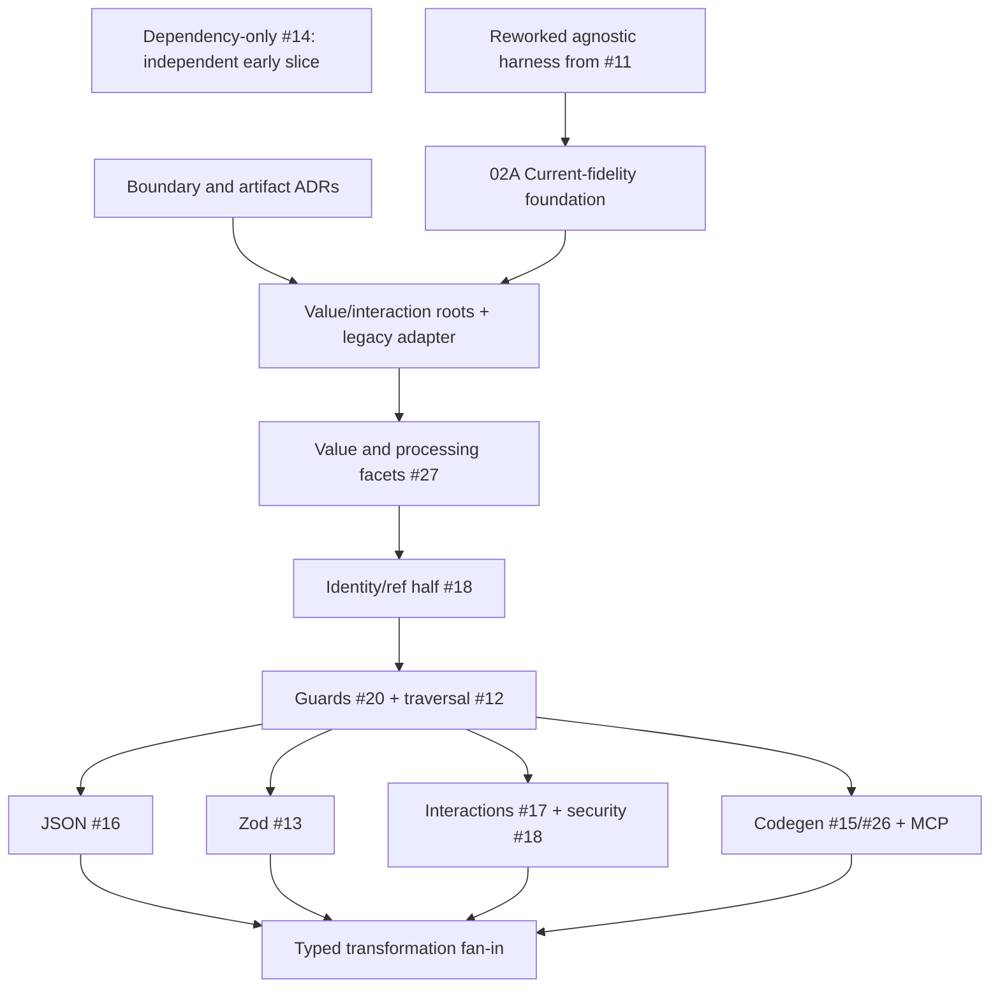

# Castr application-contract completeness and semantic-losslessness proof programme

**Status:** implementation instructions, not a proof certificate
**Revision:** 2 — application-contract and semantic-graph boundary amendment
**Review cut-off:** 21 August 2026
**Castr baseline:** [`main@63a7e675caa438d98df5d36ee4ba4f76ef962d08`](https://github.com/EngraphCode/castr/commit/63a7e675caa438d98df5d36ee4ba4f76ef962d08)
**Canonical OCE baseline:** [`main@1173c1adf252eab2dbe7d95f2494139f51504243`](https://github.com/EngraphCode/oak-open-curriculum-ecosystem/commit/1173c1adf252eab2dbe7d95f2494139f51504243)
**Audience:** the engineers and agents who will repair Castr, review the repairs, and decide whether a release claim is warranted

## Executive verdict

Castr cannot be proved “complete and lossless” by adding more examples to its present round-trip suites. A parser and writer can agree perfectly after the parser has already discarded meaning. Current main demonstrates that failure mode: nested `false` becomes `{}`, OpenAPI security `AND` becomes `OR`, omitted `additionalProperties` becomes `false`, unsupported nested Zod members can disappear, and some generated refinements accept everything.

The two future-direction reports make a further, non-trivial correction: the theorem's **semantic domain** must be bounded as well as its versions. Castr's proposed centre is application value contracts and software interaction contracts. RDF datasets, SHACL graph constraints/processing, JSON-LD graph processing, and graph-to-application projection belong to a sibling graph system and a separate adapter. Castr must not become a universal schema/graph IR.

The defensible theorem is bounded and executable:

> For every construct in Castr's declared, version-pinned **application-value or software-interaction profile**, at every declared semantic position and facet, and on every ratified compatible public transformation edge, Castr either preserves every applicable semantic channel or rejects before producing output with a stable, contextual diagnostic. A separately named governed-widening profile may weaken only declared channels with explicit caller authorisation and a complete machine-readable delta. There are no unclassified, partially handled, silently widened, or silently discarded constructs.

This yields two related claims that must never be conflated:

1. **Completeness of capability decision:** every source feature is either admitted or bounded out-of-scope; every admitted construct/facet obligation on every ratified edge is then classified as exact, exactly encoded, governed widening, or impossible. None is blank or merely unimplemented.
2. **Losslessness:** only exact-native and exact-encoded obligations preserve every selected semantic channel. Governed widening is complete and honest product behaviour, but it is not lossless.

That theorem needs three things before most repairs land:

1. a machine-readable support contract derived from authoritative specifications;
2. independent behavioural oracles at source and target boundaries; and
3. an explicit adjudication of historical Castr compromises so old tests do not turn accidental or undesirable behaviour into the new contract.

The work is organised into 15 independently reviewable Castr-core tranches plus one conditional graph-interoperation tranche owned primarily by the separate adapter. Tranches 00–04 form the foundational spine, but Tranche 00 adopts only the decisions and planning contract needed to activate that spine; it does not demand proofs that later tranches must create. The format, code-generation, MCP, resource, and edge lanes then follow the explicit dependency graph in Section 6 rather than an assumed five-way parallel fan-out. Each product change follows OCE's atomic TDD rule: failing behavioural proof first, minimal product correction, refactor, and a green landing in one commit. No deliberately red proof PR remains open across landings.

No release may carry a complete/lossless claim broader than its current certificate. Castr's currently advertised broad surface remains blocked until the final certification tranche generates a zero-gap proof record on one integrated current-main commit, or until unsupported surfaces are explicitly removed/unadvertised and a narrower profile passes the shipped-product and certification gates. The present 4,124 passing tests and individually green remediation branches are useful evidence, but they are not that record.

## 1. Problem frame and OCE governance

### 1.1 The problem, not the inherited solution

**Observed gap:** Castr's current universal, strict, lossless multi-format framing is both too broad and under-proved. The proposed forward identity narrows it to application value and interaction contracts, while current tests can still remain green after meaning inside that domain has been discarded.

**Who is harmed:** downstream users and generated-code consumers receive contracts weaker, stronger, malformed, or differently shaped from their sources; the most asymmetric cases affect authentication, validation, and trusted code generation.

**Causal mechanism:** the estate relies heavily on Castr-to-Castr round trips, snapshots, token presence, selected fixtures, and hand-maintained policy. These instruments can prove stability or presentation while missing source-versus-target meaning. Historical decisions also rejected or normalised valid constructs for architectural convenience, creating a risk that regression tests will preserve the compromise.

**Constraints:** the supported languages are large, some are executable rather than finite declarative grammars, standards evolve, general schema equivalence is undecidable, different properties require different instruments, and graph-shaped semantic objects cannot be made application-shaped merely because their carriers use JSON or contain constraints.

**Success:** a finite, version-pinned support inventory; independent proof per semantic channel and pair; no unexplained exclusions; correct fail-closed treatment of genuine target impossibility; an integrated, reproducible release certificate; and public claims generated from that evidence.

### 1.2 Canonical OCE sources used

The following files were downloaded from the canonical OCE repository at the pinned commit, read in full, and used to shape this programme:

| Canonical source                                                                                                                                                                | SHA-256 of downloaded file                                         | Consequence for this programme                                                                                                                                   |
| ------------------------------------------------------------------------------------------------------------------------------------------------------------------------------- | ------------------------------------------------------------------ | ---------------------------------------------------------------------------------------------------------------------------------------------------------------- |
| [`principles.md`](https://github.com/EngraphCode/oak-open-curriculum-ecosystem/blob/1173c1adf252eab2dbe7d95f2494139f51504243/.agent/directives/principles.md)                   | `0a2675307e1151b689d7334ccdbe68ae90766dd3819339b4a329cbe398ca8f5b` | Strict and complete; remove proven-wrong ideas; every issue earns the correct kind of check; use the property's real machinery.                                  |
| [`testing-strategy.md`](https://github.com/EngraphCode/oak-open-curriculum-ecosystem/blob/1173c1adf252eab2dbe7d95f2494139f51504243/.agent/directives/testing-strategy.md)       | `7571998b16dbfe993e425662d40fe28e05b66d8b9ee08d0ae208c36f9e92cf11` | Tests prove runtime behaviour, never configuration/content/types; no skips, conditional tests, ambient state, in-process spawning, or gated wall-clock ceilings. |
| [`validation-strategy.md`](https://github.com/EngraphCode/oak-open-curriculum-ecosystem/blob/1173c1adf252eab2dbe7d95f2494139f51504243/.agent/directives/validation-strategy.md) | `23929856e0d75f0c7aaa8e14251b5031f0394c72ca5daa2ffeae5b5f199fa729` | Test, evaluate, and assure are different; a green check proves only its exercised path; the subject dictates the instrument.                                     |

The canonical OCE [`plan`](https://github.com/EngraphCode/oak-open-curriculum-ecosystem/blob/1173c1adf252eab2dbe7d95f2494139f51504243/.agent/skills/plan/SKILL-CANONICAL.md), [`reason`](https://github.com/EngraphCode/oak-open-curriculum-ecosystem/blob/1173c1adf252eab2dbe7d95f2494139f51504243/.agent/skills/cognition/reason/SKILL-CANONICAL.md), [`metacognition`](https://github.com/EngraphCode/oak-open-curriculum-ecosystem/blob/1173c1adf252eab2dbe7d95f2494139f51504243/.agent/skills/cognition/metacognition/SKILL-CANONICAL.md), [`concept-exploration`](https://github.com/EngraphCode/oak-open-curriculum-ecosystem/blob/1173c1adf252eab2dbe7d95f2494139f51504243/.agent/skills/cognition/concept-exploration/SKILL-CANONICAL.md), and [`proportionality`](https://github.com/EngraphCode/oak-open-curriculum-ecosystem/blob/1173c1adf252eab2dbe7d95f2494139f51504243/.agent/skills/cognition/proportionality/SKILL-CANONICAL.md) skills supplied the framing, warrant/falsifier discipline, tranche sizing, and disposition ledger.

### 1.3 Metacognitive correction made during this work

The inherited request shape was “a full set of proofs, expressed in Vitest.” Canonical OCE changes that shape in an important way: **Vitest is the right instrument for deterministic runtime logic, not for every property in an assurance case.** Forcing compiler types, dependency architecture, packed-artifact viability, official protocol execution, licensing, or prose quality into Vitest would violate the user's stated principle.

This report therefore gives exhaustive Vitest instructions for runtime behaviour and names the correctly typed companion gates:

- TypeScript compiler projects for compile-time contracts;
- ESLint/dependency-cruiser/Knip for structural and dependency rules;
- Stryker for mutation adequacy;
- official conformance runners for their own protocols;
- smoke tests for packed and built artefacts;
- benchmarks for performance observations, never wall-clock assertions in gated tests;
- security review and dedicated scanners for security assurance;
- human review for normative interpretation, content quality, licence, and product-claim adjudication.

The certification command composes these gates. It does not disguise them as Vitest tests.

### 1.4 Architectural-boundary inputs and decision posture

Two strategic reports supplied after Revision 1 were read in full:

| Input                                                      | SHA-256                                                            | Material consequence                                                                                                                                                                       |
| ---------------------------------------------------------- | ------------------------------------------------------------------ | ------------------------------------------------------------------------------------------------------------------------------------------------------------------------------------------ |
| _Castr future direction: an application-contract compiler_ | `1f7b0302b2f35792423c52102b9ced5494b2f93c9b4a58daf6d489237ec1892f` | Narrows Castr to application values and software interactions; introduces discriminated artifact roots, explicit runtime-processing facets, governed widening, and typed format admission. |
| _Future direction for the semantic-graph contract system_  | `d6b3d42dc7128668a0b8f80ff44f76910cd0651778f3429f086a2c9db775dc14` | Assigns RDF/SHACL/JSON-LD semantics to a sibling system; makes cross-domain projection an explicit adapter concern with separately composed evidence.                                      |

Both inputs are strategic proposals, not adopted ADRs. This programme uses them as the forward design target because they resolve the universal-IR problem, but Tranche 00 must still ratify, amend, or reject that target. Until then the product domain is unresolved and certification remains blocked.

The proposed ownership boundary is:

| Class                                                       | Castr status                                                        | Proof owner                              |
| ----------------------------------------------------------- | ------------------------------------------------------------------- | ---------------------------------------- |
| JSON Schema and Zod application-value contracts             | Native value artifacts                                              | Castr                                    |
| TypeScript structural types                                 | Explicit value-facet projection/code target                         | Castr                                    |
| OpenAPI and MCP tool interactions                           | Native interaction artifacts containing/referencing value contracts | Castr                                    |
| Documentation                                               | Derived descriptive rendering, not a reversible semantic peer       | Castr shipped-product assurance          |
| RDF datasets, SHACL, RDF syntaxes, JSON-LD graph processing | Outside Castr's native domain                                       | Semantic-graph system                    |
| Graph ↔ application mapping                                 | Versioned projection contract and adapter                           | Separate integration package/application |

The recommended product statement to be ratified is:

> **Castr compiles application value and interaction contracts between compatible representations without silently changing their meaning.**

## 2. What “complete” and “lossless” must mean

### 2.1 Version-pinned, bounded theorem

Let:

- `R` be a ratified Castr product profile and artifact-schema version;
- `A` be one of Castr's native artifact kinds: `value-contract` or `interaction-contract`;
- `F` be the declared semantic facet: accepted input, produced output, ordered processing, annotations, or interaction semantics;
- `D_s` be the declared finite inventory of syntax/semantic obligations for source language and version `s`;
- `P_s` be Castr's parser into IR;
- `W_t` be the writer for target `t`;
- `V_s` and `V_t` be independent source and target semantic oracles;
- `C(R, A, F, s, feature, position, t)` be the declared target-profile disposition.

For every declared valid in-domain source `d` and every applicable distinguishing witness `x`, a claimed exact pair must establish:

\[
V_s(d, x) = V_t(W_t(P_s(d)), x)
\]

and separately preserve every non-validation semantic channel that applies. For a genuinely impossible mapping, `W_t` must reject during whole-artifact preflight, before rendering or mutation, with the declared diagnostic.

The theorem has four independently reported parts:

1. **Source completeness:** every valid feature in an advertised source profile enters the correct artifact kind and facet without loss.
2. **IR losslessness:** persistence preserves every selected facet, relationship, distinction, and artifact-schema version.
3. **Representation completeness:** every declared compatible target edge preserves, exactly encodes, governs a visible widening, or rejects each applicable feature.
4. **Projection honesty:** every explicit facet selection, interaction/tool projection, migration, rendering, or cross-domain projection reports what it selects, weakens, omits, or cannot map.

A graph-to-target claim begins outside this theorem. Castr's local proof begins at a versioned projected application-value artifact. End-to-end graph claims require the independent certificate composition in the conditional interoperation tranche.

No finite suite proves correctness for all future standards, all JavaScript programs, all regular expressions, or all unbounded recursive schema/document-reference graphs. The release claim must always name:

- exact source grammars and versions;
- exact target versions and output profiles;
- native semantic domain, product profile, artifact kind/schema version, and transformation-edge role;
- semantic facets and channels included;
- platform/toolchain matrix;
- official corpus revisions;
- bounded exhaustive limits and property-test seeds;
- explicit source-admission exclusions and target-impossibility cases.

### 2.2 Semantic channels

“Validation equivalence” is only one dimension. Every obligation declares all channels it carries.

| Channel             | Preservation obligation                                                                                                              |
| ------------------- | ------------------------------------------------------------------------------------------------------------------------------------ |
| Artifact kind       | Value and interaction artifacts cannot be confused, fabricated, or converted implicitly.                                             |
| Accepted input      | Complete admitted-input language, including presence, coercion and preprocessing where claimed.                                      |
| Produced output     | Successful runtime value and structure, independently of the accepted input domain.                                                  |
| Runtime processing  | Ordered coercion, preprocessing, defaults, catches, refinements, transforms, codecs, sync/async behaviour, and declared effects.     |
| Validation language | Same admitted and rejected instance set for the distinguishing domain.                                                               |
| Parsed value        | Same successful value after defaults, coercion, stripping, passthrough, transforms, catches, codecs, or preprocessors where claimed. |
| Presence            | Required, optional, omitted, `undefined`, `null`, empty, zero, and explicit `false` distinctions.                                    |
| Identity            | Wire keys, component identities, enum identities, anchors, and generated symbols remain correctly related.                           |
| References          | Target, base URI, pointer escaping, recursion, anchors, and dynamic scope.                                                           |
| Annotation          | Title, description, examples, default, deprecated, read/write flags, XML, external docs, and extensions.                             |
| API operation       | Paths, methods, parameters, serialization, content, responses, links, callbacks, webhooks, servers, and tags.                        |
| Security            | Exact Boolean formula, inheritance, overrides, schemes, and scopes.                                                                  |
| Artifact            | Files, paths, imports, exports, manifest relationships, ordering policy, atomicity, and shipped-form viability.                      |
| Diagnostic          | Stable code, source dialect, target, construct, source/IR path, cause chain, and repair guidance.                                    |
| Resource policy     | Scheme/host/root rules and byte, node, depth, ref, redirect, deadline, output, and diagnostic budgets.                               |
| Projection evidence | Selected profile/policy, exact/widen/reject outcome, complete findings, provenance, and any location-mapping reference.              |

`Validation language` and `parsed value` are observable views of the accepted-input, produced-output, and processing facets; they do not replace those facets. Concrete syntax—formatting, comments, lexical spelling, and source ordering—is outside semantic losslessness unless a separately named concrete-syntax profile explicitly includes it.

### 2.3 Target dispositions

Source admission and target capability are different decisions. Every authoritative source feature first receives exactly one source-admission status:

- `admitted`: part of the advertised, bounded source grammar and therefore carried into the appropriate artifact/facets; or
- `out-of-scope`: outside that grammar and rejected by the source boundary with a stable diagnostic.

Only an admitted feature can generate a transformation obligation. Every obligation reachable through a ratified directed edge—source construct × semantic position × selected facet/channel × target profile—then receives exactly one target status:

- `exact-native`: target expresses the meaning directly;
- `exact-encoded`: a documented encoding/helper/sidecar preserves the same declared meaning and is behaviourally proved;
- `governed-widening`: a separately named, caller-authorised projection profile weakens declared channels and returns a complete machine-readable delta;
- `impossible`: the target language cannot carry it; conversion rejects atomically.

`unimplemented` may exist only in planning state. It blocks the associated support claim and release. `partial`, `mostly`, `best effort`, silent widening, warning-and-continue, placeholder validators, and blank obligations are forbidden in every advertised profile.

`governed-widening` never discharges a lossless certificate. In the default exact profile it behaves as rejection. A separately named projection certificate may include it only with explicit authorisation and proof of the declared relation/delta. TypeScript and MCP particularly need honest projection boundaries: a TypeScript type cannot express most runtime JSON Schema assertions, and an MCP tool projection is not a lossless representation of an entire OpenAPI interaction document.

Before construct-level dispositions, every format or surface has one domain role:

- `native-value`: a representation of application-value artifacts;
- `native-interaction`: a representation of software-interaction artifacts;
- `explicit-projection`: a directed, facet-selecting or weaker view;
- `descriptive-rendering`: human-facing output with no reversibility claim;
- `adjacent-domain`: handled only through a separately certified adapter;
- `not-admitted`: no public Castr edge.

`out-of-scope` is a source-admission status, never a target-edge disposition. It means a feature outside an advertised source grammar. It is not a label for an entire different semantic domain. RDF/SHACL/JSON-LD graph semantics are `adjacent-domain`, not difficult Castr features and not target impossibilities.

### 2.4 Proof criterion per obligation

An exact/encoded obligation is discharged only when all applicable items pass:

1. **Admission:** every declared valid syntax form at the declared position is accepted into the correct artifact kind and semantic facets.
2. **Invalid rejection:** invalid forms are rejected by the owning input boundary.
3. **Separation:** source forms with different meaning remain distinguishable in IR.
4. **IR carriage:** persistence preserves the complete accepted-input, produced-output, processing, annotation/interaction value, identity, artifact version, and non-semantic provenance distinctions.
5. **Writer totality:** every representable IR value produces a valid target.
6. **Semantic parity:** source and target independent oracles agree on separating witnesses.
7. **Facet parity:** accepted-input outcomes, successful produced values, and ordered runtime processing agree where the language transforms values.
8. **Channel parity:** independent extractors agree for artifact kind, identity, references, annotations, operations, security, artifacts, and any applicable projection evidence.
9. **Idempotence:** the declared canonical output stabilises after one pass.
10. **Determinism:** the same semantic input, explicit options, and pinned toolchain produce identical artifacts.
11. **Fail-closed behaviour:** an unrepresentable child or incompatible artifact kind fails the complete artifact with no partial output.
12. **Mutation bite:** a seeded mutation to the wrong semantic behaviour makes the owning proof fail.

IR equality is useful as a secondary invariant. It is never the sole semantic oracle.

### 2.5 Proof criterion for governed widening

A governed-widening obligation is discharged only when all applicable items pass:

1. the caller explicitly selects the named projection/widening policy;
2. the exact/lossless profile rejects the same input atomically;
3. the target artifact is valid and every unaffected channel remains exact;
4. the relation is the declared widening, not an arbitrary semantic difference or narrowing;
5. every weakened, selected, or omitted channel/feature appears once in a structured finding with source path and policy;
6. at least one distinguishing witness demonstrates the widening, while source-valid witnesses remain valid under the declared comparable channel;
7. provenance cannot be used by a later writer to reconstruct missing meaning and relabel the result exact;
8. output, findings, and ordering are deterministic; and
9. CLI/API/docs/certificate call the result a projection or widening, never lossless.

Facet projection is explicit too. For example, `typescript-accepted-input-structural` and `typescript-produced-output-structural` are different target profiles. Selecting one facet does not prove the full value contract, and a produced-output type is not a substitute for accepted-input or processing semantics.

## 3. Historical-compromise challenge gate

### 3.1 Rule

Existing behaviour, characterisation tests, snapshots, branch assertions, allowlists, exclusions, normal forms, and dependency limitations are **hypotheses**. None becomes the forward contract unless it passes this gate. Accepted ADRs remain authoritative until explicitly amended or superseded; Tranche 00 may challenge them, but must record a retain/amend/supersede disposition and no implementation may contradict them first.

1. Name the observable behaviour, not the implementation or configuration that currently produces it.
2. Identify provenance: normative specification, deliberate user-value decision, dependency limitation, temporary implementation gap, or accident.
3. State the warrant and a falsifier.
4. Produce a minimal pair and distinguishing witness.
5. Ask first whether the semantic object belongs to Castr's ratified domain; decide ownership from meaning, not carrier syntax, the word “schema,” or implementation difficulty.
6. For an in-domain construct, ask whether the target can represent it by any semantically honest mechanism.
7. Classify source admission first. For admitted features, classify each ratified edge exact-native, exact-encoded, governed-widening, or impossible. “Not implemented” is not “impossible,” and widening is not exact.
8. Use the correct instrument to demonstrate the claimed outcome.
9. Record the adjudication in the support contract and decision record.
10. Delete or rewrite any old test that constrains the rejected compromise.

No characterisation test is promoted directly to an acceptance proof. It may protect a refactor temporarily; normative/user-value adjudication decides whether its behaviour survives.

### 3.2 Mandatory challenge register

These inherited decisions are already suspect and must be decided in Tranche 00 before their affected branches land.

| Inherited behaviour/policy                                                       | Why it is suspect                                                                                                                                                                                             | Recommended first-principles disposition                                                                                                                                                                    |
| -------------------------------------------------------------------------------- | ------------------------------------------------------------------------------------------------------------------------------------------------------------------------------------------------------------- | ----------------------------------------------------------------------------------------------------------------------------------------------------------------------------------------------------------- |
| Reject all non-strict objects and remove unknown-key semantics from IR           | Valid JSON Schema/OpenAPI/Zod inputs include absent/true/schema-valued additional properties, passthrough, catchall, and unevaluated semantics. It contradicts “all valid source features parse into the IR.” | Restore distinct input-acceptance, output-retention/stripping, catchall-validation, and unevaluated semantics to the application-value IR. Target writers may reject only genuinely impossible mappings.    |
| Omitted `additionalProperties` becomes `false`                                   | Omission and `false` have different validation behaviour.                                                                                                                                                     | Preserve syntactic presence separately from value; prove omitted/true/false/schema-valued forms.                                                                                                            |
| Every OpenAPI input is automatically upgraded/stamped `3.2.0`                    | Version migration can change dialect and keyword semantics; direct `buildIR()` currently stamps without the canonical loader.                                                                                 | Make lossless same-version parse/write the default. Make upgrade an explicit, separately proved transformation with a rule-by-rule migration contract.                                                      |
| Draft-07 is silently normalised to 2020-12                                       | `$ref` siblings, identifiers, tuples, dependencies, exclusives, vocabularies, and defaults differ.                                                                                                            | Carry dialect/version in IR; use dialect-specific parsing/writing/oracles. Any migration is explicit.                                                                                                       |
| Strict-object output is universally preferable                                   | Product preference cannot overwrite source meaning in a lossless compiler.                                                                                                                                    | Preserve source semantics; offer strict projection only as an explicit profile with a loss report or rejection.                                                                                             |
| Custom/opaque carriers are categorically forbidden                               | That may prevent same-format extension fidelity or reversible cross-format carriage.                                                                                                                          | Preserve `x-*` and unknown normative extensions in typed opaque bags. Distinguish native semantic equivalence from opaque round-trip preservation; never claim opaque data affects unaware target runtimes. |
| All Zod `.catchall()` input is rejected                                          | Zod and IR can represent many catchalls; PR #27 demonstrates a broader path.                                                                                                                                  | Support representable catchalls; model strip/passthrough/catchall and parsed values separately. Reject only dynamic/unbounded forms outside the declared static grammar.                                    |
| `.email()`, `.uuid()`, `.int()`, `.or()`, `.and()`, `.array()` are “unsupported” | Several are directly or semantically representable.                                                                                                                                                           | Reclassify as implementation work and prove actual Zod runtime behaviour.                                                                                                                                   |
| `x-*` entries are skipped while iterating OpenAPI structures                     | OpenAPI explicitly allows extensions; skipping violates same-format losslessness.                                                                                                                             | Preserve at every legal object level with key safety and stable provenance.                                                                                                                                 |
| One “primary success” response represents an operation                           | Selection is a target view, not lossless operation storage; `default`-only operations are valid.                                                                                                              | IR retains every response/status/media/header/link. Each target projection has an explicit, behaviourally proved selection or rejection rule.                                                               |
| Primitive MCP output is wrapped in `{ value }`                                   | Current MCP permits arbitrary JSON output; wrapping changes wire shape.                                                                                                                                       | Preserve the source output root. Use the dated protocol spec/schema as authority.                                                                                                                           |
| MCP Draft-07 keyword allowlist                                                   | MCP 2026-07-28 defaults to JSON Schema 2020-12.                                                                                                                                                               | Remove the obsolete allowlist; carry/validate the correct dialect.                                                                                                                                          |
| MCP SDK object-only output is authoritative                                      | Locked SDK 1.29.0 lags the 2026-07-28 protocol and constrains output/structured content to objects.                                                                                                           | Protocol spec and official dated schema govern; SDK is only a secondary compatibility oracle. Include array and primitive outputs.                                                                          |
| TypeScript output is called lossless for all schema constraints                  | Static types cannot express most runtime assertions.                                                                                                                                                          | Define a structural projection contract, or fail in a lossless profile when a semantic channel cannot be carried.                                                                                           |
| `int64 → bigint` or `int64 → reject` is universal truth                          | This is target/profile policy; JSON Schema annotations and JS number/bigint runtime semantics differ.                                                                                                         | Decide per directed edge and channel with witnesses; never put target policy into shared application-contract IR truth.                                                                                     |
| Non-built-in template paths are accepted but ignored                             | A successful option that has no effect is dishonest behaviour.                                                                                                                                                | Implement the public extension seam or reject the option at the boundary. Do not test the list of built-ins; test the observable result.                                                                    |
| Scalar `x-ext` hash paths can replace external identity                          | Bundler paths are a dependency mechanism, not source identity.                                                                                                                                                | Preserve source base URI and wire identity separately; prove bundled/unbundled schema/document-reference equivalence.                                                                                       |
| Generated-code token/snapshot presence proves correctness                        | Placebo `.refine()` functions and invalid literals pass this style of proof.                                                                                                                                  | Compile with the TypeScript machinery and execute generated validators against positive/negative witnesses.                                                                                                 |
| Existing official-suite exclusions can be inherited                              | Optional/pending/non-scored often describes suite maturity, not an acceptable Castr gap.                                                                                                                      | Every excluded case gets an explicit adjudication; Castr challenge cases may intentionally exceed the upstream scoring set.                                                                                 |
| Every language called a schema belongs to one Castr semantic domain              | Application values, software interactions, RDF graphs, relational schemas, policies, and theorem languages describe different semantic objects.                                                               | Ratify the application-value/interaction boundary. Admit formats by semantic-object fit; keep graph semantics in the sibling system.                                                                        |
| `CastrDocument` is the universal canonical root                                  | It can force standalone JSON Schema/Zod values to carry fabricated OpenAPI identity and mix values with interactions.                                                                                         | Replace canonical truth with versioned `value-contract` and `interaction-contract` roots. Retain `CastrDocument` only behind an explicit compatibility/migration adapter.                                   |
| Accepted input, produced output, and runtime processing are one schema node      | Zod coercion, defaults, catches, transforms, codecs, async work, and effects can change successful output independently of accepted input.                                                                    | Model and persist the three facets separately; prove their observable relations and ordered processing.                                                                                                     |
| Retained Zod source chains or renderer strings are sufficient semantic truth     | Source-shaped strings can be incomplete, target-specific, non-executable, or used to recover meaning discarded by the IR.                                                                                     | Parse supported runtime semantics into typed processing steps. Source syntax is diagnostic provenance only and writers never use it as hidden truth.                                                        |
| Current exports and CLI modes define the desired product                         | The shipped surface contains historical accidents, missing surfaces, and pre-boundary architecture.                                                                                                           | Product charter and ADRs choose the desired surface. Classify each current surface retain/adapt/deprecate/internalise/remove, then prove the ratified result.                                               |
| Every format participates in a Cartesian source-target matrix                    | Value representations, interactions, static projections, tool projections, migrations, and documentation are not reversible peers.                                                                            | Use a typed directed transformation graph. No edge is valid unless its semantic role and selected facets are explicit.                                                                                      |
| Documentation is a reversible semantic target                                    | Documentation describes contracts but generally cannot carry their executable semantics.                                                                                                                      | Treat it as descriptive rendering with executable examples and claim-truth assurance, never a lossless round-trip peer.                                                                                     |
| Governed widening may appear under a lossless claim                              | Caller-authorised weakening is useful but the target accepts or guarantees something different.                                                                                                               | Separate exact and projection certificates; zero widening rows are permitted in a lossless certificate.                                                                                                     |
| RDF/SHACL or JSON-LD can be added because they use constraints or JSON           | Their native object is an identity-bearing graph/dataset with graph paths, sharing, cycles, context expansion, and neighbourhood constraints.                                                                 | Keep RDF, SHACL, JSON-LD processing, RDFS/OWL, and SPARQL graph-side. Castr starts only at an explicit projected application contract.                                                                      |
| Graph semantics can survive in an opaque Castr metadata bag                      | Opaque carriage does not give Castr graph execution semantics and recreates a universal IR escape hatch.                                                                                                      | Permit scoped same-family `x-*`/unknown-extension carriage only. Foreign graph semantics cross through a versioned public projection protocol, never an internal bag.                                       |
| Property names/schema shape can imply a graph projection                         | Roots, IRIs, blank nodes, multiplicity, lists/order, language, shared nodes/cycles, absence, openness, entailment, and location mapping are not inferable safely.                                             | Require an explicit projection contract; ambiguity, unmapped data, or missing reverse mapping is reported or rejected.                                                                                      |
| The two cores should share a universal artifact union or format registry         | Premature sharing couples releases and recreates the same semantic-category error at package level.                                                                                                           | Keep cores independent and let a separate adapter depend on both public APIs. Extract shared code only after two stable implementations demonstrate the abstraction.                                        |
| A locally exact Castr step proves an end-to-end graph conversion                 | The graph-to-application projection may already have widened, selected, or lost meaning before Castr receives its input.                                                                                      | Require separately linked graph, projection-adapter, and Castr certificates; only an exact projection can compose into a lossless end-to-end claim.                                                         |

## 4. Correct instrument for each property

### 4.1 Instrument map

| Property                           | Owning instrument                                                                                         | Role in this programme                                                                                                                                            |
| ---------------------------------- | --------------------------------------------------------------------------------------------------------- | ----------------------------------------------------------------------------------------------------------------------------------------------------------------- |
| Pure runtime transformation        | Vitest unit test                                                                                          | Import one pure public/owning function; literal inputs/outputs; no mocks or I/O.                                                                                  |
| Composition of runtime units       | Vitest integration test                                                                                   | Import the integration point; inject only simple branch-free fakes; no external I/O or process spawn.                                                             |
| Running stdio/HTTP protocol system | E2E harness at the actual boundary                                                                        | Drive a separately running system only if Castr actually ships one; use MCP client SDK for transport, not internal registration objects.                          |
| Generated Zod runtime behaviour    | Vitest integration test using a safe in-process module runner, or smoke harness for built modules         | Compare original and generated `safeParse` success and parsed values; never inspect only emitted tokens.                                                          |
| TypeScript syntax/types            | `tsc`/TypeScript compiler project                                                                         | Positive and negative consumer fixtures under the locked compiler; this is not a Vitest type test.                                                                |
| Source syntax/style                | TypeScript parser, ESLint, Prettier                                                                       | Compiler/parser owns syntax; ESLint owns rules; Prettier is presentation and a secondary parse signal only.                                                       |
| Module/dependency architecture     | dependency-cruiser, ESLint boundaries, Knip, package manager                                              | Resolve the actual dependency graph; never grep import strings or assert manifest bytes in Vitest.                                                                |
| JSON Schema semantics              | Dialect-correct AJV plus official JSON Schema Test Suite, driven by deterministic Castr integration tests | Validate source and target against the same instances using independent validators.                                                                               |
| OpenAPI structure                  | Official dated OpenAPI schemas                                                                            | Validate both source and output; supplement with clause-linked behavioural cases because schemas are non-normative and incomplete.                                |
| MCP protocol conformance           | Official dated schema and official conformance runner                                                     | Run named scored and challenge scenarios separately; do not wrap runner maturity into a false full-conformance claim.                                             |
| Mutation adequacy                  | Stryker plus required seeded semantic mutants                                                             | Audits whether the behavioural estate detects wrong product behaviour. Coverage percentage is secondary.                                                          |
| Packed/built artifact viability    | Smoke tests on the `pnpm --dir lib pack` tarball and built CLI                                            | Clean consumer, plain Node, no source loader; smoke runner may perform the required I/O.                                                                          |
| Resource correctness               | Vitest with injected counters/clock/cancellation and simple fakes                                         | Assert below/exact/over logical budgets; never gate on elapsed milliseconds.                                                                                      |
| Performance                        | Benchmark/reporting tool                                                                                  | On-demand or observed trend; no finite wall-clock ceiling in gated tests.                                                                                         |
| URL/file security                  | Behavioural policy tests plus security review/scanners                                                    | Fake resolver proves Castr decisions; scanner/review covers broader attack surface. No live internet in deterministic CI tests.                                   |
| RDF/SHACL/JSON-LD semantics        | Sibling graph repository's W3C suites, differential engines, graph canonicalisation, and security gates   | Never count these as Castr-native conformance or imitate them with Castr Vitest.                                                                                  |
| Graph ↔ application projection     | Separate adapter integration/conformance estate plus graph and Castr certificates                         | Prove public composition, mapping outcomes, identity/location fidelity, and certificate linkage outside either core.                                              |
| Cross-core dependency direction    | dependency-cruiser/ESLint/Knip plus architectural review                                                  | Prove the adapter imports only the public APIs of both cores; neither core imports the adapter or its sibling. Do not scan imports in Vitest or share private IR. |
| Docs examples                      | Compile/run the examples through their real public package surface                                        | Do not grep prose or pin content. Human review owns wording truth.                                                                                                |
| Licence/provenance/claims          | SBOM/licence tooling, release workflow, human review                                                      | Not a runtime Vitest property. Registry availability is a release smoke observation.                                                                              |

### 4.2 Prohibited proof proxies

- A second-pass round trip is not proof of first-pass source preservation.
- A Castr-generated normal form is not an independent oracle.
- Snapshot equality proves stable presentation, not semantics.
- `.toContain('.refine(')` does not prove the refinement rejects anything.
- Key/count equality does not prove values, references, grouping, or annotations.
- A test that reads `package.json`, a Vitest config, `.agent/`, or a support document to pin bytes/keys is testing configuration/content, not product behaviour.
- A source hash is provenance evidence, not behavioural proof.
- Coverage percentage is routing information, not completeness.
- `expectTypeOf` or a runtime assertion on a TypeScript type is the wrong instrument.
- Spawning `tsc`, ESLint, a package manager, or a conformance CLI from an in-process Vitest test violates the OCE test boundary. Invoke the real gate separately.
- A wall-clock threshold is nondeterministic. Use logical budgets in tests and a benchmark for performance.
- A skipped, conditional, early-returning, missing-fixture, warning-only, or “lint unavailable” case is no proof. Castr regressions are fixed, not quarantined.
- An official suite's own pending/non-scored classification is not permission to omit a Castr challenge case.

## 5. Executable support contract and proof estate

### 5.1 Contract shape

Create one generated/typed support contract. It is product policy and drives behaviour; it is not a prose/config checklist.

```ts
interface SourceFeatureObligationBase {
  readonly id: string;
  readonly productProfile: ProductProfileId;
  readonly artifactKind: 'value-contract' | 'interaction-contract';
  readonly artifactSchemaVersion: string;
  readonly facets: readonly (
    'accepted-input' | 'produced-output' | 'processing' | 'annotations' | 'interaction'
  )[];
  readonly source: {
    readonly language: SourceLanguage;
    readonly version: string;
    readonly profile: string;
    readonly construct: string;
    readonly syntaxForms: readonly string[];
    readonly positions: readonly SemanticPosition[];
    readonly specification: URL;
  };
  readonly channels: readonly SemanticChannel[];
  readonly publicEntrypoints: readonly PublicEntrypoint[];
  readonly witnesses: readonly WitnessId[];
  readonly sourceOracle: OracleId;
  readonly historicalDecision?: DecisionId;
}

export type ProofObligation =
  | (SourceFeatureObligationBase & {
      readonly sourceAdmission: {
        readonly kind: 'out-of-scope';
        readonly diagnostic: DiagnosticCode;
        readonly proof: ProofId;
      };
      readonly irCarrier?: never;
      readonly edges?: never;
    })
  | (SourceFeatureObligationBase & {
      readonly sourceAdmission: {
        readonly kind: 'admitted';
        readonly proof: ProofId;
      };
      readonly irCarrier: IrCarrierId;
      readonly edges: readonly TransformationEdgeObligation[];
    });

export interface TransformationEdgeObligation {
  readonly id: EdgeId;
  readonly target: TargetProfileId;
  readonly targetArtifactKind: ArtifactKind;
  readonly selectedFacets: readonly SemanticFacet[];
  readonly channels: readonly SemanticChannel[];
  readonly role:
    'native-representation' | 'explicit-projection' | 'descriptive-rendering' | 'migration';
  readonly projectionBoundary?: BoundaryContractId;
  readonly disposition: TargetDisposition;
}

export type TargetDisposition =
  | { readonly kind: 'exact-native'; readonly proof: ProofId }
  | {
      readonly kind: 'exact-encoded';
      readonly proof: ProofId;
      readonly encoding: EncodingId;
    }
  | {
      readonly kind: 'governed-widening';
      readonly policy: ProjectionPolicyId;
      readonly proof: ProofId;
      readonly findings: FindingContractId;
    }
  | { readonly kind: 'impossible'; readonly diagnostic: DiagnosticCode };
```

Tranche 00 also needs an explicit, non-certifying planning state so inventory closure does not depend on proofs that the later tranches have not built yet:

```ts
export interface PlannedObligation {
  readonly id: string;
  readonly authoritativeInventoryKey: string;
  readonly status: 'planned';
  readonly ownerTranche: `0${1 | 2 | 3 | 4 | 5 | 6 | 7 | 8 | 9}` | `${10 | 11 | 12 | 13}`;
  readonly unresolvedFields: readonly string[];
  readonly requiredDecision?: DecisionId;
  readonly blocksCertification: true;
}

export type ProgrammeObligation = PlannedObligation | ProofObligation;
```

`planned` is an inventory-accounting state, never a semantic disposition and never evidence. Tranche 00 may close with planned rows only when every row names its owning tranche and unresolved fields. Each format/cross-cutting tranche replaces its planned rows with fully classified, executable obligations. Tranche 14 and every release certificate reject any remaining planned row.

Keep one logical support contract, but do not assume one monolithic compiled TypeScript type graph. Pilot one source profile first; prefer bounded per-source and per-edge manifests with a standalone generator/validator and certificate aggregator. This avoids repeating the declaration-bundler failure mode recorded in ADR-037 while preserving global inventory closure.

Do not hand-maintain a list that can omit an unknown feature undetected. Derive inventories where possible:

- JSON Schema vocabularies/metaschemas and official suite directories;
- fixed fields and object inventories from the exact official OpenAPI schemas, with a reviewed normative overlay;
- the dated MCP schema/spec;
- the ratified product charter, artifact ADRs, and profile registry;
- the desired public package/API/CLI surface derived from those profiles;
- current package exports, CLI modes, writers, and templates as migration evidence to classify retain/adapt/deprecate/internalise/remove—not as authority that chooses the product;
- a deliberately bounded, published Zod AST grammar. “Zod 4 source” cannot honestly mean arbitrary executable TypeScript.

Do not add RDF, SHACL, RDFS/OWL, SPARQL, or JSON-LD graph-processing constructs to Castr's source inventory. If a public integration exists, Castr's first source obligation is the versioned projected application-value artifact; graph and projection obligations remain in their owning certificates.

The contract's runtime proof driver must execute the observable behaviour named by each resolved row. A test asserting only that a row or proof ID exists would merely pin configuration. Contract completeness is also reported by a standalone generator/validator: planning mode fails when an official inventory item has neither a resolved obligation nor an explicit planned row; certification mode additionally fails every planned row.

### 5.2 Suggested estate layout

Keep unit and integration tests beside their owning code, as canonical OCE requires. Reuse existing Castr proof estates rather than creating a second taxonomy.

```text
lib/src/contracts/
  semantic-channels.ts
  source-grammars.ts
  target-capabilities.ts
  proof-obligations.generated.ts

lib/src/**/
  *.unit.test.ts
  *.integration.test.ts

lib/tests-transforms/
  conformance/
  semantic-parity/
  transformation-graph/

lib/tests-generated/
  runtime-behaviour/

lib/tests-e2e/
  *.test.ts
  packed-package/
  cli/

lib/tests-fixtures/upstream/
  manifest.json
  <corpus>/<pinned-revision>/...

lib/tests-fixtures/compiler/
  positive/
  negative/
  tsconfig.json
```

Use one shared semantic-outcome library and keep it simple. It may expose dialect-correct validator adapters, witness loaders, spec-aware channel extractors, deterministic finite enumerators, and safe generated-module evaluation. It must not import Castr's IR helpers to decide expected meaning.

### 5.3 Anti-vacuity contract for every runtime proof

Each semantic case must demonstrate:

- the source was admitted to the expected artifact kind/facets under the named profile;
- the source oracle accepts/compiles the source;
- the source oracle distinguishes the witness pair;
- the public/owning Castr seam produced the target;
- the target oracle accepts/imports the target;
- at least one accepting and one rejecting witness run for assertion constructs;
- parsed values are compared when the language transforms values;
- ordered processing/effect outcomes are compared where claimed, and a widening case proves its policy/findings rather than using exact equality;
- every expected schema/export/payload exists;
- zero parse diagnostics before downstream assertions;
- no case was skipped, returned early, or downgraded because a harness dependency was absent.

```ts
it.each(SEMANTIC_CASES)(
  '[$id] preserves observable source behaviour',
  async ({ source, witnesses, sourceOracle, transform, targetOracle }) => {
    const before = await sourceOracle(source);
    const artifact = await transform(source);
    const after = await targetOracle(artifact);

    expect(witnesses.accepted.length).toBeGreaterThan(0);
    expect(witnesses.rejected.length).toBeGreaterThan(0);

    for (const witness of [...witnesses.accepted, ...witnesses.rejected]) {
      const sourceOutcome = await before(witness);
      const targetOutcome = await after(witness);
      expect(targetOutcome.accepted).toBe(sourceOutcome.accepted);
      if (sourceOutcome.accepted && targetOutcome.accepted) {
        expect(targetOutcome.value).toEqual(sourceOutcome.value);
      }
    }
  },
);
```

This exact-equality pattern is for runtime behaviour on exact edges. Compiler-type fixtures, governed-widening relation cases, packed-artifact smoke, and official runner execution remain separately typed gates/cases.

## 6. Tranche dependency model



Every tranche is independently reviewable and leaves main green. A tranche may depend only on landed predecessors, never on another open remediation branch. JSON Schema, OpenAPI, and Zod lanes may proceed in parallel after Tranche 04. General code generation depends on all three semantic producers; MCP projection depends on JSON Schema and OpenAPI, plus Zod while Zod-origin MCP remains claimed. Tranche 10 lands loader/ref budgets after 03+04, generated-file/output budgets after 08, and protocol-runtime budgets only when a real MCP runtime surface exists. All five semantic lanes fan into Tranche 11. Their shared file ownership must be resolved through the landed application-contract IR and support contract, not cross-branch assumptions. The conditional adapter consumes public, certified outputs from both cores and does not block a Castr-only release unless Castr advertises graph interoperation.

## 7. Foundational tranches

## Tranche 00 — Contract court and compromise adjudication

### Goal

Make the completeness claim finite, resolve contradictory doctrine, and prevent old implementation choices from becoming acceptance criteria by inertia.

### Required decisions

Record one decision for every item below before changing the associated model or tests:

1. adoption/amendment/rejection of the application-contract product boundary and candidate product statement;
2. `value-contract` versus `interaction-contract` artifact roots and the artifact-schema version;
3. accepted-input, produced-output, ordered-processing, annotation, and interaction facets;
4. compatibility/deprecation path from legacy `CastrDocument`;
5. exact source versions/dialects/profiles and desired public entrypoints;
6. exact target versions, roles, profiles, and independently admitted ingress/egress versions;
7. native representation, explicit projection, descriptive rendering, migration, and absent-edge meanings;
8. whether same-format output preserves the source version/dialect by default;
9. the explicit contract for version/dialect and persisted-artifact migration;
10. governed-widening policies and their exclusion from lossless certification;
11. semantic versus concrete-syntax losslessness;
12. the bounded Zod source grammar versus runtime-Zod-object input;
13. object input acceptance, unknown-key retention/stripping, and catchall validation as distinct semantics;
14. native semantic output versus scoped same-family opaque round-trip preservation;
15. treatment of normative extensions and unknown future fields;
16. TypeScript accepted-input/output structural projection profiles;
17. MCP interaction/tool-projection boundary versus whole-OpenAPI fidelity;
18. response/media/status/security projection policy per target;
19. RDF/SHACL/JSON-LD graph ownership, format-admission criteria, and direct graph non-support wording;
20. versioned projected-value boundary, certificate-composition rules, and whether Castr imports it directly or only through an adapter;
21. error codes, atomicity, resource policy, and supported trust profiles;
22. output canonicalisation/ordering rules and public package/CLI/template surfaces intended for release.

The recommended governing decisions are those in the challenge register: choose the application-value/interaction domain; parse and carry all valid constructs in each declared in-domain grammar; preserve versions, facets, and presence distinctions; make migration/projection/widening explicit; separate native meaning from opaque carriage; keep graph semantics behind a public projection boundary; and reserve failure for invalid source, bounded out-of-scope grammar, incompatible artifact kind, or proven target impossibility.

### Implementation instructions

- Generate the source inventories from official schemas/vocabularies wherever possible.
- Add a reviewed semantic overlay for requirements official schemas cannot express.
- Define the Zod static AST grammar explicitly by syntax form and chaining rules. Arbitrary executable TypeScript remains outside this parser grammar unless a separate runtime-object entrypoint is provided.
- Define all semantic positions once. Do not let each recursive parser/writer keep a local, incomplete list.
- Compare the current shipped surface with the ratified desired surface. Classify every export, CLI mode, template, and writer as retain, adapt, deprecate, internalise, or remove; current configuration does not choose the product.
- Define a typed directed transformation graph. Do not manufacture edges for Cartesian symmetry.
- Classify every authoritative source feature as admitted or out-of-scope with its proof/diagnostic; only then populate every obligation on every ratified directed edge with one target disposition and its witness/diagnostic.
- Give every historical compromise a disposition: retain with normative/user-value warrant, replace, or delete.
- Maintain a decision-impact ledger for every challenged live authority. At minimum reconcile ADR-023, ADR-024, ADR-030, ADR-031, ADR-032, ADR-035, ADR-038, ADR-039, ADR-040, ADR-041, ADR-042, ADR-043, ADR-044, ADR-045, ADR-046, ADR-047, and ADR-048, plus `.agent/IDENTITY.md` and `.agent/directives/requirements.md`. Record retain/amend/supersede explicitly; when a decision changes, update its status, index, and backlinks and synchronise affected acceptance criteria, vision, and roadmap surfaces in the same landing. Correct the pre-existing ADR-038 index/status mismatch as part of that reconciliation. No implementation may contradict a still-authoritative decision first.
- Generate outward support documentation from the contract. Human review approves wording; no Vitest test reads or hashes the prose.

### Behavioural proof shape

The runtime tests are generated _from_ obligations and execute the actual seam. They must not merely assert manifest contents.

```ts
describe.each(runtimeObligations)('$id', (obligation) => {
  it.each(obligation.cases)('proves $caseId', async (proofCase) => {
    const observed = await proofCase.exercisePublicBehaviour();
    expect(observed).toEqual(proofCase.expectedOutcome);
  });
});
```

The inventory generator/validator is a separate build/static gate. It fails if an official inventory item or shipped public surface lacks a disposition. That is validation of the generated contract, not a test of documentation configuration.

### Acceptance

- Zero contradictory live decisions; every affected accepted ADR and doctrine surface has an explicit, synchronised retain/amend/supersede outcome.
- Product boundary, artifact-root, facet, profile/version, widening, and graph-ownership ADRs adopted.
- Every authoritative inventory item has either a fully classified obligation or an explicit `planned` row naming its owning tranche and unresolved fields.
- Contract schema and planning-mode validator reject missing, duplicate, orphaned, or ownerless inventory rows.
- No T00 acceptance claim treats a `planned` row, proof ID placeholder, or future harness as behavioural evidence.
- Adoption or amendment of the application-contract boundary activates Tranches 02B onward; rejection terminates this execution graph and triggers an explicit re-plan rather than silently retaining its downstream assumptions.
- Every challenge-register item has a ratified forward disposition.
- Public claims name the semantic domain, artifact/profile/version, transformation-edge role, and selected facets; the unqualified phrase “all schemas/formats/Zod/OpenAPI/JSON Schema” does not appear.

## Tranche 01 — Proof harness, oracle independence, and fixture provenance

### Goal

Make every later proof non-vacuous, hermetic, replayable, and independent from Castr's own interpretation.

### Harness rules

- Every case names product profile, artifact kind/schema version, semantic facets, transformation-edge role, target profile, and channels. The harness is not shaped around legacy `CastrDocument`.
- Source expectation and target expectation come from different, named independent oracles.
- Castr helpers may perform the transformation; they never compute expected meaning.
- Each assertion construct has a minimal separating pair and source-oracle precheck.
- Each channel has a small dedicated extractor; do not build one complex universal test oracle.
- Static fixture imports are generated before the test run. Test bodies do not scan/read the filesystem.
- All I/O adapters, resource policy, clocks, and sinks are explicit parameters.
- Unit tests have no mocks. Integration fakes are literal, branch-free, and model only the documented boundary.
- Test files do not read/mutate `process.env`, globals, module cache, cwd, or ambient files.
- Test code does not spawn compilers, linters, package managers, servers, or conformance runners.
- No skip/todo/conditional-registration/early-return path exists. A missing oracle, export, schema, or payload is a hard failure.
- No gated assertion uses elapsed time. Harness timeouts remain runner mechanics only.

### Fixture manifest

The upstream manifest records governance/provenance, never behavioural truth:

```ts
export interface UpstreamFixtureSource {
  readonly id: string;
  readonly repository: URL;
  readonly revision: string;
  readonly licence: string;
  readonly includedPaths: readonly string[];
  readonly excludedPaths: readonly {
    readonly path: string;
    readonly decision: DecisionId;
    readonly rationale: string;
  }[];
  readonly updateTrigger: string;
}
```

Checksums may verify supply-chain identity during the fixture update operation. Do not write a Vitest assertion that pins them and call it proof. Generated static imports make the selected data available offline in deterministic CI.

### Mutation-bite ritual

For every gap-closing test:

1. write the failing behavioural case;
2. for a reproduced defect, confirm it fails against current product behaviour; when no defective baseline exists, define and apply one named semantic mutant at the owning seam;
3. confirm the relevant proof set detects the defect/mutant without requiring an exact count of failing test cases;
4. restore the source;
5. implement the correct behaviour;
6. land test and product code together, all gates green.

Do not commit the temporary mutation. Later, Tranche 12 makes the critical mutation classes permanent Stryker/seeded gates.

### Acceptance

- Every semantic proof declares source oracle, target oracle, witnesses, channels, and public seam.
- Removing a source constraint or bypassing the target writer makes its named proof fail.
- Every official fixture is statically reachable offline; none is discovered conditionally.
- The full proof suite passes in random file order and parallel Vitest workers without shared-state leakage.
- A proof run emits obligation IDs and outcomes, not coverage-derived claims.

## Tranche 02 — Application-contract artifact algebra, discriminated roots, persistence, and safe values

### Goal

Make the IR a lossless, backend-neutral carrier **within Castr's application-value and software-interaction domain**, while preventing the fidelity work from cementing legacy `CastrDocument` as universal truth.

Execute this tranche in three green internal stages:

- **02A — fidelity foundation:** make current transformations fail on known silent loss, establish semantic-equality/persistence conventions, and extract only root-neutral primitives through current public seams without asserting that the legacy root is the desired architecture;
- **02B — discriminated artifact roots and compatibility:** introduce the versioned value/interaction union, migrate current semantics behind it, and prove the legacy adapter/deprecation path; and
- **02C — semantic-facet migration:** extract #27's application-value algebra and replace source-shaped Zod/OpenAPI metadata with accepted-input, produced-output, processing, annotation, identity, and reference semantics.

02A permits urgent silent-loss fixes to land; it does not claim that the full value/processing algebra already exists. 02B follows 02A, and 02C follows 02B, matching the future-direction migration phases. Only 02C completes the product foundation required by the format lanes and final certificate.

### Required IR domains

Exercise every field/variant in:

- `CastrValueContractDocument`: definition/roots, accepted-input semantics, produced-output semantics, ordered processing steps, annotations, artifact version, source profile and provenance;
- `CastrInteractionContractDocument`: operations, interaction metadata, referenced/contained value-contract document, parameters, request bodies, responses, errors, headers, links, callbacks, webhooks, media, examples, servers and security;
- the complete recursive application-value semantics node;
- references, anchors, base identities, dependency graph and cycles;
- security formulas;
- scoped same-family extensions and opaque preservation bags with owning position/profile;
- generated-artifact plans only if they are intentionally part of persisted IR.

The authoritative root is:

```ts
type CastrArtifact = CastrValueContractDocument | CastrInteractionContractDocument;
```

The neutral value model must not require OpenAPI objects, OpenAPI identity, Zod render strings, TypeScript fragments, or a target plan. An interaction operation references value contracts through domain identities. Target rendering plans are derived after target selection.

Do not extend this union with RDF terms, quads, named graphs, blank-node topology, SHACL paths/targets/constraints, JSON-LD contexts, or a generic foreign-artifact bag. A projected graph result crosses a versioned public boundary; it does not make graph IR part of Castr.

### Artifact-boundary proofs

Prove through runtime construction, validation, persistence, and public parse seams that:

- standalone JSON Schema and Zod produce `value-contract` artifacts without fabricated OpenAPI fields;
- OpenAPI produces an `interaction-contract` whose operations reference a value-contract document;
- operations/security cannot appear in a value-contract root and interaction-only fields cannot be mistaken for value semantics;
- accepted input, produced output, ordered processing, and annotations survive independently;
- processing order, sync/async posture, and declared effect dependencies remain observable where claimed;
- the source is discarded after parsing and no writer recovers semantics from retained source syntax/provenance;
- artifact schema version is explicit and migrations are transformation edges;
- legacy `CastrDocument` input maps exactly to the new artifacts or returns structured findings/rejection; it is never the new canonical root.

Use `tsc`—not Vitest—to prove static discriminated-union exhaustiveness.

### Exhaustive finite state distinctions

For every applicable field, exercise omitted and present. Where valid, distinguish:

- absent, `undefined`, `null`, empty string, zero, `false`, empty array, and empty map;
- Boolean schema `true`, Boolean schema `false`, and empty object schema `{}`;
- omitted, `true`, `false`, and schema-valued `additionalProperties`;
- required, optional, nullable, defaulted, and transformed presence;
- accepted-input versus produced-output shape and ordered processing-step differences;
- source wire identity and target symbol identity;
- one security requirement set containing several schemes and several alternative sets;
- reference identity and resolved target identity.

### Mandatory adversarial keys/values

Use literal deterministic cases plus `fast-check` later:

`__proto__`, `prototype`, `constructor`, empty string, numeric-looking names, dots, hyphens, `/`, `~`, quotes, apostrophes, backticks, `${...}`, comment terminators, newlines, backslashes, astral Unicode, combining forms, and bidirectional text.

### Representative Vitest proofs

```ts
it.each(['__proto__', 'constructor', 'prototype', "can't", 'a/b~c'])(
  'preserves own key %s without inherited membership',
  (key) => {
    const properties = CastrSchemaProperties.fromEntries([[key, stringSchema]]);

    expect(properties.keys()).toEqual([key]);
    expect(properties.size).toBe(1);
    expect(properties.has(key)).toBe(true);
    expect(properties.get(key)).toEqual(stringSchema);
    expect(Object.prototype.hasOwnProperty.call(properties.toJSON(), key)).toBe(true);
  },
);

it('preserves an empty value-property collection through public persistence', () => {
  const original = valueContractFixture({ propertyEntries: [] });
  const restored = deserializeIR(serializeIR(original));

  expect(semanticArtifactView(restored)).toEqual(semanticArtifactView(original));
  expect(rootValuePropertyEntries(restored)).toEqual([]);
});
```

`valueContractFixture`, `semanticArtifactView`, and `rootValuePropertyEntries` in these examples must be test-owned literal builders/extractors that do not reuse the production serializer's assumptions.

### Guard and persistence strategy

- Generate or mechanically derive runtime validation from the authoritative IR model so later fields cannot be omitted from a hand-maintained deep guard.
- Validate every external serialized value at the boundary and preserve the cause/path.
- Use `Map`, null-prototype data, or own-property-safe containers consistently.
- Define canonical serialization for ordering and class revival; preserve explicit presence separately from value.
- Reject non-serializable values instead of silently dropping them.
- Generate a finite literal matrix for all variants and fields; keep the resulting test data simple and declarative.

### Acceptance

- Every valid IR variant passes validation and persistence.
- Both artifact roots, all declared facets, and their cross-references pass validation and persistence without fabricated fields.
- Mutating each required discriminator/field invalidly is rejected with path and cause.
- `deserializeIR(serializeIR(ir))` preserves all semantic channels, including empty and falsey values, collection behaviour, schema/document-reference identity, and provenance.
- Own-key APIs agree for every adversarial key; no inherited key is reported as owned.
- Same value serializes deterministically without relying on insertion accident.
- The IR carries no mandatory backend rendering string, fabricated foreign document identity, graph-semantic payload, or private sibling-core type.
- The legacy compatibility adapter has complete migration findings and cannot become a writer dependency.

## Tranche 03 — Wire identity, references, security algebra, and safe literals

### Goal

Land the in-domain identity/reference primitives on which every parser and writer depends, plus interaction-only security algebra and target-source safety, before rebasing large format branches.

Keep these concerns distinct:

| Concern                         | Authority                                                                                  |
| ------------------------------- | ------------------------------------------------------------------------------------------ |
| Semantic identity               | Stable artifact identity used by value/interaction references                              |
| Source origin/span              | Diagnostic/provenance only; never hidden semantic truth                                    |
| Reference context               | Dialect, base URI and scope required for normative resolution                              |
| Target symbol                   | Derived after target selection; never wire identity                                        |
| Projection context/location map | Versioned adapter policy and zero/one/many cross-domain locations; not Castr core identity |

### Wire identity and symbol allocation

- Store immutable source `wireName` separately from every target-specific symbol.
- Preserve legal wire keys exactly in same-format artifacts.
- Allocate target symbols deterministically and injectively; a collision must disambiguate without retargeting references or reject before output.
- Cover `a-b`/`a_b`, `Basic.Thing`/`Basic_Thing`, reserved words, leading digits, empty strings, case-only differences, composed/decomposed Unicode, and filesystem-sensitive names.
- Adding an unrelated colliding name must not change an already allocated symbol/reference.

### Schema/document reference graph

Prove:

- JSON Pointer `~0`/`~1`, URI fragments, percent encoding, `$id`, anchors, dynamic anchors, and base URI;
- references to every OpenAPI component category, not only schemas;
- local, external, self-recursive, mutually recursive, repeated, and diamond graphs;
- bundled and equivalent unbundled input retain the same source reference-graph meaning;
- every emitted reference resolves to exactly one emitted target;
- group/file names remain confined to the selected output root.

### Provenance and context separation

Prove that:

- changing diagnostic-only source origin/span does not change semantic target output;
- removing diagnostic-only provenance does not change meaning where the profile declares it non-semantic;
- changing normative base URI/dialect/scope changes reference resolution exactly where the governing specification says it must;
- a writer cannot recover missing meaning from source text, retained renderer metadata, or source-shaped objects;
- target-symbol changes never alter wire identity.

The first, second, third, and fifth items are runtime/metamorphic behaviours. dependency-cruiser and architectural review—not a Vitest import scan—prove writers do not depend on parser/source packages.

### Security algebra

Security is an interaction-contract facet, not a universal value-schema field. Represent OpenAPI security as an ordered list of requirement sets. Array entries are `OR`; schemes within one set are `AND`.

```ts
type SecurityFormula = readonly ReadonlyMap<string, readonly string[]>[];
```

Cover absent security, `[]`, `[{}]`, one scheme, alternatives, one multi-scheme requirement, `(A AND B) OR C`, document inheritance, operation override, operation `[]`, OAuth scopes, and empty scope arrays for non-OAuth schemes. Persist and extract this formula structurally; never flatten or compare counts.

### Single safe literal boundary

Route every external string/value used in generated TypeScript through an AST literal or one audited JSON-compatible literal emitter. The emitter itself is a pure function with unit cases for all legal JavaScript string/value forms. Writers prove exact runtime keys/values rather than testing which quote style the emitter chose.

```ts
it.each(["can't", '` ${x} `', '</script>', '\u2028', '\\', '/*x*/'])(
  'emits a literal whose evaluated value is unchanged',
  (value) => {
    const source = emitLiteral(value);
    const result = evaluateLiteralInSafeParser(source);
    expect(result).toBe(value);
  },
);
```

Use the TypeScript parser/compiler gate for full generated program syntax; the Vitest unit case proves the runtime literal function.

### Acceptance

- Every source wire key remains recoverable and correctly referenced.
- Symbol mapping is stable, injective, and independent of definition order.
- All emitted refs resolve; no reference silently changes after name normalisation or bundling.
- Security formulas are identical through persistence and every supporting target.
- All external literal values survive exactly and cannot alter the generated AST.
- Output filenames cannot escape the selected root and collisions are handled atomically.

## Tranche 04 — Unified source admission and fail-closed target preflight

### Goal

Remove shallow public bypasses and make success mean the whole source was valid, classified, and representable before any output is rendered.

### Admission boundary

Every public input form—object, string, JSON, YAML, file, URL, CLI, and programmatic API—must use one owning preparation contract. Pure preparation logic is integration-tested with injected loaders; actual file/URL/build execution belongs to smoke or the security lane.

Prove:

- explicit source profile dispatch returns `value-contract` or `interaction-contract` correctly;
- exact supported Swagger/OpenAPI versions and version-specific fields;
- exact JSON Schema dialect/default rules;
- the bounded Zod AST grammar and every accepted syntax form;
- unsupported/invalid constructs at root and every recursive position;
- no input object mutation;
- identical semantic outcome and diagnostic across equivalent input forms;
- `buildIR()` accepts only a branded/validated prepared document or performs preparation itself;
- no version is stamped or migrated without executing its declared rules.

If any generic format/autodetection seam remains public, prove that RDF data, SHACL shapes, JSON-LD documents, relational schemas, and arbitrary JSON do not get misparsed as JSON Schema/OpenAPI merely because their carrier is JSON/YAML. They return a stable domain-boundary/profile diagnostic before IR or output. Test the runtime dispatch result, not the contents of a format registry.

Admission and target preflight also prove:

- standalone value sources do not acquire fabricated interaction metadata;
- value → interaction synthesis, interaction → selected-value extraction, interaction → MCP tool projection, and artifact → documentation rendering occur only through named directed edges;
- an incompatible artifact kind rejects unless an explicit projection/migration contract governs it;
- a governed-widening edge is disabled by default and returns complete findings when selected.

### Structured parse result

Every child parse produces success or a contextual error. Collections never filter `undefined` children, recalculate tuple arity after loss, widen a native enum, or retain a renderer-specific string as a substitute for meaning.

```ts
it.each(nestedUnsupportedCases)(
  'fails the complete declaration for $id at $path',
  ({ source, expectedCode, expectedPath }) => {
    const result = parseZodSource(source);

    expect(result).toEqual({
      ok: false,
      error: expect.objectContaining({
        code: expectedCode,
        path: expectedPath,
      }),
    });
  },
);
```

The assertion observes the public result, not internal handler calls or whitelist contents.

### Whole-artifact capability preflight

For every IR construct and target:

- return the Tranche 00 disposition before rendering;
- aggregate all unreachable/impossible paths into a bounded structured result if that is the public contract, or return the first deterministic error consistently;
- never let the writer make a second contradictory capability decision;
- place an impossible construct late in a large document to prove no earlier artifact escapes;
- prove single and grouped output share the same preflight;
- preserve existing destination state on failure; perform atomic replacement only after complete success.

### Acceptance

- No public shallow bypass can accept 3.1 and merely stamp 3.2.
- No unsupported nested Zod/schema child can disappear into partial success.
- No writer silently drops, weakens, wraps, converts artifact kind, or substitutes a placeholder for a classified construct.
- Invalid syntax and out-of-scope source features fail at admission with source profile, construct, semantic path, cause, and guidance; impossible targets fail at preflight with the corresponding target context.
- No string, file, manifest, or destination mutation is observable after preflight failure.
- All accepted source obligations and all target preflight obligations are drawn from the same executable typed transformation contract.

## 8. Independent domain tranches

## Tranche 05 — JSON Schema dialect and recursive semantic fidelity

### Goal

Prove complete `value-contract` source admission, IR carriage, same-dialect output, explicit dialect migration, and target projection for every claimed JSON Schema vocabulary and recursive position.

### Declare the dialects first

At minimum, adjudicate the current Draft-07 and 2020-12 paths separately. Do not let the MCP legacy implementation make Draft-07 an implicit global default. If earlier drafts remain publicly claimed, each receives its own inventory, metaschema, validator, and suite directory; otherwise reject them explicitly.

The IR must retain source dialect and base identity. Same-format output uses the same dialect by default. A Draft-07 → 2020-12 rewrite is an explicit transform whose migration rules are proved individually.

### Complete vocabulary families

Inventory and prove, as applicable per dialect:

- core: `$schema`, `$id`/`id`, `$ref`, `$defs`/`definitions`, `$anchor`, `$dynamicAnchor`, `$dynamicRef`, vocabulary declaration, comments, base URI and canonical URI;
- types and values: Boolean schemas, object schemas, `type` including arrays, `enum`, `const`, null and arbitrary JSON values;
- numeric: `multipleOf`, inclusive/exclusive bounds, integers, falsey bounds and non-finite-source rejection;
- string: lengths, patterns, formats, content encoding/media/schema, Unicode length rules;
- array: `items`, legacy tuple arrays, `prefixItems`, `additionalItems`, `contains`, `minContains`, `maxContains`, uniqueness and bounds;
- object: `properties`, `patternProperties`, `additionalProperties`, `unevaluatedProperties`, `propertyNames`, required, property counts, dependencies, dependent required/schemas;
- applicators: `allOf`, `anyOf`, `oneOf`, `not`, `if`/`then`/`else`, `unevaluatedItems`;
- annotations: title, description, default, deprecated, read/write, examples and extension/provenance data.

### Recursive position matrix

For every schema-valued keyword, exercise both object and Boolean schemas at every legal child position:

`properties`, `patternProperties`, `additionalProperties`, `unevaluatedProperties`, `propertyNames`, `items`, tuple members, `prefixItems`, `additionalItems`, `contains`, `unevaluatedItems`, `dependentSchemas`, `allOf`, `anyOf`, `oneOf`, `not`, `if`, `then`, `else`, definitions, root, OpenAPI schema/content carriers, and MCP input/output carriers.

The Boolean-schema matrix is finitely exhaustive. Do not sample it. The current nested-`false` defect exists because root and recursion used different callbacks.

### Official suite adapter

Use the pinned [JSON Schema Test Suite](https://github.com/json-schema-org/JSON-Schema-Test-Suite/tree/6648e8194c69697b2e1a15fe76a06a480b183a51). A pre-test generator produces a static TypeScript manifest from the selected JSON files; the Vitest body performs no filesystem discovery.

```ts
describe.each(jsonSchemaOfficialCases)('$dialect $file: $description', (group) => {
  it.each(group.tests)('$description', ({ schema, data, valid }) => {
    const source = validateWithIndependentDialectOracle(group.dialect, schema, data);
    expect(source).toBe(valid);

    const ir = parseJsonSchema({ schema, dialect: group.dialect });
    const output = writeJsonSchema({ ir, dialect: group.dialect });
    const target = validateWithIndependentDialectOracle(group.dialect, output, data);

    expect(target).toBe(source);
  });
});
```

This proves exercised instance-validity preservation. Add separate channel extractors for annotations, identities, refs, and syntactic presence. The official suite cannot prove those by itself.

### Remote references and zero-network policy

- Register the suite's `remotes/<dialect>` content in an injected local registry.
- Prove every remote case resolves from that registry.
- Inject a fetch fake that fails on any network attempt; assert the observable conversion result, not the fake's call count unless forwarding itself is the contract.
- Cover base changes, nested `$id`, anchors, fragments, percent encoding, cycles, unresolved refs, and hostile external targets.

### Dialect separation cases

Mandatory minimal pairs include:

- Draft-07 `$ref` sibling behaviour versus 2020-12;
- legacy tuple `items: []`/`additionalItems` versus `prefixItems`/`items`;
- `definitions` versus `$defs`;
- legacy dependencies versus dependent vocabularies;
- numeric/Boolean exclusive bounds across old drafts if claimed;
- explicit/omitted `$schema` at each public entrypoint;
- optional `format` as annotation versus assertion according to the selected profile.

### Acceptance

- Every mandatory official case for every claimed dialect executes through source and emitted semantics.
- Optional format cases are explicitly divided into annotation-preservation and assertion profiles; none is silently omitted.
- Every official remote case is offline and zero-network.
- Every schema-bearing position carries `true` and `false` correctly.
- Root standalone schemas, reference-valued definitions, and empty/Boolean documents work; the contract is not limited to a `$defs` bundle.
- Omitted/true/false/schema-valued object openness remains distinct in IR and exact same-format output.
- Every dialect migration rule has a source/target witness; no generic “upgrade” result is trusted.
- Unsupported vocabularies fail closed with no partial IR/output and cannot appear as a successful silent pass.

## Tranche 06 — Complete OpenAPI document and operation fidelity

### Goal

Prove every claimed OpenAPI interaction profile's complete document, operation, nested value-contract, reference, security, and extension semantics—not merely the schema component subset.

OpenAPI is an `interaction-contract` carrier. Its operations reference application-value contracts; raw OpenAPI Schema Objects are not the universal Castr root. Ingress and egress versions are admitted independently: an ingress-only version receives complete parse and explicit migration-edge proofs, not an invented same-version writer requirement.

### Authoritative versions and validators

Use the exact normative [OAS 3.0.4](https://spec.openapis.org/oas/v3.0.4.html), [3.1.2](https://spec.openapis.org/oas/v3.1.2.html), and [3.2.0](https://spec.openapis.org/oas/v3.2.0.html) texts for the claimed versions. Validate source and output against official dated schemas from [`OAI/spec.openapis.org@ff18fbf`](https://github.com/OAI/spec.openapis.org/tree/ff18fbf54d8cdb721f0bf26e317f5ad4090f3da8):

- 3.0 schema `2024-10-18` with its appropriate draft support;
- 3.1 `schema-base/2025-11-23`;
- 3.2 `schema-base/2025-11-23`.

The OpenAPI project states that its schemas are non-normative and cannot express every rule. Therefore generate a fixed-field/object inventory from them, then maintain a human-reviewed, clause-linked semantic overlay. Official [Learn OpenAPI examples at `43756549`](https://github.com/OAI/learn.openapis.org/tree/43756549c27cbf84107b190b82c65e0336f2f09f/examples) are positive adoption seeds, not a conformance oracle.

Tranche 00 must also make Swagger/OpenAPI 2.0 a hard profile decision because the current product advertises it as ingress-only:

- **Retain:** define a named `swagger-2.0-ingress` profile pinned to the normative [`versions/2.0.md`](https://github.com/OAI/OpenAPI-Specification/blob/46c1076ba6f9a7a09ecaa6b740ab603cf6cc9886/versions/2.0.md) and archived official [`schema.json`](https://github.com/OAI/OpenAPI-Specification/blob/46c1076ba6f9a7a09ecaa6b740ab603cf6cc9886/_archive_/schemas/v2.0/schema.json) at `OAI/OpenAPI-Specification@46c1076ba6f9a7a09ecaa6b740ab603cf6cc9886` (Apache-2.0). Build a fixed-field and clause-linked corpus because no comprehensive official 2.0 conformance suite exists. Prove every public entry form and the explicit migration edge, including `definitions`, `host`/`basePath`/`schemes`, `consumes`/`produces`, body/form-data parameters, `collectionFormat`, file schemas, security definitions, and response schemas.
- **Remove/deprecate:** reject 2.0 stably before IR construction at every public entrypoint and synchronise the support contract, Vision, API, CLI, and docs. Do not leave an advertised but uncertified ingress.

Likewise, broad “3.0.x” or “3.1.x” wording is valid only if every included patch profile is inventoried; otherwise public claims name the exact certified versions.

### Document/object inventory

Exercise every fixed field and legal extension position in:

- root, info, contact, licence, external docs and servers/variables;
- paths, path items, webhooks, callbacks and additional operations;
- operations, tags and hierarchical tags;
- parameters, request bodies, responses, headers, links and examples;
- media types, encodings, `itemSchema`, XML and discriminators;
- every component map category;
- all security scheme and OAuth flow variants;
- all reference-object sites and allowed sibling rules per version;
- all 3.2 additions, including `query`, additional operations, media-type item schema, Example Object forms and device authorization flow.

Every object map uses safe own-key handling and retains arbitrary legal `x-*` values. An extension is not ignored because Castr does not interpret it.

### Operation semantics

For every standard method plus 3.2 `query`/additional operations, prove:

- path-level and operation-level parameter inheritance/override;
- path/query/header/cookie location;
- style, explode, allow-reserved, content-versus-schema exclusivity, examples and defaults;
- request requiredness, all media types and encodings;
- exact response keys, wildcard status ranges, `default`, content, headers and links;
- callbacks/webhooks, per-operation servers, tags, descriptions and deprecation;
- read/write direction and request/response schema projection;
- every response remains in IR even when a target later selects one.

### Security formula proof

```ts
it.each(openApiSecurityCases)('$id preserves the exact security formula', (proofCase) => {
  const sourceFormula = extractOasSecurityFormula(proofCase.document);
  const output = writeOpenApi(buildIR(prepareOpenApi(proofCase.document)));
  const targetFormula = extractOasSecurityFormula(output);

  expect(targetFormula).toEqual(sourceFormula);
});
```

`extractOasSecurityFormula` is a small spec-owned test extractor, not an IR helper. Include `(OAuth AND ApiKey) OR MutualTLS`, empty override, optional `{}`, inheritance, and scopes.

### Version and migration proofs

- Every advertised same-version 3.0/3.1/3.2 peer output preserves its declared version and semantics by default; no unadvertised egress version is implied by ingress support.
- Explicit 3.0 → 3.1/3.2 conversion proves nullable/type-null, examples, exclusive bounds, refs, schema dialect, webhooks, and every version-specific rule separately.
- Explicit 3.1 → 3.2 conversion proves all 3.2 defaults/additions and does not merely replace the version string.
- A native 3.2 document does not pass through an older dependency model that strips new fields.
- Invalid cross-version fields reject before conversion.

### Same-format channel proof

For every obligation:

1. validate source independently;
2. extract the applicable semantic channels from source;
3. parse/write through public Castr seams;
4. validate output independently;
5. compare operation/security/reference/annotation/extension channel views;
6. execute schema witnesses under the correct OAS dialect;
7. assert one-pass canonical idempotence only after source parity passes.

### Acceptance

- Every generated fixed-field inventory item has an exact/encoded/governed-widening/reject disposition and executable case.
- All selected official examples remain valid, but their success is labelled smoke/adoption evidence only.
- Every component category and emitted ref resolves.
- Wire names and extensions survive exactly.
- Security Boolean formula, response set, parameter serialization, callbacks and webhooks survive.
- OpenAPI schema objects use the correct version/dialect oracle; 3.0 is not evaluated as generic 2020-12.
- No automatic upgrade or normalisation hides loss under a new version stamp.

## Tranche 07 — Bounded Zod 4 source and generated-runtime fidelity

### Goal

Define exactly which Zod 4 value-contract source language Castr parses, represent accepted input, produced output, and ordered runtime processing independently, then prove parser completeness and generated-schema behavioural equivalence—including parsed values, not just acceptance.

### Pin and grammar

Use the installed Zod `4.4.3` runtime and reference the matching official [`colinhacks/zod@v4.4.3`](https://github.com/colinhacks/zod/tree/v4.4.3) public tests/docs. Upstream Zod tests prove Zod, not Castr; derive a small clause/source-linked Castr grammar and witness manifest rather than vendoring/running the full upstream suite.

The grammar must state:

- allowed declaration/import/export forms;
- allowed base constructors and namespaces;
- allowed method chains, order, aliases and equivalent syntax;
- reference/lazy/recursive forms that are statically resolvable;
- metadata syntax;
- whether arbitrary functions, closures, imported helpers, async predicates, transforms, codecs, preprocessors, and dynamic computed schemas are outside the static grammar;
- the separate contract, if any, for accepting already-constructed Zod runtime objects.

Castr must never execute untrusted Zod source to parse it. Runtime differential tests may import only repository-owned, reviewed static fixtures.

### Construct matrix

Adjudicate and prove:

- primitives, literals, enums/native enums, any/unknown/never/void/null/undefined;
- strings and every claimed validation/format;
- numbers, integers, big integers, NaN and bounds;
- arrays, tuples/rest, sets, maps, records and objects;
- unions, discriminated unions, intersections, `.or()`, `.and()`, `.array()`;
- optional, nullable, nullish, nonoptional and exact presence;
- strict/strip/passthrough/catchall object modes;
- defaults, prefault, catch, coercion and preprocess;
- refinements/super-refinements, transforms, pipes, codecs and async behaviour;
- lazy recursion and declaration-backed references;
- readonly, brands, metadata/description and JSON Schema conversion where claimed.

For every effect, distinguish input acceptance, output value, sync/async contract, and type-level projection. A target that preserves validation but loses transformed values is not lossless across the parsed-value channel.

The IR proof also records portability and effect posture per processing step. A retained source-chain string, renderer fragment, or opaque callback description is diagnostic provenance only; it cannot discharge processing semantics or be read by a writer to reconstruct discarded meaning.

### Parser fail-closed rules

- Every nested parse returns a structured success/error.
- Union/intersection/tuple/enum/object assembly preserves arity and order.
- One unsupported child fails the containing declaration.
- Contradictory object-mode chains are rejected according to actual final runtime semantics or the bounded grammar—not accepted because an earlier `.strict()` token appeared.
- Whitelist membership is mechanism only; acceptance proofs execute semantics.
- Blanket catchall rejection is removed. Representable catchalls follow the final Tranche 02 object model.

### Source-versus-generated runtime proof

Pre-generate reviewed fixture modules and a static import manifest. Vitest imports both original and generated modules in-process; it does not spawn a compiler or read arbitrary source files.

```ts
it.each(zodRuntimeParityCases)('$id preserves acceptance and parsed value', async (c) => {
  const sourceSchema = await c.loadSourceSchema();
  const generatedSchema = await c.loadGeneratedSchema();

  for (const witness of c.witnesses) {
    const before = await sourceSchema.safeParseAsync(witness);
    const after = await generatedSchema.safeParseAsync(witness);

    expect(after.success).toBe(before.success);
    if (before.success && after.success) {
      expect(after.data).toEqual(before.data);
    }
  }
});
```

Every case includes a witness that the source construct actually distinguishes. A `.refine()` string without a rejecting witness is invalid proof.

### Compile-time contract

Do not use Vitest to “test types.” Generate positive and negative TypeScript consumer fixture projects for `z.input`, `z.output`, and relevant assignability. The TypeScript gate compiles positive projects successfully and checks expected diagnostic codes/locations for negative projects without `@ts-expect-error` suppression. Use `satisfies` anchors where a compile-time value relation is the intended contract.

### Acceptance

- Every syntax form in the declared grammar parses or returns its declared structured rejection.
- Every accepted nested form preserves arity/order and cannot be filtered silently.
- Strict, strip, passthrough, and catchall distinctions have ratified, behaviourally proven pair dispositions.
- Original and generated schemas agree on acceptance and parsed output for all explicit witnesses.
- Defaults, catches, transforms, codecs, refinements, preprocessors, coercion and async behaviour are each admitted or honestly out-of-scope at the source boundary; every admitted form is then preserved, visibly widened, or rejected as target-impossible—none becomes a no-op placeholder.
- Accepted-input, produced-output, and processing facets persist independently, including ordering and sync/async/effect posture.
- Positive/negative compiler fixtures prove the declared input/output type projection under TypeScript 6.0.3.

## Tranche 08 — Generated TypeScript/Zod artifact correctness and source safety

### Goal

Prove that every generated artifact is syntactically valid, type-correct under the locked compiler, semantically executable where applicable, literal-safe, collision-safe, and viable in its generated file topology. TypeScript is certified only through named facet-specific static projection profiles, never as a reversible runtime-semantic peer.

At minimum distinguish `typescript-accepted-input-structural` and `typescript-produced-output-structural`. Each profile names its value facet, carried structural/presence/reference channels, omitted runtime assertion/processing channels, and whether those omissions cause exact-profile rejection or governed-widening findings.

### External sink inventory

Every path from external data into generated source or filenames receives a proof ID:

- component/schema/property/enum names and values;
- operation IDs, paths, parameter names and tags;
- status codes, media types and headers;
- descriptions, examples, defaults and error messages;
- patterns, formats, discriminator keys/mappings and URLs;
- import/export names, module specifiers, group/file names and manifests;
- security scheme names and MCP fields.

### Adversarial literal/name corpus

Include quotes, apostrophes, backticks, `${}`, `/* */`, `//`, CR/LF, Unicode separators, null bytes where the input format permits them, slashes, backslashes, reserved words, leading digits, bidi/combining characters, long strings, path traversal, absolute paths, Windows device names, and benign injection sentinels.

Use selected lexical cases derived from pinned [Test262 `3655e746`](https://github.com/tc39/test262/tree/3655e7464de3d52643ecddd4b5f9f4f3e7f62398), with licence/attribution. Do not run the full JavaScript engine corpus; it tests the engine, not Castr.

### Pre-generation and correct gates

1. A generation command produces the full matrix into a controlled fixture workspace and a static runtime import manifest.
2. `tsc -p lib/tests-fixtures/compiler/tsconfig.json` uses TypeScript `6.0.3`, `strict`, `exactOptionalPropertyTypes`, `noUncheckedIndexedAccess`, and real module resolution.
3. Positive projects must have zero diagnostics.
4. Negative projects must yield the specifically adjudicated diagnostic code/location through a validation script; do not suppress the error in source.
5. ESLint runs with project-aware configuration; configuration failure is failure.
6. Prettier checks presentation only and preserves the original error cause when invalid source reaches it.
7. Vitest statically imports successfully compiled generated modules and executes the declared runtime validators/exports.
8. Packed/generated topology is exercised in Tranche 13 smoke tests under plain Node.

Do not spawn these tools from Vitest. The aggregate gate invokes each instrument directly.

### Runtime artifact proofs

- Exact generated runtime keys/values equal source wire values.
- Every expected export is present and callable/usable.
- Zod schemas execute positive/negative witnesses.
- Endpoint/MCP metadata represents the source operation/security/response channels.
- Single-file and grouped output behave equivalently where both are public.
- Adding an unrelated name cannot change an existing symbol/import.
- Failure in any file prevents the whole artifact set from being committed.
- Importing sentinel fixtures cannot perform an injected action; run that assertion in an isolated shipped-form smoke process, not by mutating the Vitest global.

### Acceptance

- Every sink has a generated fixture and observable proof.
- Zero TypeScript syntax/semantic diagnostics across the positive matrix.
- Every negative compiler case fails for the intended contract reason.
- No module-resolution diagnostic is filtered as “expected.”
- Every generated module imports and behaves under its declared runtime.
- Legal external strings never change generated AST structure.
- All paths are confined, collisions deterministic, and multi-file writes atomic.

## Tranche 09 — MCP 2026-07-28 interaction/tool projection and protocol fidelity

### Goal

Replace the obsolete Draft-07/object-only projection with a versioned `interaction-contract → MCP tool` edge under the dated MCP contract, while keeping schema projection, interaction selection/widening, runtime validation, SDK interoperability, and protocol conformance as distinct claims. MCP input is not implied by target support; admit it only through a separately declared source profile.

### Authority order

1. normative [MCP tools specification `2026-07-28`](https://github.com/modelcontextprotocol/modelcontextprotocol/blob/2026-07-28/docs/specification/2026-07-28/server/tools.mdx) and final [SEP-2106](https://modelcontextprotocol.io/seps/2106-json-schema-2020-12);
2. official dated [MCP `2026-07-28` JSON schema](https://github.com/modelcontextprotocol/modelcontextprotocol/blob/2026-07-28/schema/2026-07-28/schema.json);
3. official [conformance suite at `74edef34`](https://github.com/modelcontextprotocol/conformance/tree/74edef34d674f563537be8c6587cebaa58e830ca), named by scenario/status;
4. locked TypeScript SDK `1.29.0` as a secondary implementation-compatibility oracle only.

The protocol permits arbitrary JSON Schema 2020-12 output schemas and arbitrary JSON structured content. SDK 1.29.0's object-only `ToolSchema`/`CallToolResultSchema` is therefore not the governing oracle.

### Schema projection obligations

- omitted `$schema` defaults exactly as the dated protocol states;
- explicit supported dialect dispatch is correct;
- input root obeys the protocol's required object shape;
- output root retains object, array, string, number, integer, Boolean, null, composition, and Boolean schema shapes;
- every admitted 2020-12 keyword survives, including `prefixItems`, dependent/unevaluated vocabularies, content keywords and contains bounds;
- refs/anchors/base URIs remain correct and no external fetch occurs unless policy explicitly permits it;
- emitted schema and runtime validator use the same dialect and vocabulary;
- source OpenAPI/Zod parameter/body/response meaning is preserved within the explicitly declared tool-projection boundary;
- tool names, descriptions, annotations, security metadata, errors, and ordering follow their own channel contracts.

Inventory every source interaction channel—path/method, servers, parameter serialization, media negotiation, requests, every response/status, callbacks/webhooks, security, errors, and lifecycle metadata—as exact-native, exact-encoded, governed-widening with findings, or reject. Undocumented metadata is not an exact security or interaction encoding.

### Behavioural cases

```ts
it.each(mcpOutputRootCases)('$id preserves output root and validation', ({ ir, values }) => {
  const tool = projectMcpTool(ir);

  expect(tool.outputSchema).toEqual(expect.objectContaining(values.expectedSchemaShape));
  for (const value of values.instances) {
    expect(validateMcpOutput(tool.outputSchema, value)).toBe(value.valid);
  }
});
```

Do not assert that a registration config lacks/presents a key. Drive the actual schema projection or wire response and observe behaviour. Include the current counterexamples: primitive/Boolean output remains primitive/Boolean; `contentEncoding`, `prefixItems`, dependent/unevaluated keywords, and contains bounds remain effective.

### Official conformance handling

- Import relevant official schema-preservation/no-network cases as clause-linked deterministic Castr cases where they exercise Castr-owned behaviour.
- Run the official runner separately against an actual Castr protocol surface only if Castr ships one.
- Record exact scenario IDs, conformance revision, protocol version, scored/pending/non-scored status, and result.
- The suite's `requirements/2026-07-28.yaml` marks server preservation pending and client preservation post-release/non-scored. Keep these as Castr challenge cases; do not inherit the omission or report “full conformance.”
- Do not claim transport/auth/client/server conformance from schema generation alone.

### Acceptance

- No Draft-07 allowlist strips current MCP meaning.
- Input/output schema validators and generated schemas agree under 2020-12 witnesses.
- Array/primitive/null/Boolean output and structured content retain their wire shape.
- Protocol spec/schema cases pass even where the locked SDK rejects a current-valid shape; SDK skew is reported explicitly.
- Every official runner claim names the exact scenarios and status.
- Registration, `tools/list`, and `tools/call` are each tested only at the real boundary Castr actually exposes.

## Conditional Tranche 09G — Projected application-contract boundary and graph interoperability

### Status and ownership

This tranche is conditional on a public graph-interoperation claim. It is owned primarily by a separate graph–Castr adapter/integration package, not Castr core. A Castr-only release is not blocked while the adapter remains unadvertised. Any graph-to-Castr claim is blocked until this tranche has a current certificate.

Neither core imports the other's private IR. Import direction is unambiguous: the adapter depends on the versioned public APIs/artifacts of `graph-core` and `castr-core`; neither core imports the adapter or the sibling core. Castr's native theorem begins at the projected application-value artifact; it does not prove the RDF/SHACL interpretation that produced it.

### Certificate composition

For graph input `G`, projection contract `P`, projected application artifact `A`, and Castr target `T`:

\[
GraphCert(G, graphProfile)
\land ProjectionCert(G, P, A, outcome = exact)
\land CastrCert(A, T, castrProfile)
\Rightarrow ComposedCert(G, P, T)
\]

The conclusion covers only the intersection of channels named by all three certificates. It is the composition rule for an **end-to-end lossless** claim. Projection claims use a monotone outcome algebra: all stages exact gives `exact`; no rejection and at least one governed widening gives `widened`; any rejection gives `rejected` and no downstream stage runs. The composed certificate carries the ordered union of findings and provenance from every executed stage. A widened projection may therefore support a separately labelled, fully evidenced projection claim, but never a lossless claim. `ambiguous` and `unmapped` are findings/concerns rather than top-level outcomes: unresolved ambiguity rejects; an explicitly authorised policy may omit unmapped meaning only as `widened`, with a complete delta. A graph-side widening can never be relabelled Castr `exact-encoded`.

### Versioned boundary envelope

The adapter owns a public envelope resembling:

```ts
interface ProjectedApplicationContract {
  readonly boundaryVersion: string;
  readonly graphProfile: string;
  readonly projectionProfile: string;
  readonly outcome: 'exact' | 'widened' | 'rejected';
  readonly valueContract?: CastrValueContractDocument;
  readonly findings: readonly ProjectionFinding[];
  readonly locationMapping: ProjectionLocationMap;
  readonly provenance: ProjectionProvenance;
}
```

Castr normally consumes only the validated public `valueContract`; the adapter retains graph findings/mappings and composes them with Castr target findings. No opaque RDF dataset, SHACL shape graph, JSON-LD context, or private graph type enters Castr's semantic IR.

### Required proof matrix

For every versioned projection concern, provide exact/widen/reject cases covering:

- selected root nodes;
- IRI and blank-node identity representation;
- predicate IRI ↔ application property mapping;
- scalar, array, set, and container multiplicity;
- unordered values versus RDF-list/external ordering;
- RDF lexical/datatype conversion;
- language tags and text direction;
- embed/reference nesting;
- shared nodes and cycles;
- absence, null, defaults, and invalidity;
- open graph neighbourhoods, closed application objects, and unmapped predicates;
- class/type and entailment assumptions;
- SHACL focus/result paths mapping to zero, one, or many application locations.

The adapter's profile registry advertises each workflow independently; implementing one does not imply the others. For every advertised workflow, prove:

1. producer and consumer validate the boundary version/profile and no private IR type crosses;
2. exact artifacts compile through every claimed Castr target using ordinary typed-edge proofs;
3. widened artifacts cannot enter a lossless composed profile; any explicit projection mode retains origin and complete findings;
4. rejection or unresolved ambiguity produces no application artifact or partial Castr output; a policy-authorised omission of unmapped meaning may produce only a `widened` artifact with complete findings, and the exact profile rejects it atomically;
5. reversible profiles pass graph → application → graph under RDF dataset semantic comparison/canonicalisation;
6. non-reversible profiles never run or claim that round trip;
7. shared-node, cyclic, multilingual, multi-valued, absence/openness, and location-mapping witnesses distinguish the graph semantics;
8. failure at projection or Castr preflight is atomic and preserves structured diagnostic provenance;
9. package-level architecture gates prove public-only dependency direction and no universal artifact/format registry; and
10. packed multi-package smoke proves the actual composed consumer surface;
11. if application-contract → graph-shape compilation is advertised, the projection contract supplies predicate/class/root/node-identity policy, every application facet receives exact/widen/reject treatment, unsupported processing or interaction-only semantics cannot disappear, and any claimed reverse relation uses graph semantic comparison rather than JSON equality; and
12. if application-data → RDF → SHACL validation is advertised, processor failure is distinct from a successful `conforms: false` report, validation uses the selected data/projection/entailment profiles, and focus/result paths map to zero, one, or many application locations without forced singularity.

Required semantic mutants include erasing graph identity, collapsing a shared node, changing set/list order, discarding language/datatype, mapping absence to null, flattening a cycle, dropping an unmapped predicate, forcing a multi-location result to one pointer, changing `widened` to `exact`, and importing a private core IR.

### Correct instruments

- Adapter Vitest proves deterministic public-boundary composition and findings.
- RDF dataset isomorphism/canonicalisation and SHACL engines are graph-side semantic oracles.
- W3C RDF/SHACL/JSON-LD/canonicalisation runners stay in the graph repository.
- dependency-cruiser/ESLint/Knip and architecture review own dependency direction.
- packed multi-package smoke owns shipped composition.
- human review owns projection-contract meaning and any irreversible policy.

## 9. Fan-in tranches

## Tranche 10 — Resource containment, loader policy, and hostile input

### Goal

Turn Castr's file/URL/ref/code-generation trust boundary into an explicit, caller-visible, deterministic policy and prove Castr's own decisions without testing the internet, DNS, filesystem, or vendor internals.

### Required policy values

Expose explicit configuration for:

- entry-document bytes;
- individual and cumulative external-ref bytes;
- reference and redirect counts;
- schema/document/operation/node count;
- nesting and traversal depth;
- generated output bytes and file count;
- diagnostic count/size;
- cancellation/deadline through an injected signal/clock abstraction;
- allowed schemes, hosts, ports and trust profile;
- input file roots and output root;
- external refs enabled/disabled;
- recursion/cycle policy.

Do not add environment fallbacks or hidden global defaults. The public safe profile should deny external resolution unless explicitly enabled by a caller that supplies policy.

### Deterministic boundary matrix

For each numeric/logical budget, prove below limit, exact limit, and limit + 1. Assert the result/error, work counter, and artifact atomicity—never elapsed milliseconds.

Use injected, branch-minimal fakes to cover:

- `http`, `https`, `file`, data/unsupported schemes;
- allowlisted and disallowed host/port;
- loopback, private, link-local, IPv4/IPv6 and cloud-metadata ranges;
- redirects from allowed to disallowed targets and redirect loops;
- DNS result revalidation/rebinding policy at the resolver seam;
- permitted file, parent traversal, absolute path, symlink escape and case variation;
- cumulative bytes across many small refs;
- deep/wide/cyclic/diamond schema/document-reference graphs;
- malformed text/encoding and YAML alias expansion at the parser boundary;
- huge enums/properties/compositions and excessive diagnostics;
- output traversal, collision, partial failure and existing destination preservation.

Tests observe that Castr permits/denies/limits the operation. They do not assert fake call counts unless exact forwarding is the interface contract.

### Regex and generated-code hazards

- Treat regex source as external data and preserve it exactly only where the target/runtime can do so safely.
- Use a structural safe-regex analyser or an isolated bounded runtime policy as the actual instrument; do not add a flaky elapsed-time test.
- Compile generated source through Tranche 08 and import attack fixtures only in isolated smoke execution.
- Use dedicated security scanners/review for broader injection/SSRF/path traversal analysis. A finite attack fixture is a regression, not a security certificate.

### Property/fuzz layer

Use `fast-check` with explicit CI seeds and bounded generators for JSON values, schema trees, names, URI/schema-reference graphs, nesting, and byte distributions. Persist every shrunk counterexample as a deterministic regression case. Report “no counterexample in seed/run budget,” never “proved for all inputs.”

### Acceptance

- Every policy boundary is explicit and caller-visible.
- Below/exact limits complete; limit + 1 returns the named deterministic error before uncontrolled work or output.
- Disallowed URL/file targets are never read and redirects are re-evaluated.
- Cycles terminate according to policy without stack overflow/hang.
- No partial output or destination corruption occurs on any failure.
- Benchmarks and security review run as their own instruments; gated Vitest remains logical and deterministic.

## Tranche 11 — Typed transformation graph, declared compatible pairs, projections, and multicast fan-in

### Goal

Prove every ratified directed transformation edge independently across every applicable obligation; stop inferring one writer's correctness from another and stop treating semantically different artifact roles as reversible format peers.

### Transformation-edge inventory

Build a typed directed graph, not a Cartesian matrix. Every edge records product/source/target profile versions, source and target artifact kinds, selected facets, role, channels, and exact/widen/reject policy.

**Value-contract sources:** JSON Schema Draft-07/2020-12 profiles, bounded Zod 4.4.3 source, constructed Zod runtime objects if admitted, versioned persisted value artifacts, and a versioned projected application-value boundary artifact if publicly admitted.

**Interaction-contract sources:** retained Swagger/OpenAPI ingress profiles, OpenAPI 3.0.4/3.1.2/3.2.0 as independently admitted, MCP input only if separately shipped/proved, and versioned persisted interaction artifacts.

**Target roles:** peer value representations (JSON Schema/Zod), peer interaction representations (advertised OpenAPI outputs), explicit migrations, accepted-input or produced-output TypeScript structural projections, MCP tool projections, descriptive documentation, and persisted artifacts.

Classify each edge as:

- `native-representation`: same semantic object/facets represented in another carrier;
- `explicit-projection`: selected facets or deliberately weaker contract, with policy/findings;
- `descriptive-rendering`: non-reversible human-facing view;
- `migration`: explicit version/artifact-schema transformation.

No edge is manufactured for symmetry. “No edge” is a ratified product-design decision when source and target describe different objects; it is not `unimplemented`. Conversely, every desired/retained public entrypoint must appear or be deprecated/removed—“not applicable” cannot hide a reachable edge.

### Directed-edge obligation execution

Before edge generation, execute every source-admission obligation and prove that out-of-scope cases reject before IR construction. Then, for every admitted source obligation × semantic facet/position × declared edge:

- `exact-native`/`exact-encoded`: run source and target independent oracles, applicable channel extractors, and separating witnesses;
- `governed-widening`: prove explicit opt-in, exact-profile atomic rejection, the declared widening relation, complete structured findings, and exact unaffected channels;
- target `impossible`: assert the stable fail-closed preflight diagnostic and artifact atomicity;
- no obligation inherits proof from a different source, target, artifact kind, facet, or position;
- no lower-level API bypass exposes an unclassified transformation edge.

```ts
describe.each(executableEdgeObligations)('$source → $target', (edge) => {
  it.each(edge.cases)('[$id] preserves declared channels', async (proofCase) => {
    const sourceView = await proofCase.observeSource();
    const targetArtifact = await edge.transform(proofCase.source);
    const targetView = await proofCase.observeTarget(targetArtifact);

    expect(targetView).toEqual(sourceView);
  });
});
```

The equality shape above applies only to exact edges. Governed-widening cases compare the declared relation and exact findings rather than weakening the expected view until it happens to match. Channel extractors remain small and independent. Do not create a complex expected-output generator that reimplements Castr.

### Composition and multicast relations

Prove:

- direct A → C versus A → B → C only where both routes claim equivalent semantics;
- changing artifact kind, selected facets, or projection policy changes the result or rejects as declared;
- one IR multicast to every target does not mutate IR or make output depend on target order;
- reparse/write cycles do not accumulate loss;
- same-format output stabilises after the one declared canonical pass;
- a failed target does not corrupt or suppress another target and the multicast result obeys its declared atomicity policy;
- no writer success is inferred from an adjacent writer's snapshot.

### TypeScript and MCP honesty

- A TypeScript edge names accepted-input or produced-output structural projection and declares every omitted runtime/processing channel.
- An MCP edge is scoped to a versioned interaction/tool projection, not the entire API document, and classifies every discarded interaction channel.
- `exact-encoded` needs runtime behaviour showing the encoding works for a normal target consumer; opaque carriage alone is labelled round-trip preservation, not native semantics.

### Acceptance

- 100% of obligations on every declared directed edge execute, widen, or reject as declared.
- Zero unimplemented/partial/blank obligations on every ratified release edge.
- Every edge has its own role/profile/oracle/witness evidence.
- Intentionally absent edges cite the governing admission/product decision and are unreachable from public APIs.
- A lossless certificate contains zero governed-widening edges; a projection certificate lists every widening finding.
- Direct/composed/multicast paths agree only where that equivalence is explicitly claimed.
- The machine-readable transformation-graph report names no unexplained exclusion or mechanically invented edge.

## Tranche 12 — Determinism, metamorphic/property evidence, mutation, and proof isolation

### Goal

Demonstrate that the proof estate catches semantic loss, that output is stable under non-semantic perturbations, and that Castr is free from shared test/runtime state.

### Metamorphic runtime relations

Semantics/output must remain invariant under:

- map/object definition order where the source declares no order meaning;
- JSON versus YAML representation;
- whitespace/comments;
- cloned object identity;
- equivalent local-ref versus injected bundled representation;
- sequential versus parallel calls;
- prior successful/failed calls;
- unrelated components/names that do not collide semantically.

Semantics/output must change where meaning changes:

- artifact kind or interaction/value containment;
- accepted-input versus produced-output facet selection;
- processing-step order, sync/async posture, or declared effect dependency;
- projection role/policy and exact versus governed-widening selection;
- tuple or other ordered child order;
- security `AND`/`OR` grouping;
- required/optional/null/default state;
- wire name/ref target;
- oneOf/anyOf/conditional distinctions;
- dialect/version when its semantics differ.

### Environment and fresh-process assurance

Vitest test files do not read/mutate env/cwd/globals or spawn children. Instead:

- pure product composition receives locale/timezone/root/clock/options explicitly and is tested with literal inputs;
- CI invokes the same deterministic proof command in separate jobs with different runner environment/cwd and compares emitted certification artifacts in a standalone validator;
- built-form isolation and temp cleanup are exercised by smoke runners;
- test-worker parallelism and random order are Vitest runner configuration, not branches in tests.

### Property evidence

Add `fast-check@4.9.0` as an explicit dev dependency if adopted. Generate bounded:

- legal external strings and identifiers;
- JSON instances and shallow schema trees from the declared grammar;
- insertion permutations;
- schema/document-reference graphs/cycles;
- numeric/string boundary neighbourhoods;
- security formulas within a declared scheme/group bound.

Use fixed reviewed CI seeds plus additional scheduled seeds. Print seed/path on failure and commit the shrunk case before the product fix. Do not let random generation replace deterministic official/minimal cases.

### Mutation assurance

Run Stryker with Vitest as the runtime test runner for semantic-critical modules. Require explicit seeded mutation classes even if aggregate mutation score is high:

- delete each carried keyword;
- replace `false` with `{}`/`true`;
- turn omitted openness into `false`;
- flatten security requirement sets;
- filter a failed nested Zod member;
- replace a refinement predicate with `true`;
- drop extension/annotation/presence data;
- alter a wire/ref target after symbol allocation;
- bypass capability preflight;
- use raw external string interpolation;
- dispatch the wrong JSON Schema/MCP dialect;
- wrap/change a primitive output root;
- confuse value/interaction artifact discriminants;
- collapse accepted input, produced output, or processing; reorder a processing step;
- classify governed widening as exact or omit one widening finding;
- permit a disallowed loader target or ignore a logical budget.

The hard gate is zero surviving required semantic mutants. Overall mutation score is diagnostic; every survivor is adjudicated.

### Proof-estate isolation

- Move filesystem/process/tooling tests to the correct smoke/validation home.
- Remove known-violation baselines.
- Use OS-owned temp roots only in smoke/tool scripts with `finally` cleanup.
- Run suites in several orders; after each shipped-form job, assert only its observable cleanup contract, not internal temp implementation.
- Do not increase timeouts to hide contention. Diagnose shared state or reclassify a performance observation to benchmarks.

### Acceptance

- All required semantic mutants die.
- All finite metamorphic relations pass.
- Property runs are seeded/replayable and claim only their run budget.
- Same explicit semantic input produces byte-identical target artifacts in-process and across fresh CI environments under the declared toolchain.
- No temp, global, cwd, env, cache, or target-order contamination is observed.
- Coverage reports remain non-gating evidence unless tied to a separate justified routing policy; semantic obligations, not percentages, govern completion.

## Tranche 13 — Public package, CLI, docs examples, and release viability

### Goal

Prove the product users actually receive, not the source-tree graph that Vitest/Vite happens to resolve.

### Packed-package smoke

Create a smoke runner that:

1. builds the library and runs `pnpm --dir lib pack` from the workspace root;
2. creates a clean consumer outside the producer workspace;
3. installs only the tarball and declared consumer dependencies;
4. imports every static `exports` key and one concrete path for every wildcard export under plain Node;
5. compiles a strict consumer project through the real TypeScript gate;
6. runs one minimal behavioural conversion for every public source/target entrypoint;
7. verifies bin target, shebang/executable posture as applicable, declaration/runtime files, licence, README, package metadata, and no undeclared monorepo dependency;
8. removes the producer checkout from resolution reach for the execution step.

This is smoke, not an in-process Vitest test. It may perform the required package/filesystem/process I/O and contains no mocks.

### CLI smoke truth set

- cold start of built CLI under plain Node;
- `--help` exits 0 with useful stdout;
- invalid/unknown arguments exit non-zero with guidance on stderr and no stack trace;
- every supported generation mode completes one trivial example;
- unsupported template/option values reject rather than succeed with no effect;
- output confinement and atomicity hold in the shipped binary.

### Docs and claims

- Generate outward positioning from the ratified application-contract charter. The default candidate is: “Castr compiles application value and interaction contracts between declared compatible representations.”
- A named lossless profile says every selected feature is exact or the edge rejects before output. Separately named projection profiles may perform caller-authorised governed widening and return a machine-readable loss report.
- Extract or maintain examples as real source files compiled/run against the tarball; prose embeds those sources or is generated from them.
- Human review owns clarity and claim truth; do not add grep/hash/config tests.
- Generate the support matrix from the Tranche 00/11 contract and proof certificate.
- Every public TSDoc import path must exist in the tarball.
- Package name/version/repository/licence/release notes/tags/provenance agree.
- If npm remains unavailable, outward surfaces state pre-release/private/source-only truth. If public release is intended, registry availability is a release smoke observation, not a permanent Vitest assertion.
- Do not claim all schema languages, all source-target combinations, RDF/SHACL/JSON-LD semantics, reversible documentation, runtime-lossless TypeScript, or whole-API losslessness from an MCP tool projection.
- Any graph-interoperation claim links a current conditional-Tranche-09G certificate whose `exact`, `widened`, or `rejected` outcome matches the wording. A graph-interoperation **lossless** claim additionally requires exact graph, projection, and Castr certificates over the same channels; Castr's local certificate alone is insufficient.

### Acceptance

- A cold consumer with the source repo absent can install, import, compile, and execute every claimed public surface.
- JSON Schema/OpenAPI/TypeScript/MCP writers are either exported and proved or removed from public claims.
- Public surfaces expose the two artifact kinds and typed transformation roles; legacy `CastrDocument` compatibility is clearly versioned/deprecated rather than presented as universal truth.
- CLI/help/docs examples match observable shipped behaviour.
- Licence and provenance exist in the packed artifact.
- Release tag, package version, registry result, and GitHub release are linked or public-release wording is absent.

## Tranche 14 — Integrated certification and release gate

### Goal

Compose every correctly typed evidence source into one auditable certificate without pretending one green gate proves the others.

### Suggested scripts

Names may follow repository conventions, but responsibilities must remain separate:

```json
{
  "validate:proof-contract": "generate-and-validate the official-derived obligation inventory",
  "test:proof:foundation": "vitest run IR/identity/admission runtime proofs",
  "test:proof:json-schema": "vitest run JSON Schema semantic proofs",
  "test:proof:openapi": "vitest run OpenAPI semantic proofs",
  "test:proof:zod": "vitest run Zod runtime semantic proofs",
  "test:proof:codegen": "vitest run compiled generated-module runtime proofs",
  "test:proof:mcp": "vitest run MCP schema/runtime proofs",
  "test:proof:resources": "vitest run logical resource-policy proofs",
  "test:proof:transformations": "vitest run complete typed-edge/projection proofs",
  "validate:generated-types": "tsc/compiler validation of positive and negative generated fixtures",
  "validate:architecture": "eslint + dependency-cruiser + knip on real graphs",
  "conformance:json-schema": "offline official suite adapter aggregate",
  "conformance:mcp": "official runner for named actual protocol surfaces",
  "mutation:semantic": "Stryker plus seeded semantic-mutant gate",
  "smoke:package": "packed clean-consumer smoke",
  "smoke:cli": "built CLI smoke",
  "proof:certify": "compose existing gate outputs and emit the signed/versioned proof record"
}
```

`proof:certify` orchestrates commands at the package/CI level. Vitest test files do not spawn the other instruments.

### CI topology

- Every PR runs all deterministic runtime proofs affected by its obligation IDs plus the full foundational suite.
- Because silent corruption is Critical-tier, a required sharded full semantic/conformance fan-in also runs on every PR; shard rather than silently sample.
- Official MCP runner jobs run only when an actual protocol surface exists, but named schema challenge cases always run.
- Property seeds rotate in scheduled CI, while fixed seeds remain on PRs.
- Mutation runs targeted modules on PRs and the full critical set before merge/release according to measured cost; required seeded mutants always run.
- Smoke runs on the exact packed/built artifact produced for release.
- The merge commit/current integrated head reruns every gate. Historical branch-tip green checks are not reused as evidence.

### Certificate contents

Emit a machine-readable and human-readable record containing:

- Castr commit, dirty-state assertion, Node/pnpm/platform/tool versions;
- ratified product-boundary/artifact/profile ADRs;
- Castr product profile ID/version, artifact-schema version, semantic domain, artifact kinds/facets, transformation-edge roles, source/target profile versions, trust/resource profile, and compatibility/deprecation status;
- governed-widening policy/findings and separate lossless/projection certificate type;
- projection-boundary version/outcome and upstream graph/adapter certificate digests when interoperation is claimed;
- official corpus revisions, selected paths and exclusion decisions;
- obligation counts by source-admission status and by product profile/artifact kind/facet/directed edge/channel/target disposition;
- every runtime proof result by obligation ID;
- compiler/static/conformance/mutation/smoke/security/human-review gate result;
- required mutation survivors (must be zero);
- unexplained exclusions, unimplemented obligations, skips and conditional cases (all must be zero);
- known upstream defects with separate evidence and no weakened Castr claim;
- release artifact digest, package/version/tag/provenance links;
- expiry/update triggers when any pinned standard/tool changes.

### Release acceptance

Release can proceed only when one current integrated commit has:

- zero planned, unclassified, or unimplemented release obligations;
- all exact/encoded rows independently proved across applicable channels;
- zero governed-widening rows in a lossless certificate; every widening row in a projection certificate explicitly authorised and completely reported;
- all out-of-scope source-admission rows rejecting before IR construction and all impossible target rows failing closed atomically;
- every demonstrated deep-review counterexample green through public seams;
- all mandatory official cases for every claimed dialect green;
- all required semantic mutants killed;
- full compiler/static/build/runtime/conformance/smoke gates green;
- no skipped/conditional/warning-only proof;
- clean packed-consumer success;
- no unresolved historical-compromise decision;
- no unresolved product-boundary/artifact/profile/graph-ownership decision;
- no public graph-interoperation claim without a current composed certificate matching its declared exact/widen/reject outcome, and no graph-interoperation lossless claim without exact three-certificate composition;
- outward claims generated from the certificate and approved by human review.

## 10. Official and authoritative fixture/conformance sources

### 10.1 Adoption table

Evidence classes follow the artifact model: JSON Schema and Zod cases exercise value/processing semantics; OpenAPI exercises interaction semantics; MCP exercises interaction/tool projection and any real protocol surface; TypeScript exercises static facet projections; Test262 exercises generated-source lexical safety; fast-check supplies bounded adversarial evidence only.

| Priority | Source and exact pin                                                                                                                                                                                                                                                                                                                                                                                                                                                                                                                                                                 | Licence                                                                        | Correct use                                                                                                                                                                        | What it does **not** prove                                                                                                                                                    | Exclusion/update rule                                                                                                                                                                                       |
| -------- | ------------------------------------------------------------------------------------------------------------------------------------------------------------------------------------------------------------------------------------------------------------------------------------------------------------------------------------------------------------------------------------------------------------------------------------------------------------------------------------------------------------------------------------------------------------------------------------ | ------------------------------------------------------------------------------ | ---------------------------------------------------------------------------------------------------------------------------------------------------------------------------------- | ----------------------------------------------------------------------------------------------------------------------------------------------------------------------------- | ----------------------------------------------------------------------------------------------------------------------------------------------------------------------------------------------------------- |
| P0       | [JSON Schema Test Suite `6648e8194c69697b2e1a15fe76a06a480b183a51`](https://github.com/json-schema-org/JSON-Schema-Test-Suite/tree/6648e8194c69697b2e1a15fe76a06a480b183a51), especially `tests/draft2020-12`, each other claimed draft, `optional/format`, and `remotes`                                                                                                                                                                                                                                                                                                            | MIT                                                                            | Direct deterministic source/output instance-validity differential with dialect-correct independent validators.                                                                     | Annotations, URI normalisation, document syntax fidelity, cross-format semantics, or untested spec mandates. The project itself notes the suite cannot express every mandate. | All mandatory files for every claimed draft run. Optional formats are explicitly classified. Remotes are local, never skipped. Pin/update monthly and on dialect work.                                      |
| P0       | [MCP spec tag `2026-07-28`](https://github.com/modelcontextprotocol/modelcontextprotocol/blob/2026-07-28/docs/specification/2026-07-28/server/tools.mdx), official [`2026-07-28` JSON schema](https://github.com/modelcontextprotocol/modelcontextprotocol/blob/2026-07-28/schema/2026-07-28/schema.json), [SEP-2106](https://modelcontextprotocol.io/seps/2106-json-schema-2020-12), official [conformance `74edef34d674f563537be8c6587cebaa58e830ca`](https://github.com/modelcontextprotocol/conformance/tree/74edef34d674f563537be8c6587cebaa58e830ca), package `0.2.0-alpha.11` | Conformance package declares MIT; preserve exact repository transition notices | Dated official schema; deterministic preservation/no-network challenge cases; official runner for any real Castr protocol surface.                                                 | Full MCP transport/auth/client/server conformance from schema generation, or full conformance when scenarios are pending/non-scored.                                          | Requirements mark server preservation pending and client preservation post-release/non-scored. Keep them as Castr challenge cases and report status. Re-pin on every dated MCP release/conformance version. |
| P0       | [TypeScript `v6.0.3`](https://github.com/microsoft/TypeScript/tree/v6.0.3) and its [`tests/cases/conformance`](https://github.com/microsoft/TypeScript/tree/v6.0.3/tests/cases/conformance) as reference                                                                                                                                                                                                                                                                                                                                                                             | Apache-2.0                                                                     | Use installed compiler/`tsc` with strict positive/negative generated consumer projects; derive only targeted lexical/type fixture ideas from upstream.                             | Runtime validation or semantic equivalence; running the whole upstream suite would test TypeScript, not Castr.                                                                | Update on compiler lock change. Do not vendor the very large upstream corpus.                                                                                                                               |
| P1       | Normative [OAS 3.0.4](https://spec.openapis.org/oas/v3.0.4.html), [3.1.2](https://spec.openapis.org/oas/v3.1.2.html), [3.2.0](https://spec.openapis.org/oas/v3.2.0.html); official schemas [`OAI/spec.openapis.org@ff18fbf54d8cdb721f0bf26e317f5ad4090f3da8`](https://github.com/OAI/spec.openapis.org/tree/ff18fbf54d8cdb721f0bf26e317f5ad4090f3da8); official examples [`OAI/learn.openapis.org@43756549c27cbf84107b190b82c65e0336f2f09f`](https://github.com/OAI/learn.openapis.org/tree/43756549c27cbf84107b190b82c65e0336f2f09f/examples)                                       | Specification/schema Apache-2.0; Learn examples CC-BY-4.0                      | Validate exact-version source/output structure; derive fixed-field inventory; use examples as positive seeds; author clause-linked negative/semantic cases.                        | Comprehensive OpenAPI conformance. Official schemas are expressly non-normative and cannot encode every cross-field rule; examples carry no negative oracle.                  | No official full OAS conformance corpus exists. Human-review the clause manifest quarterly and on OAS/schema release. Vendor only chosen schemas/examples with attribution.                                 |
| P1       | Conditional Swagger/OpenAPI 2.0 sources: normative [`versions/2.0.md`](https://github.com/OAI/OpenAPI-Specification/blob/46c1076ba6f9a7a09ecaa6b740ab603cf6cc9886/versions/2.0.md) and archived official [`schema.json`](https://github.com/OAI/OpenAPI-Specification/blob/46c1076ba6f9a7a09ecaa6b740ab603cf6cc9886/_archive_/schemas/v2.0/schema.json) at `OAI/OpenAPI-Specification@46c1076ba6f9a7a09ecaa6b740ab603cf6cc9886`                                                                                                                                                      | Apache-2.0                                                                     | If ingress is retained, derive fixed-field inventory, validate structure, and author clause-linked semantic/migration cases for all 2.0-only constructs.                           | Comprehensive 2.0 conformance; the archived schema is non-normative and no official transformation corpus exists.                                                             | T00 must either activate the pinned `swagger-2.0-ingress` profile or remove/deprecate it everywhere with stable rejection.                                                                                  |
| P1       | [Zod `v4.4.3`](https://github.com/colinhacks/zod/tree/v4.4.3), especially public classic tests for objects, strings, numbers, unions, discriminated unions, tuples, recursion, refinements, and JSON Schema                                                                                                                                                                                                                                                                                                                                                                          | MIT                                                                            | Derive version-matched grammar/witness cases; execute original reviewed fixtures and generated schemas; compare success and parsed values; compile input/output consumer fixtures. | A neutral standard or full arbitrary-TypeScript grammar. Upstream tests prove Zod's implementation, not Castr's transformer.                                                  | Every higher-order effect gets explicit source admission, then preserve/widen/reject adjudication per edge. Update on resolved Zod lock change. Use installed package, do not vendor repo.                  |
| P1       | [Test262 `3655e7464de3d52643ecddd4b5f9f4f3e7f62398`](https://github.com/tc39/test262/tree/3655e7464de3d52643ecddd4b5f9f4f3e7f62398)                                                                                                                                                                                                                                                                                                                                                                                                                                                  | BSD-3-Clause-style terms plus patent grant; preserve notices                   | Derive a small, attributed lexical corpus for strings, property names, identifiers, escapes, Unicode and comments; compile/evaluate Castr-generated artifacts.                     | General JavaScript-engine conformance or complete injection safety.                                                                                                           | Select only cases that discriminate Castr emitters. Review on emitter/toolchain change.                                                                                                                     |
| P2       | [fast-check `v4.9.0`](https://github.com/dubzzz/fast-check/tree/v4.9.0)                                                                                                                                                                                                                                                                                                                                                                                                                                                                                                              | MIT                                                                            | Bounded generators behind Vitest, fixed seeds, shrink/replay, deterministic regressions from failures.                                                                             | Domain authority, conformance, or universal proof.                                                                                                                            | Bias to high-risk structures; never use it to waive a missing deterministic obligation. Update with dependency lock.                                                                                        |

### 10.2 OpenAPI corpus gap is itself a requirement

OpenAPI's official estate supplies normative prose, non-normative validation schemas, and positive learning examples, but no comprehensive official transformation/conformance suite. Historical OAI proposals/issues for such a suite remain evidence of the gap, not a corpus Castr can rely on. Therefore the OpenAPI clause-linked manifest is mandatory product assurance, not optional “extra tests.” Every manual row cites the exact OAS version and section and records requirement level, witness, counter-witness, channels, pair disposition, oracle, and human review date.

### 10.3 MCP corpus maturity must remain visible

The official MCP suite is alpha and its JSON Schema preservation coverage is partly pending/non-scored. Castr must run the official runner only for surfaces it actually ships and report exact scenarios. It must also keep deterministic challenge cases for valid array/primitive output and preservation even when the upstream scoring file does not yet require them. “Passes official MCP conformance” is prohibited unless the certificate lists the version, role, scenario set, exclusions, and scoring status.

### 10.4 Fixture supply procedure

Create a standalone update operation—not a Vitest test—that:

1. resolves the approved upstream repository/tag/SHA;
2. downloads only adjudicated paths;
3. records licence/notices, size and provenance digest;
4. generates static TypeScript imports/case manifests;
5. records every excluded path with a decision and rationale;
6. runs the appropriate formatter/static gates;
7. opens a review showing newly added/removed upstream cases and which support obligations they affect.

CI consumes the pinned offline data. No deterministic test fetches the internet. Hashes make the supply reproducible; changing a hash is reviewed by provenance tooling, not treated as behavioural failure.

### 10.5 Secondary robustness corpora

Real Oak, ePerusteet, Petstore, APIs.guru, OpenAPI Generator/Swagger Parser fixtures, and similar community/consumer corpora are useful for integration robustness and real-world feedback. They are not normative semantic oracles. Pin and licence-review any copied subset, label its evidence class, and reduce every discovered failure to a minimal spec-linked deterministic case before calling the defect closed.

### 10.6 Graph-side and adapter fixtures are conditional and separately owned

RDF, SHACL, RDFS/OWL, SPARQL, and JSON-LD RDF-processing fixtures are intentionally absent from Castr's native completeness count. This is a semantic-domain decision, not permission for a claimed adapter to ignore them.

When the sibling graph system or Tranche 09G is implemented, its owning assurance estate must pin exact revisions/licences and use, as applicable:

- official W3C RDF syntax tests for every claimed carrier;
- the official W3C SHACL test suite for the selected Core/SPARQL/profile;
- official JSON-LD 1.1 test suites for expansion/compaction/framing/context loading;
- RDF Dataset Canonicalization tests and independent dataset semantic comparison;
- differential SHACL/RDF processors for disputed cases.

Those suites prove graph-side layers only. There is no general official graph-to-application projection conformance corpus. The adapter must therefore maintain its own versioned, contract/clause-linked concern matrix for roots, identity, predicates, multiplicity, ordering, datatypes, language/direction, nesting, sharing/cycles, absence/null, openness, entailment, unmapped data, and zero/one/many validation-location mappings. Do not put unpinned `main` links into a release certificate.

## 11. Pull-request analysis and integration disposition

### 11.1 Scope and interpretation

The repository has 29 numbered pull requests at the review cut-off. Fourteen are historical merged/closed changes and 15 remain open. “Superseded” below is deliberately precise:

- **wholly superseded** means close without merging because another branch contains the durable lineage;
- **branch superseded** means do not merge the PR as assembled, but migrate named evidence or small changes into proof-shaped tranches;
- **useful but rework** means the branch contains valuable implementation or tests, but its semantic policy, base, proof oracle, scope, or composition is insufficient;
- **retain/rebase** means the lane is a useful integration unit after prerequisites land and its proofs are upgraded;
- **already merged/closed** is historical evidence, not a pending integration decision.

A green historical branch check proves only that branch's exercised paths. It is not reusable evidence for the current integrated theorem.

### 11.2 Live PR inventory at the cut-off

| PR                                                  | Lane                              |      Live state | Mergeability | Last observed CI                 | Programme disposition                                                                |
| --------------------------------------------------- | --------------------------------- | --------------: | -----------: | -------------------------------- | ------------------------------------------------------------------------------------ |
| [#10](https://github.com/EngraphCode/castr/pull/10) | Programme record / gate footprint |            Open |    Mergeable | Green, run `29643394081`         | **Branch superseded; migrate selected content.**                                     |
| [#11](https://github.com/EngraphCode/castr/pull/11) | Fidelity harness                  |            Open |    Mergeable | Green, run `29636973388`         | **Useful but rework; preserve concepts, replace the branch runner/oracles.**         |
| [#12](https://github.com/EngraphCode/castr/pull/12) | Capability traversal              |            Open |   Conflicted | Green, run `29639426326`         | **Useful but rework after the final JSON semantic model.**                           |
| [#13](https://github.com/EngraphCode/castr/pull/13) | Zod parser whitelist              |            Open |   Conflicted | Green, run `29641087846`         | **Useful but split/rework after #27 semantics.**                                     |
| [#14](https://github.com/EngraphCode/castr/pull/14) | AJV Draft-04 dependency           |            Open |   Conflicted | Green, run `29641582484`         | **Extract a dependency-only PR and land independently/early.**                       |
| [#15](https://github.com/EngraphCode/castr/pull/15) | Writer micro-fixes                |            Open |   Conflicted | Green, run `29639747548`         | **Useful but split by obligation.**                                                  |
| [#16](https://github.com/EngraphCode/castr/pull/16) | JSON Schema fidelity              |            Open |   Conflicted | Green, run `29640861904`         | **Useful but rebase/rewrite after #27.**                                             |
| [#17](https://github.com/EngraphCode/castr/pull/17) | Endpoint/MCP/CLI                  |            Open |   Conflicted | Green, run `29639364689`         | **Useful but split; preserve all responses before target selection.**                |
| [#18](https://github.com/EngraphCode/castr/pull/18) | Security and wire names           |            Open |   Conflicted | Green, run `29641131336`         | **Essential material; split identity and security obligations.**                     |
| [#20](https://github.com/EngraphCode/castr/pull/20) | Canonical guards                  |            Open |    Mergeable | Green, run `29641673426`         | **Useful but rework after 02C; rederive from the final roots/facets.**               |
| [#21](https://github.com/EngraphCode/castr/pull/21) | Test hygiene / guard              | Open, not draft |   Conflicted | Green, run `29641325286`         | **Useful but rework; salvage concrete isolation/E2E fixes only.**                    |
| [#23](https://github.com/EngraphCode/castr/pull/23) | Practice transplant               |            Open |   Conflicted | Green, run `29641956931`         | **Branch superseded for this programme; migrate only still-needed practice deltas.** |
| [#26](https://github.com/EngraphCode/castr/pull/26) | `maybePretty` / typed omit        |           Draft |    Mergeable | Red by design, run `29641945373` | **Retain as blocked evidence; rework before undrafting.**                            |
| [#27](https://github.com/EngraphCode/castr/pull/27) | Explicit `additionalProperties`   |           Draft |    Mergeable | Red by design, run `29641947801` | **Essential semantic input, not mergeable wholesale. Split and re-prove.**           |
| [#28](https://github.com/EngraphCode/castr/pull/28) | Pre-rebase preservation twin      |           Draft |   Conflicted | No run                           | **Candidate wholly superseded by #27; verify patch equivalence, then close.**        |

Mergeability and checks are volatile GitHub state, not architectural facts. Re-query them immediately before integration.

### 11.3 Detailed disposition of every open PR

#### PR #10 — programme record and machine-local gate footprint

Extract the tracked-file scanner/ignore correction and any still-accurate evidence. Do not migrate universal-compiler assumptions. Do not merge the old remediation topology, finding ledger, or integration sequence as policy: this report and its generated support contract supersede them. Before closure, record a commit/file-level migration or patch-equivalence ledger proving which unique evidence moved and which content was deliberately retired; PR prose alone is insufficient. Close the branch after the small correction and durable evidence have been migrated to Tranche 01/14.

#### PR #11 — fidelity harness and test truth

This branch is useful but requires replacement rather than a straight rebase. Preserve its outcome-record and non-vacuity concepts. Replace its OpenAPI/legacy-`CastrDocument`-specific file-path runner with injected or statically imported cases and independent source/target semantic oracles; `loadOpenApiDocument`, IR equality, and hand-authored `sourceAssertions` are migration evidence, not foundation. The resulting artifact-kind-agnostic harness becomes the single semantic-outcome runner, and later lanes register cases rather than creating another runner. Prove it with seeded wrong-parser, wrong-writer, absent-artifact, and vacuous-witness mutants.

#### PR #12 — complete capability traversal

Keep recursive traversal and contextual paths. Rebase only after the value/interaction artifact roots, #27 value semantics, and relevant processing facets are settled. Traversal is across application-contract artifacts, not RDF predicate openness or graph identity. `itemSchema` must either be implemented for every declared target profile or classified with an explicit target disposition; absence is not proof of impossibility. Integer capability must be a target/version policy, not a global IR erasure.

#### PR #13 — Zod parser recognition

Keep fail-fast handling of genuinely unrecognised AST forms and the `.and()`, `.or()`, and `.array()` challenge cases. Remove the blanket rejection of every `.catchall()`: #27 demonstrates that many catchall behaviours are representable. Replace a hand-maintained denylist with the bounded Zod grammar/capability contract from Tranche 07. Rebase only after accepted-input, produced-output, and ordered-processing semantics exist; source-shaped Zod chains do not become canonical IR truth.

#### PR #14 — declared Draft-04 dependency

Extract only the dependency ownership/lockfile correction into a clean, dependency-only PR and land it independently/early; it has no semantic dependency on the boundary ADRs or #11. Keep its unrelated napkin/continuity changes out of that slice. Let the package manager, Knip, and build gates prove dependency declaration/resolution; do not add Vitest assertions over `package.json` text. Runtime tests should prove only Draft-04 behaviour through the public parser/writer seam.

#### PR #15 — MCP errors, bundling determinism, and literal types

Split into three proof-shaped changes: stable diagnostic mapping, deterministic reference provenance, and generated TypeScript literal semantics. Diagnostics name artifact kind, transformation-edge role, and target profile without exposing Zod's internal error shape as Castr's public contract. `int64` treatment must be declared per target/profile. Literal output must be compiled by TypeScript and behaviourally imported, not accepted from snapshots alone.

#### PR #16 — JSON Schema keyword fidelity

Retain dialect/vocabulary work, recursive keyword traversal, and official-suite integration. Land it into the value-contract root. Replace its closed-world `additionalProperties` policy with the Tranche 00 decision and #27 semantic model before rebasing. Do not treat Draft-07 `$ref` siblings as if 2020-12 rules applied. Run every keyword at every legal recursive position and compare independent validator outcomes.

#### PR #17 — endpoints, MCP and CLI honesty

This becomes the main seed for interaction-root migration and explicit response/tool projections, so it depends on the artifact split. Split response/status preservation from target selection and CLI validation. The interaction IR must retain every response/status/media-type alternative before a target policy selects, widens, or rejects; “pick one primary response” is not lossless. Remove dead template options or implement observable behaviour for them. MCP projections need the dated schema/spec authority and primitive/array output cases from Tranche 09.

#### PR #18 — security formulas and component identity

Both fixes are critical but should be separate tranches. Identity/reference primitives serve both application artifact kinds; OpenAPI security belongs only to interaction artifacts. Preserve security as OR-of-AND formulas, including inheritance and `{}`. Preserve wire identity independently of generated symbol identity. Use a deterministic injective symbol allocator with collision proofs rather than rejecting valid documents merely because two wire names normalise alike. Preserve `x-*` extensions only according to the owning same-family profile/channel contract.

#### PR #20 — canonical guards

Treat the branch as useful but rework it after Tranche 02C. Then mechanically derive guards for both final roots, every facet, and their references; do not imply the assembled branch can merely be rebased. Keep one public parse→persist→restore proof per variant plus focused units at the guard seam. The guards are application-contract mechanisms; they must not be generalised to RDF graph identity/openness. Hand-maintained guards that can drift from constructors do not discharge completeness.

#### PR #21 — test hygiene and architecture guard

Split and rework. Salvage the logger/E2E relocation and concrete isolation fixes; remove known-violation baselines, timeouts-as-correctness, shared temporary directories, and ambient-state dependence. Do not carry the large source-scanning framework as the owning proof. A narrow static scan may remain a backstop, but actual isolation requires fresh-process/smoke execution with explicit inputs. A test that searches config or test source text constrains configuration, contrary to OCE.

#### PR #23 — practice transplant

The branch's practice snapshot is stale relative to the pinned canonical OCE source used here and conflicts with current main. Do not merge it as a prerequisite for compiler proof. After the product proof programme stabilises, selectively sync only canonical deltas that have a present consumer and pass Castr's own practice gates. Before closure, record a commit/file-level migration or patch-equivalence ledger for unique deltas. The concepts are useful; this assembled branch is superseded.

#### PR #26 — `maybePretty` fail-fast and typed omit

Keep the discovery that formatting failure exposed invalid generated TypeScript. Rework the lane so Prettier is presentation-only and `tsc` is the correctness oracle. Fix the reserved-word producer defect through the single safe-name/literal boundary, add positive and negative compiler projects, bound diagnostics, and require a green integrated branch before undrafting. A red-by-design preservation branch is not mergeable proof.

#### PR #27 — explicit `additionalProperties`

This is the most important semantic correction and directly supersedes two bad policies: #16's omitted→`false` behaviour and #13's blanket catchall rejection. It is also too large to merge safely as assembled (104 files and a very large fixture deletion/rewrite). Extract in this order: application-value input-admission/output-retention/catchall algebra; persistence over accepted-input/produced-output facets; JSON Schema support; Zod support; then fixture cleanup justified case by case. Do not copy its flags onto one legacy universal schema node and do not generalise object openness to RDF graph neighbourhoods. Each extraction gets independent behavioural witnesses and an atomic green landing.

#### PR #28 — preservation twin

Close without merging only after a commit/file-level patch-equivalence ledger confirms that #27 or another retained location contains every unique semantic change and proof worth preserving. Its own description says the rebased successors live in #27 and marks it “DO NOT MERGE,” but prose/labels alone are not preservation evidence. Retain the remote branch/tag only as long as repository policy requires historical recovery.

### 11.4 Historical PRs #1–#9, #19, #22, #24, #25 and #29

| PRs                                                                                                                                                           | Repository outcome   | Relevance now                                                                                                                                                                                                                                  |
| ------------------------------------------------------------------------------------------------------------------------------------------------------------- | -------------------- | ---------------------------------------------------------------------------------------------------------------------------------------------------------------------------------------------------------------------------------------------- |
| [#1](https://github.com/EngraphCode/castr/pull/1)                                                                                                             | Closed without merge | Do not revive the branch. Its package/type/export defect cases remain valuable inputs to Tranche 13; prove the current packed artifact afresh.                                                                                                 |
| [#2](https://github.com/EngraphCode/castr/pull/2)                                                                                                             | Merged               | Architecture comparison/report history only; no current semantic obligation is discharged by a report.                                                                                                                                         |
| [#3](https://github.com/EngraphCode/castr/pull/3), [#4](https://github.com/EngraphCode/castr/pull/4)                                                          | Merged               | Practice/CI substrate is useful infrastructure. Revalidate the current fan-in and do not infer product correctness from it.                                                                                                                    |
| [#5](https://github.com/EngraphCode/castr/pull/5), [#6](https://github.com/EngraphCode/castr/pull/6), [#8](https://github.com/EngraphCode/castr/pull/8)       | Merged               | Continuity records are historical, not normative proof. Any stale sequencing is superseded by the present dependency graph.                                                                                                                    |
| [#7](https://github.com/EngraphCode/castr/pull/7)                                                                                                             | Merged               | Introduced earlier local doctrine. The pinned OCE files in Section 1 shaped this programme as requested; Castr's live doctrine remains authoritative unless separately synced or adopted, and Tranche 00 must record and resolve any conflict. |
| [#9](https://github.com/EngraphCode/castr/pull/9)                                                                                                             | Merged               | Findings/remediation seed remains evidence; support decisions and proof design are superseded by this report.                                                                                                                                  |
| [#19](https://github.com/EngraphCode/castr/pull/19)                                                                                                           | Merged               | Environment-independent snapshot samples are useful presentation regression evidence, but snapshots remain secondary to behaviour.                                                                                                             |
| [#22](https://github.com/EngraphCode/castr/pull/22)                                                                                                           | Merged               | Collaboration substrate only; outside the compiler semantic theorem.                                                                                                                                                                           |
| [#24](https://github.com/EngraphCode/castr/pull/24), [#25](https://github.com/EngraphCode/castr/pull/25), [#29](https://github.com/EngraphCode/castr/pull/29) | Merged               | Statusline work is outside Castr semantics; #29 supersedes #25's label choice. No bearing on completeness/losslessness.                                                                                                                        |

### 11.5 Required integration graph



This graph is semantic, not a command to merge the named branches unchanged. The dependency-only extraction from #14 is an independent early slice, not a prerequisite edge from the boundary/harness work. #21's hygiene rework may proceed in parallel but must validate the new estate before fan-in. #10 and #23 sit outside as migration sources; #28 closes only after patch-equivalence verification. The artifact ADRs, discriminated roots, compatibility adapter, processing algebra, typed profile registry, and graph projection boundary are new work not represented by a current PR.

### 11.6 Duplicate and conflicting proof ownership

| Overlap                                            | Single owner after consolidation                                    | Resolution                                                                                          |
| -------------------------------------------------- | ------------------------------------------------------------------- | --------------------------------------------------------------------------------------------------- |
| Round-trip/fidelity runners in several lanes       | #11-derived shared semantic harness                                 | Other tranches register obligation cases and oracles; they do not fork the runner.                  |
| `additionalProperties` expectations in #16 and #27 | Tranche 00 decision + #27-derived application-value algebra         | Delete/rewrite #16 tests that encode omission as `false`.                                           |
| Zod catchall expectations in #13 and #27           | Tranche 07 bounded grammar over #27 algebra                         | Delete blanket-reject tests; keep only classified unsupported dynamic forms.                        |
| Guard/persistence tests across #20/#27/#16         | #20-derived guards generated from both final artifact roots         | One exhaustive variant/facet inventory and public persistence seam.                                 |
| Security tests in #18 and endpoint tests in #17    | Tranche 06 formula oracle                                           | Focused formula units plus one public end-to-end operation proof; no token-count duplicates.        |
| TypeScript validity in #15/#26/snapshots           | Tranche 08 compiler harness                                         | `tsc` owns validity/types; Vitest owns imported runtime behaviour; snapshots own presentation only. |
| Response selection in #17 and MCP projection       | Interaction IR retains all; target edge owns selection/widen/reject | No parser-time “primary response” deletion.                                                         |
| Fixture rewrites across #16/#27                    | Pinned fixture manifest and adjudication ledger                     | Regenerate only after semantic policy lands; every deletion has provenance and rationale.           |

## 12. Finding-to-proof traceability

### 12.1 Known defect and risk register

| ID   | Observed or evidenced risk on the reviewed baseline                                     | Severity | Owning tranches | Required closing evidence                                                                                      |
| ---- | --------------------------------------------------------------------------------------- | -------: | --------------- | -------------------------------------------------------------------------------------------------------------- |
| F-01 | OpenAPI security AND requirements become OR alternatives                                | Critical | 03, 06, 11      | Formula AST equality and distinguishing authorization assignments through public parse/write seams.            |
| F-02 | MCP writer/SDK assumptions conflict with Draft 2020-12 and arbitrary JSON output roots  | Critical | 09, 11          | Dated spec-schema validation plus object/array/string/number/boolean/null structured-output cases.             |
| F-03 | Nested JSON Schema Boolean `false` becomes `{}`                                         | Critical | 02, 05, 11      | `false`/`true`/empty-object witness matrix at every recursive schema position.                                 |
| F-04 | Zod nested constructs can disappear; placeholder refinements accept everything          | Critical | 04, 07, 08      | Source runtime versus generated runtime outcomes and values; seeded refinement mutants killed.                 |
| F-05 | External strings reach generated source through unsafe or inconsistent emitters         | Critical | 03, 08, 10      | Single sink inventory, hostile lexical corpus, `tsc`, clean-process import, and code-injection negative cases. |
| F-06 | Omitted `additionalProperties` is normalised to `false`                                 |     High | 00, 02, 05, 07  | Omitted/true/false/schema-valued separation in IR and validators.                                              |
| F-07 | No verified public npm release/consumer viability                                       |     High | 13, 14          | Exact tarball pack/install/import/CLI/type smoke and registry/release evidence.                                |
| F-08 | Component wire names and generated symbols are conflated/collide                        |     High | 03, 06, 08      | Injective deterministic symbol mapping and adversarial collision corpus preserving wire keys.                  |
| F-09 | `__proto__` and inherited-key handling can lose or misclassify data                     |     High | 02, 03, 10      | Own-key, null-prototype, persistence, and generated-runtime cases for hostile keys.                            |
| F-10 | Empty IR property collections can fail deserialisation                                  |     High | 02              | Constructor/persist/restore/public-round-trip proof for empty and singleton boundaries.                        |
| F-11 | Direct `buildIR()` can accept/stamp versions differently from the canonical loader      |     High | 04, 06          | One admission boundary; entrypoint-equivalence matrix and explicit migration tests.                            |
| F-12 | IR carries backend-contaminated or nonuniform representations                           |     High | 00, 02, 11      | Typed application-artifact algebra inventory and directed-edge separation/persistence proofs.                  |
| F-13 | Claimed writers/entrypoints are not all exported or shipped                             |     High | 11, 13          | Generated public-surface inventory and packed-consumer smoke.                                                  |
| F-14 | Loader has no complete host/size/time/depth/ref policy                                  |     High | 10              | Deterministic logical-budget boundary cases and isolated transport smoke.                                      |
| F-15 | Test temp-state leakage and timeout sensitivity undermine hermeticity                   |   Medium | 01, 12          | Unique explicit directories, shuffled/repeated/fresh-process suite runs, no gated wall-clock assertions.       |
| F-16 | Documentation/claims/licence state is stale or absent                                   |     High | 13, 14          | Human-reviewed claim generation from certificate, licence/provenance checks, published-support table.          |
| F-17 | Universal-schema identity gives the proof an incoherent semantic subject                | Critical | 00, 11, 13, 14  | Ratified application-contract charter, format-admission decisions, typed transformation graph, bounded claims. |
| F-18 | One OpenAPI-shaped root conflates value and interaction artifacts                       | Critical | 02, 04, 06, 11  | Discriminated roots, standalone-value cases, interaction→value references, legacy migration proof.             |
| F-19 | Zod accepted-input, produced-output, and processing semantics hide in source strings    | Critical | 02, 07, 08, 11  | Typed ordered processing algebra, persistence and source/generated runtime plus compiler witnesses.            |
| F-20 | Cartesian pair accounting treats projections/renderings as lossless peers               | Critical | 00, 04, 11, 14  | Directed edge roles, selected facets, absent-edge decisions and profile-specific certificates.                 |
| F-21 | Governed widening is laundered into a lossless certificate                              | Critical | 00, 11, 13, 14  | Exact-profile rejection, explicit policy/findings, separate projection certificate and zero-widening gate.     |
| F-22 | RDF/SHACL/JSON-LD enter Castr through syntax similarity or opaque metadata              | Critical | 00, 02, 04, 14  | Domain-boundary admission cases, graph-owned fixtures, no graph IR/bag, public non-support claims.             |
| F-23 | A lossy graph projection is hidden by a locally exact Castr step                        | Critical | 09G, 14         | Three-certificate composition requiring exact projection and end-to-end outcome/provenance propagation.        |
| F-24 | Adapter gravity couples private cores or recreates a universal IR/kernel                |     High | 09G, 13, 14     | Public-only dependency graph, separate versions, architecture gates and packed multi-package smoke.            |
| F-25 | Shared/cyclic graph identity or validation locations collapse into one JSON object/path |     High | 09G             | Graph-side shared-node/cycle witnesses and zero/one/many location-mapping proofs.                              |

### 12.2 Coverage accounting

The generated certificate must compute, not hand-wave, these totals:

```text
source-admission and carriage obligations
  = Σ advertised product/source-profile features
    × legal positions × applicable facets/channels

transformation-edge obligations
  = Σ admitted source obligations applicable to each declared directed edge/profile

projection obligations
  = Σ explicit facet-selection, widening, migration and rendering rules
  ⊂ transformation-edge obligations (reported subset; never added again)

discharged
  = admitted-source carriage proofs + out-of-scope admission proofs
    + exact-native proofs + exact-encoded proofs
    + governed-widening proofs in non-lossless projection profiles
    + impossible fail-closed proofs

unexplained gap
  = eligible source-admission/carriage obligations
    + eligible transformation-edge obligations
    - discharged
```

Release requires `unexplained gap = 0`. A lossless certificate additionally requires `governed-widening = 0`. The projection count is a tagged view of transformation-edge obligations, not a third additive population. Counts must include zero-case assertions so an accidentally empty generated inventory fails before the semantic suite runs. Intentionally absent edges are reported separately with their governing product/admission decision and must be unreachable; they are not zero-row “proofs.”

### 12.3 Proof IDs and bidirectional links

Every failing report should be navigable in both directions:

- specification clause → support obligation → Vitest/compiler/conformance/smoke proof IDs;
- proof ID → product profile/artifact kind/facet/directed edge/source-target versions/position/channel → product owner module;
- defect/PR → changed obligations → required mutation bite → certificate result;
- public claim → exact certificate field and bounded profile.

Do not put source file paths into public diagnostics unless they are stable product concepts. Paths belong in developer evidence; stable codes and semantic paths belong in the contract.

## 13. Implementation operating instructions

### 13.1 How to execute each tranche independently

For every tranche:

1. Freeze its obligation IDs and prerequisite certificate digest.
2. Run the historical-compromise gate for affected behaviours and obtain a human-reviewed decision.
3. Add the smallest failing behavioural proof through the owning public seam; separately run it against a temporary wrong implementation to demonstrate that it bites.
4. Implement only the application-contract artifact/parser/writer/projection change needed for that proof; do not preserve a legacy root merely because it is current.
5. Add exhaustive finite boundary rows, negative cases, recursive positions, and the targeted official-corpus slice.
6. Run the correct companion instruments; never encode their configuration as Vitest assertions.
7. Run every already-landed foundational proof plus all obligations touched by the tranche.
8. Rebase on current main, rerun on the integrated commit, and attach the evidence manifest.
9. Land product code, proofs, generated contract changes, and decision updates atomically while green.
10. Update the certificate generator; never edit a release result by hand.

Each PR should be reviewable without an unmerged sibling. If it needs a sibling branch to become green, it is a preservation branch, not an integration candidate.

### 13.2 PR template for proof-shaped repairs

```markdown
## Behavioural obligation

- IDs:
- product profile/artifact schema version:
- artifact kind/facets:
- source profile → target profile; transformation-edge role:
- versions/positions/channels:
- exact/widen/reject disposition and widening policy, if any:
- historical decision:

## Falsifier and separating witnesses

- source oracle:
- target oracle:
- accepted witness:
- rejected witness:
- parsed-value witness, if applicable:

## Correct instruments

- Vitest runtime suites:
- TypeScript/static/conformance/smoke/security/human gates:

## Mutation bite

- temporary wrong change:
- proof that failed:
- restored result:

## Integration

- prerequisite certificate digest:
- affected obligation count before/after:
- official fixtures and pins:
- full current-head fan-in result:
- no skips/conditionals/known-baseline additions:
```

### 13.3 Vitest construction rules

- Use `it.each()` over static, reviewed case manifests for finite matrices.
- Make the case name contain obligation ID, product profile, artifact kind/facet, source version, target role/profile, position, and channel.
- Use public or owning module seams; do not duplicate private implementation logic in expected values.
- Assert the fixture/source is valid before transforming it.
- Assert the artifact/output exists and is accepted by an independent target oracle before semantic comparison.
- Compare outcomes and successful parsed values, not token presence.
- Exercise both polarities and boundary neighbours for every predicate.
- For recursive constructs, run all legal positions and at least one nested composition where interaction matters.
- For failure, assert stable diagnostic code/context and absence of any committed artifact.
- For deterministic generation, compare canonical bytes only after semantic proofs pass and after explicitly removing allowed volatile provenance fields.
- Convert every property-test counterexample into a named deterministic regression case.
- Never fetch fixtures, spawn processes, inspect manifests, mutate env/cwd/globals, or rely on module-cache state inside an in-process Vitest case.

### 13.4 Representative fail-closed proof

```ts
it.each(UNREPRESENTABLE_CASES)(
  '[$id] rejects the whole artifact before publication',
  async ({ compile, destination, expected }) => {
    const result = await compile();

    expect(result).toEqual({
      ok: false,
      error: expect.objectContaining({
        code: expected.code,
        sourcePath: expected.sourcePath,
        target: expected.target,
      }),
    });
    expect(await destination.listPublishedArtifacts()).toEqual([]);
  },
);
```

The test double above models an injected output transaction in memory. Actual filesystem atomicity belongs in packed/build smoke, not in-process test-authored filesystem I/O.

### 13.5 Non-Vitest gates that must accompany the tranches

| Gate                           | Subject                                              | Minimum required invocation/result                                                                                                      |
| ------------------------------ | ---------------------------------------------------- | --------------------------------------------------------------------------------------------------------------------------------------- |
| `tsc` compiler fixtures        | Generated types/source                               | Strict positive consumers compile; negative consumers fail for the expected semantic reason; no unrelated diagnostic.                   |
| ESLint/dependency-cruiser/Knip | Structure/dependency/public surface                  | No new violation/baseline; dependency and export inventories match the product design.                                                  |
| Stryker                        | Test sensitivity                                     | Zero surviving required seeded mutants; measured score reported separately, never used to waive a survivor.                             |
| Official runner                | MCP or other actual protocol surface                 | Exact version, role, scenario IDs and scoring state recorded; no claim broader than executed scenarios.                                 |
| Packed/build smoke             | Shipped form, CLI, process isolation, file atomicity | Run against `pnpm --dir lib pack` output in a clean consumer, explicit input/output paths, clean environment, bounded external harness. |
| Benchmark                      | Performance observation                              | Report distribution and regression investigation; no flaky wall-clock correctness ceiling in Vitest.                                    |
| Security assurance             | Generated-code/loader threat model                   | Manual review plus suitable SAST/dependency/secret/provenance tools; runtime hostile cases remain in Vitest.                            |
| Human review                   | Spec interpretation, exclusions, claims, licences    | Named reviewer, version/clauses, dispositions, unresolved questions, and approval in the certificate.                                   |

### 13.6 Proof maintenance triggers

Regenerate and re-review the support inventory when any of these changes:

- a source/target/specification version;
- product-boundary/artifact/profile ADR, artifact schema version, transformation-edge role, or governed-widening policy;
- JSON Schema metaschema/vocabulary or OpenAPI official schema;
- MCP dated schema, conformance package, or SDK;
- Zod, AJV, TypeScript, Vitest, Prettier, or code generator;
- IR variant, public entrypoint, template, CLI option, package export, or writer;
- projected-value boundary schema, graph profile, adapter release, or linked graph/projection certificate;
- official fixture pin or licence;
- supported Node/platform matrix;
- a historical exclusion or target disposition;
- a public completeness/losslessness claim.

The update operation must show inventory additions/removals and block on unclassified new rows.

## 14. Independent adversarial reviews

These reviews attack different premises. Their agreement is more important than any single reviewer agreeing with the proposed implementation.

### Adversarial review A — finite-suite fallacy

**Attack:** “Exhaustive Vitest” sounds like a proof over all schemas, all strings, arbitrary Zod programs, recursive schema/reference graphs, future standards, and every environment. That claim is mathematically indefensible.

**Verdict:** sustained. The programme is valid only with the bounded theorem in Section 2. A release certificate that omits versions, profiles, finite bounds, channels, or exclusions is not evidence of universal completeness.

**Required defence:** generate claims from the version-pinned contract and explicitly state what remains unproved.

### Adversarial review B — circular oracle

**Attack:** Castr parser → Castr IR → Castr writer → Castr parser can be perfectly stable after both sides make the same destructive normalisation. IR equality and snapshots amplify this illusion.

**Verdict:** sustained and already demonstrated by nested `false`, security formulas, and omitted `additionalProperties`.

**Required defence:** independent source and target semantic execution plus distinguishing witnesses and parsed-value comparison. Keep IR round-trip only as a secondary invariant.

### Adversarial review C — legacy compromise laundering

**Attack:** Characterisation tests, exclusions, allowlists, and “strict” policies can quietly elevate old implementation convenience into the new product contract.

**Verdict:** sustained. In particular, blanket catchall rejection, omitted→`false`, automatic version upgrade, one-primary-response selection, and object-only MCP output must not be inherited without adjudication.

**Required defence:** Tranche 00 is a merge prerequisite; delete or rewrite proofs for rejected compromises.

### Adversarial review D — official-suite overclaim

**Attack:** Passing an “official” suite is rhetorically powerful but may cover a validator rather than a transformer, omit annotation/cross-field rules, or contain pending/non-scored cases.

**Verdict:** sustained. JSON Schema's suite is necessary but incomplete; OpenAPI has no comprehensive official transformation suite; MCP preservation coverage is immature.

**Required defence:** report exact revisions/scenarios and supplement them with clause-linked challenge cases. Never advertise generic conformance from a subset.

### Adversarial review E — wrong-tool proof theatre

**Attack:** Putting `package.json`, `tsconfig`, source-code regex scans, spawned CLI calls, and wall-clock ceilings into Vitest creates green checks that constrain configuration or harness accidents rather than behaviour.

**Verdict:** sustained under canonical OCE principles.

**Required defence:** the instrument map in Section 4 and companion gates in Section 13 are mandatory. Vitest remains the runtime-logic tool, not a universal wrapper.

### Adversarial review F — branch-composition illusion

**Attack:** Fifteen independently green or intentionally red branches do not compose: most conflict, several encode conflicting semantics, and their bases have drifted.

**Verdict:** sustained. The current branches are a research inventory, not an integrable proof certificate.

**Required defence:** integrate in the dependency order, split cross-cutting PRs, rerun all gates on one current merge commit, and close preservation-only branches.

### Adversarial review G — impossible versus merely unimplemented

**Attack:** Fail-fast can make Castr look strict while hiding missing implementation. A target writer rejecting every difficult construct trivially avoids silent loss but is not “complete.”

**Verdict:** sustained.

**Required defence:** only normative target-language impossibility earns `impossible`; lack of code is `unimplemented` and blocks the claim. Exact encodings must be considered before rejection.

### Adversarial review H — universal IR overengineering

**Attack:** A neutral IR rich enough for all formats may become costly, complex, and permanently unfinished. The programme risks building a universal schema theory rather than a useful compiler.

**Verdict:** sustained and directionally resolved. The future-direction proposal supplies the narrower application-value/interaction domain and discriminated roots that Revision 1 lacked. A universal schema/graph IR is not an acceptable fallback.

**Required defence:** Tranche 00 must ratify or reject that boundary explicitly. Build a rich neutral algebra only within the selected application-contract domain; use layered/typed extensions demanded by declared obligations and keep graph semantics behind the adapter boundary.

### Adversarial review I — dependency/specification skew

**Attack:** Implementations can lag standards. The reviewed MCP SDK's object-root restriction conflicts with the current dated MCP schema's arbitrary JSON output capability.

**Verdict:** sustained.

**Required defence:** authority order is normative spec → official dated schema → official conformance scenarios → SDK types/behaviour. Pin all four and expose any mismatch rather than normalising to the dependency.

### Adversarial review J — hostile input and resource exhaustion

**Attack:** Semantic equivalence tests can all pass while crafted refs, regexes, names, documents, redirects, or diagnostics exhaust resources or inject code.

**Verdict:** sustained. “Lossless” does not imply safe.

**Required defence:** Tranches 03, 08, and 10 add literal/name safety, logical budgets, loader policy, atomic failure, and separate security assurance. Performance benchmarks do not replace deterministic bounds.

### Adversarial review K — proof-estate drift

**Attack:** A large hand-maintained matrix will rot as standards, writers, exports, and dependencies change. Counts may remain green because new features never enter the matrix.

**Verdict:** sustained.

**Required defence:** generate inventories from authoritative sources where possible, fail on new unclassified rows, pin fixture provenance, and make update triggers part of the release certificate.

### Adversarial review L — steelman of the current estate

**Attack on this report:** Castr already has thousands of tests, several fidelity harnesses, snapshots, characterization cases, green quality gates, and specialist remediation branches. Replacing them with a grand proof programme could discard hard-won coverage.

**Verdict:** the premise is fair; the conclusion is not. The existing estate is broad and valuable for regression localization, formatting stability, and implementation history. Its decisive weakness is not quantity but oracle independence, inventory closure, historical-policy adjudication, and integrated evidence.

**Required defence:** reuse and rehome cases; do not bulk-delete them. Promote each to the correct evidence class, add independent witnesses, and remove only assertions that constrain rejected behaviour or duplicate a single owner.

### Adversarial review M — architectural lag / proving the wrong product

**Attack:** A rigorous proof estate derived from current exports and `CastrDocument` could make the legacy OpenAPI-rooted all-formats-as-peers architecture exquisitely tested and harder to remove.

**Verdict:** sustained; this is the principal new blocker introduced by the future-direction work.

**Required defence:** charter/ADRs precede the desired surface; the harness is artifact-agnostic; Tranche 02B establishes discriminated roots and a legacy adapter before final guards/format lanes; current exports are migration hypotheses, not product authority.

### Adversarial review N — semantic-category error and domain-boundary gaming

**Attack:** JSON syntax and the word “schema” can be used to smuggle RDF/SHACL/JSON-LD into Castr. Conversely, difficult JSON Schema/Zod features could be called “graph-shaped” to shrink Castr's obligation count.

**Verdict:** sustained.

**Required defence:** human-reviewed format admission classifies the semantic object independently of carrier and implementation cost. JSON-LD RDF processing remains graph-owned; valid application-contract constructs remain Castr obligations even when difficult.

### Adversarial review O — Cartesian completeness fallacy

**Attack:** Testing every mechanically connectable source-target combination can certify fabricated interaction metadata, implicit facet selection, or lossy projection rather than useful completeness.

**Verdict:** sustained.

**Required defence:** Tranche 11 is a typed directed transformation graph. Each edge names artifact kinds, facets, role, profiles, and policy; absent edges cite a product decision and public reachability is audited.

### Adversarial review P — widening laundering

**Attack:** A caller-authorised weakening can be valuable and fully tested, then be counted among exact rows so the aggregate report still says “lossless.”

**Verdict:** sustained.

**Required defence:** exact-profile rejection, complete structured findings, a separate projection certificate, and a hard zero-widening condition in every lossless certificate.

### Adversarial review Q — compositional loss laundering

**Attack:** Graph projection loses identity, multiplicity, language, sharing, or location semantics; Castr then preserves the reduced value artifact exactly and the complete pipeline is advertised as lossless.

**Verdict:** sustained.

**Required defence:** the three-certificate lossless formula requires an exact projection result and intersects named channels. A widened or rejected upstream outcome—and any unresolved ambiguity or authorised-unmapped omission recorded in its findings—can never compose into an end-to-end lossless claim, although a widened result may support an honestly labelled projection claim.

### Adversarial review R — adapter gravity

**Attack:** A “small shared boundary” grows into a universal artifact union, shared format registry, or private-IR dependency, coupling both cores and recreating the original ontology problem.

**Verdict:** sustained.

**Required defence:** the adapter imports versioned public protocols from both cores; neither core imports the adapter or sibling. Keep separate releases, dependency architecture gates, and no shared kernel until repeated stable implementations reveal a real abstraction.

### Adversarial review S — path singularity fallacy

**Attack:** Shared nodes, inverse paths, graph-global constraints, or cycles are forced into one JSON Pointer because application tooling expects a single location.

**Verdict:** sustained.

**Required defence:** the projection contract models zero, one, or many application locations plus unmapped cases. Graph-side semantic witnesses—not JSON deep equality—own this proof.

## 15. Final synthesis and claim boundary

### 15.1 Synthesis of the adversarial verdicts

All reviewers converge on eight non-negotiable conclusions:

1. **The semantic domain must be bounded.** If ratified, Castr owns application value and software interaction contracts—not every language called a schema and not RDF/SHACL/JSON-LD graph processing.
2. **Artifact kind and facet are part of the theorem.** Value and interaction roots, accepted input, produced output, ordered processing, annotations, and interaction semantics cannot be collapsed into one legacy document/schema node.
3. **The claim remains version/profile bounded.** “All future inputs and systems” is unprovable; exact product/artifact/source/target profiles, positions, facets, channels, and finite bounds can be certified.
4. **Behaviour needs independent witnesses.** Castr-to-Castr round trips, IR equality, token tests, and snapshots cannot establish semantic preservation alone.
5. **Completeness is a typed-inventory property.** Every authoritative source feature must be admitted or rejected at the source boundary as bounded out-of-scope. Every obligation generated from an admitted feature on a declared directed edge must then be exact, exactly encoded, governed widening, or normatively impossible; an empty, accidental, or unimplemented row blocks its profile.
6. **Governed widening is not losslessness.** It needs explicit authorisation, exact-profile rejection, complete findings, and a separate projection certificate.
7. **Cross-domain evidence composes; it does not blur.** A Castr-local exact proof cannot rescue a lossy graph projection. End-to-end losslessness requires exact graph, projection, and Castr certificates over the same channels.
8. **Evidence must compose on one shipped commit.** Current PRs contain substantial useful work; #28 is the only candidate for whole supersession, subject to commit/file patch-equivalence verification; #10 and #23 are branch-superseded migration sources; all compiler lanes need ordered integration and upgraded proof.

The report therefore rejects three easy extremes: adding more examples to the existing circular estate, rejecting every difficult feature in the name of strictness, and proving every mechanically connectable format pair. It recommends a typed application-contract compiler that preserves declared meaning, visibly widens only under a separate authorised projection profile, or fails closed according to the bounded target contract.

### 15.2 What the completed programme can prove

On the pinned release profile, it can provide strong, auditable evidence that:

- every item in the finite authoritative product/artifact/facet obligation inventory has a disposition;
- every obligation on every declared directed transformation edge executes the required runtime proof or correct non-Vitest gate;
- all mandatory selected official fixtures pass with no hidden skips;
- bounded finite enumerations and fixed-seed property runs preserve semantic outcomes;
- named out-of-scope source cases reject before IR construction, while target-unrepresentable cases fail atomically and contextually;
- generated code compiles and behaves as declared in clean consumers;
- seeded semantic faults are detected;
- the packed artifact, CLI, exports, types, docs examples, and conformance surfaces work on the declared platform matrix;
- the certificate corresponds to one reproducible integrated commit and artifact digest.
- a graph-to-target composed claim is exact when—and only when—separately certified graph, projection, and Castr releases compose exactly over the named channels; a widened claim remains possible only under its own labelled projection certificate and complete delta.

### 15.3 What it cannot prove

It cannot establish:

- equivalence for every unbounded recursive schema, regular expression, Unicode string, arbitrary executable Zod/TypeScript program, or environment;
- correctness of future specification/dependency versions;
- absence of every security vulnerability or resource attack;
- permanent registry/network availability;
- normative truth where the standards themselves are ambiguous;
- quality of human-facing documentation or licences without human/legal review.
- native RDF/SHACL/JSON-LD semantic correctness from Castr's core suite, or any graph-projection outcome whose independent certificate is missing; a non-exact certificate cannot support a lossless claim.

Those limits must appear beside public claims, not only in internal notes.

### 15.4 First safe execution sequence

1. Open Tranche 00's decision court and establish the planning contract/schema. In parallel, extract an artifact-agnostic #11 semantic harness, land #14's dependency-only fix separately, and repair #21's concrete isolation/E2E issues; none of those slices may pre-empt the pending product boundary.
2. Ratify the application-contract domain, discriminated artifact roots/facets, profile/version model, governed-widening rules, desired public surface, graph ownership, and legacy compatibility ADRs; adjudicate every historical-compromise row. Re-plan if the boundary is rejected.
3. Land the 02A fidelity foundation: make current transformations detect known silent loss and establish semantic-equality and persistence conventions without blessing the legacy root.
4. Introduce versioned value/interaction artifacts and the legacy `CastrDocument` adapter.
5. Extract #27's application-value input/output/catchall semantics into the new facets, then split the identity/provenance/reference half of #18.
6. Rederive #20 guards and #12 traversal from the new artifacts.
7. Run independent JSON #16, Zod #13, OpenAPI interaction #17/#18-security, codegen #15/#26, and MCP projection lanes.
8. Execute the typed transformation graph, resource/hostile layer, mutation layer, packed-product smoke, and exact/projection certificates.
9. If graph interoperation is advertised, execute conditional Tranche 09G and compose graph/projection/Castr certificates whose exact/widen/reject outcome matches each claim; require all three to be exact for a lossless claim.
10. Publish only the profile-specific claims generated from the applicable green certificate.

### 15.5 Present release decision

**No current Castr commit or open PR set proves the revised bounded theorem. Universal or unprofiled “complete/lossless” claims—and any release carrying Castr's currently advertised broad version of those claims—remain blocked.** A narrower release is not categorically forbidden: it must remove or unadvertise unsupported surfaces and pass Tranches 13 and 14 for the exact narrower profile. The repository has a strong base of tests and substantial repair work, but it still lacks adopted product/artifact/profile ADRs, the discriminated root/processing model, an approved support contract, independent all-channel oracles, a zero-gap typed transformation graph, correct integration of conflicting PR semantics, and a current shipped-artifact certificate.

The shortest credible path is not to merge all remediation branches and not to extend Castr into RDF/SHACL. It is to ratify the application-contract boundary, establish the artifact-agnostic harness, introduce value/interaction roots and the legacy adapter, extract #27's value semantics ahead of #13/#16, integrate the remaining typed lanes, and require one final all-green profile certificate. Graph interoperation remains a separately composed adapter claim.
