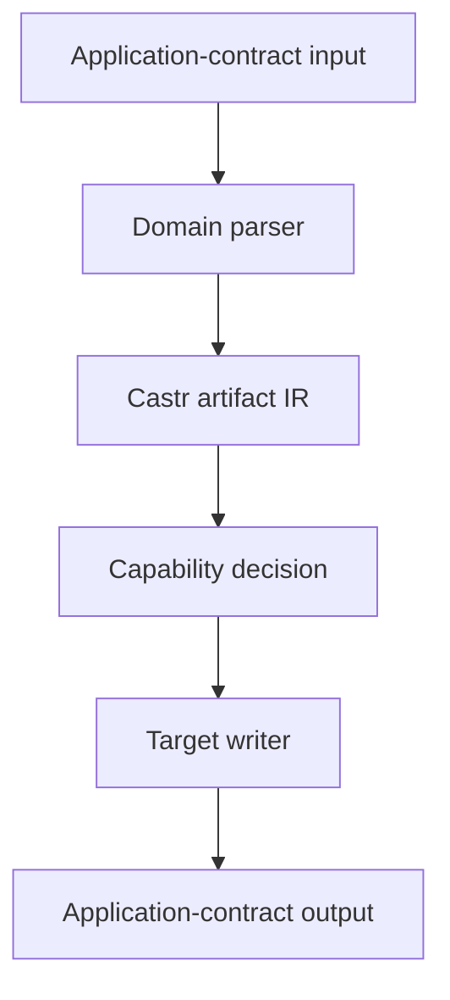
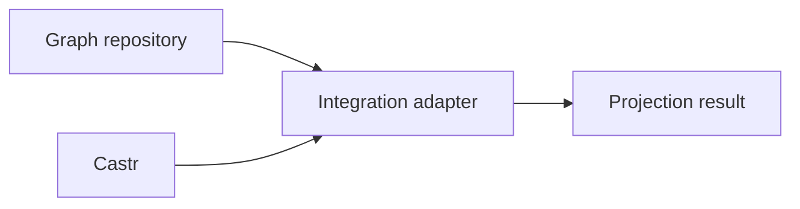

# Castr future direction: an application-contract compiler

**Status:** Strategic direction proposal  
**Date:** 21 August 2026  
**Last updated:** 8 September 2026  
**Related work:** _What Castr would require to fully support SHACL_ was external input whose
original report is unavailable in this repository; the inspected Castr revision is retained in
the reference basis below, and the graph-boundary conclusions are restated in the linked,
reviewable repository research.
**Decision posture:** This remains the dated strategic proposal, with the authority reconciliation below; it is not a new ADR or implementation plan.

**Authority update (8 September 2026):** Castr's application-value/interaction boundary was ratified on 22 August 2026 in [owner ballot B-01 and B-07](https://github.com/EngraphCode/castr/blob/f168c177faba0b0e512f2d40f7c9801c9a53b799/.agent/plans/proof-programme/ballot-2026-08-owner-walk.md). The [longstanding principles](https://github.com/EngraphCode/castr/blob/f168c177faba0b0e512f2d40f7c9801c9a53b799/.agent/directives/principles.md) require replacing old with new and forbid compatibility layers; the ballot reinforces that rule for outright `CastrDocument` replacement and keeps the sibling graph product's existence/name open. Those ratified decisions govern over this proposal. The remaining graph-system architecture and emerging-standard profiles are proposals, with no implementation commitment.

## Executive summary

Castr should become a semantics-preserving compiler for **application value contracts and software interaction contracts**.

Its natural domain is not “all schema languages.” It is the family of artifacts used to describe:

- values entering, leaving, or existing within software;
- their structural, validation, static-type and runtime-processing semantics;
- the operations through which those values cross application and network boundaries;
- compatible representations of those contracts in JSON Schema, Zod, TypeScript, OpenAPI, MCP tools and future formats that pass an explicit domain-fit test.

RDF and SHACL should not be forced into Castr's IR. They describe a different semantic object: a graph of identified entities and claims, and constraints over graph neighbourhoods and paths. Those capabilities should live in a separate semantic-graph repository. The two systems should interoperate through explicit projection contracts, not a shared universal IR.

The [8 September 2026 standards research](rdf-jsonld-yamlld-standards-and-contract-boundaries-2026-09-08.md) reinforces this boundary: RDF 1.2 claims/reifiers and directional literals, plus developing JSON-LD and YAML-LD profiles, belong to the graph system and its explicit projection adapters. The new standards/profile details are proposed requirements, not new native Castr support or adopted implementation decisions. The standalone JSON Schema roadmap remains within Castr's native domain and is not displaced by graph work.

This narrower identity makes Castr more coherent, not less ambitious. It gives the project a defensible semantic centre, clearer format-admission criteria, more honest compatibility claims, and a realistic basis for proving completeness and losslessness.

Recommended product statement:

> **Castr compiles application value and interaction contracts between compatible representations without silently changing their meaning.**

## 1. Why Castr needs a bounded identity

“Schema” is not one semantic category. It is a loose family resemblance across artifacts that may describe JSON values, program types, runtime parsing pipelines, HTTP operations, relational tables, event streams, graphs, ontologies or knowledge constraints.

A universal schema IR either:

1. becomes a lowest-common-denominator model and loses important semantics;
2. accumulates unrelated optional fields until its types cease to express meaningful invariants; or
3. becomes a meta-meta-model so abstract that every writer needs to reconstruct the actual domain semantics independently.

All three outcomes conflict with Castr's strict, complete and lossless doctrine.

Castr already has a more specific centre visible in its current formats: values used by applications and the interfaces that exchange them. Its future architecture should make that centre explicit.

## 2. Castr's semantic domain

### 2.1 Application values

An application value is a bounded representation consumed or produced by software. Relevant semantics include:

- scalar kinds and literal values;
- objects, properties and unknown-key policy;
- arrays, tuples, sets and collection bounds;
- unions, intersections and discriminators;
- required, optional, absent, nullable and defaulted values;
- numeric, textual, temporal and binary constraints;
- named definitions and recursive references;
- validation annotations and human-facing descriptions;
- input and output differences caused by coercion, defaults or transformation.

JSON Schema, Zod and TypeScript overlap heavily here, but they do not have identical capabilities.

### 2.2 Runtime value processing

Zod and similar libraries are not merely declarative schemas. They may:

- coerce input;
- preprocess values;
- apply defaults or catches;
- refine using executable predicates;
- transform an accepted input into a different output type;
- make validation dependent on runtime code or external state.

Castr must therefore distinguish at least:

- the set and structure of accepted inputs;
- the set and structure of produced outputs;
- the ordered runtime processing between them;
- portable declarative constraints versus target-specific executable behaviour.

A single object-shaped “schema” with source-specific strings such as a retained Zod chain is not a sufficient long-term semantic model.

### 2.3 Software interactions

OpenAPI and MCP tools add a second artifact class around those values:

- operations and operation identity;
- paths, methods, tool names and descriptions;
- parameters and payload locations;
- requests, responses, errors and status codes;
- content negotiation and media types;
- authentication and authorisation declarations;
- servers, protocol metadata and lifecycle information.

These concepts reference value contracts but are not reducible to them. An OpenAPI document should therefore be an interaction artifact containing or referencing value contracts, not the universal document root for every Castr input.

## 3. Proposed artifact model

The exact names require an ADR, but the conceptual split should resemble:

```ts
type CastrArtifact = CastrValueContractDocument | CastrInteractionContractDocument;

interface CastrValueContractDocument {
  readonly kind: 'value-contract';
  readonly definitions: readonly CastrValueContract[];
  readonly roots: readonly CastrContractReference[];
}

interface CastrInteractionContractDocument {
  readonly kind: 'interaction-contract';
  readonly operations: readonly CastrOperationContract[];
  readonly values: CastrValueContractDocument;
}
```

Within a value contract, distinct facets should remain visible:

```ts
interface CastrValueContract {
  readonly acceptedInput: CastrValueSemantics;
  readonly producedOutput: CastrValueSemantics;
  readonly processing: readonly CastrProcessingStep[];
  readonly annotations: CastrAnnotations;
}
```

For a purely declarative JSON Schema, accepted input and produced output may be identical and processing empty. For a Zod coercion or transform, they may differ. A target can then make an honest capability decision about each facet.

This is illustrative rather than a prescription for immediate implementation. The important invariants are:

- artifact kinds are discriminated;
- operations reference value contracts rather than being mixed into them;
- input and output semantics can differ;
- executable or effectful behaviour is not disguised as a declarative annotation;
- source-specific syntax is not retained as hidden semantic truth;
- the IR remains serialisable, deterministic and independently validatable.

## 4. Format families and admission criteria

### 4.1 Native Castr families

| Family        | Role in Castr                                                                                              |
| ------------- | ---------------------------------------------------------------------------------------------------------- |
| JSON Schema   | Declarative value-contract input and output, with dialect-specific capability profiles                     |
| Zod           | Runtime value-contract input and output, including explicitly modelled non-portable semantics              |
| TypeScript    | Static type projection and code target; not assumed to provide runtime validation                          |
| OpenAPI       | Interaction-contract input and output, containing value contracts                                          |
| MCP tools     | Interaction/tool-contract target and potentially input when the protocol surface is sufficiently specified |
| Documentation | Descriptive rendering of value and interaction contracts; not a reversible semantic peer                   |

### 4.2 Possible future families

Formats such as AsyncAPI, Avro, Protocol Buffers or GraphQL may fit parts of the domain, but none should be admitted on superficial structural similarity. Every candidate requires a standards-sourced analysis answering:

1. What semantic object does the format describe?
2. Does that object belong to application values or software interactions?
3. Can every valid input feature enter a Castr artifact without loss?
4. Which current targets can represent each semantic feature exactly?
5. Which conversions require governed widening or genuine rejection?
6. Does the format introduce a new artifact class that deserves its own root?
7. Can Castr prove the claims using official conformance fixtures and behavioural tests?

### 4.3 Formats outside Castr's native domain

The following should not be native Castr formats merely because they contain constraints or use JSON syntax:

- RDF graph syntaxes;
- SHACL;
- RDFS and OWL ontology languages;
- SPARQL queries and update programs;
- JSON-LD and YAML-LD understood as linked-data serialization and processing models;
- relational database schemas;
- arbitrary policy, rules or theorem languages.

They may interoperate with Castr through explicit adapters and projections, but their native semantics belong elsewhere.

## 5. The compiler model

Castr's revised pipeline should be expressed as:



The capability decision is first-class. For a given artifact and target, each semantic feature receives one of three outcomes:

- **Exact:** the target represents the semantics without change.
- **Governed widening:** the target safely accepts more values or expresses a deliberately weaker contract, and the caller explicitly authorises and receives evidence of that change.
- **Reject:** the target cannot truthfully represent the semantics under the selected policy.

“Not yet implemented” is not a semantic rejection. An advertised format pair must either implement every representable feature or remain unadvertised.

## 6. What Castr should promise

### 6.1 Completeness is profile-specific

Castr should never claim “full JSON Schema,” “full Zod” or “full OpenAPI” without identifying versions and profiles. Claims should take forms such as:

- JSON Schema Draft 2020-12 input under a named vocabulary profile;
- OpenAPI 3.1.x or 3.2.x interaction-contract support;
- Zod 4 input/output under a documented runtime-semantics profile;
- TypeScript structural type output with named exclusions;
- a particular input-output pair with an exact/widen/reject capability matrix.

### 6.2 Losslessness is semantic

Formatting, comments and source ordering are separate concerns unless the product explicitly promises concrete-syntax preservation. Semantic losslessness means:

- every meaningful input feature enters the IR;
- IR persistence preserves that meaning;
- same-format semantic round trips preserve it;
- a different-format writer either represents it, visibly widens it under policy, or rejects it;
- no writer recovers meaning from the discarded source document.

### 6.3 The proof burden follows the claim

Every supported format and pair requires:

- official fixture or conformance suites where available;
- spec-derived feature inventories covering what fixtures omit;
- parse → IR → write → parse proofs;
- IR serialization/deserialization proofs;
- invalid and adversarial fixtures;
- deterministic output proofs;
- real-world corpus tests;
- behavioural tests that constrain results rather than configuration tables;
- explicit negative tests for unsupported target capabilities.

## 7. Migration from the current architecture

The future direction should be reached incrementally rather than through an unbounded rewrite.

### Phase 0: express the ratified product boundary

- Express the ratified application-contract identity in the governing doctrine and relevant decision records under the owning queue.
- Remove or qualify universal “any format” language.
- Establish format-admission questions and the two artifact classes.
- Record RDF/SHACL/JSON-LD/YAML-LD as an adjacent domain, with versioned projection integration rather than deferred native Castr format backlog.

### Phase 1: finish the fidelity foundation

- Complete the active IR-fidelity proof work.
- Ensure current transformations fail tests where they lose content.
- Establish semantic equality and deterministic persistence conventions.

### Phase 2: separate value and interaction roots

- Introduce the ratified discriminated artifact roots and remove the legacy `CastrDocument` in the same landing.
- Migrate OpenAPI operations and document metadata to the interaction artifact.
- Permit standalone JSON Schema and Zod contracts without fabricated OpenAPI fields.
- Apply the longstanding replacement principle: replace old with new in the same landing, without a compatibility layer or staged legacy deprecation.

### Phase 3: replace source-shaped metadata with semantics

- Decompose Zod-chain metadata into accepted input, produced output and processing semantics.
- Separate annotations from constraints.
- Make references, recursion and definition scope domain concepts rather than OpenAPI pointer assumptions.
- Ensure writers depend only on semantic IR.

### Phase 4: make pair capability executable and provable

- Build standards-sourced capability matrices.
- Produce structured exact/widen/reject decisions.
- Test the transformation behaviour directly.
- Expose actionable diagnostics through API and CLI surfaces.

### Phase 5: expand only through the admission process

- Evaluate potential formats one at a time.
- Implement both required directions before claiming a bidirectional format.
- Introduce new artifact roots when the semantic object genuinely differs.

## 8. Relationship with the semantic-graph repository

The graph repository should own:

- RDF term, graph and dataset semantics;
- RDF syntax adapters;
- SHACL shapes, paths, constraints and validation reports;
- SHACL processing, SPARQL extensions, entailment and graph security policy;
- JSON-LD expansion/compaction, RDF conversion and candidate YAML-LD processing, including document-information preservation where promised;
- dated RDF 1.2 Basic/Full profiles, independent reifier identity, assertion membership and directional literals;
- graph-to-application projection semantics.

Castr should own:

- application value contracts;
- runtime validation and transformation facets;
- interaction contracts;
- JSON Schema, Zod, TypeScript, OpenAPI and MCP representations;
- target capability decisions within that domain.

Neither repository should import the other's internal IR as its own truth.

## 9. What the repositories should share

They should initially share doctrine and protocols, not a large common implementation package:

| Shared concern   | Common rule                                                                                                       |
| ---------------- | ----------------------------------------------------------------------------------------------------------------- |
| Semantic honesty | Exact, governed widening or reject; never silent approximation                                                    |
| IR discipline    | Input discarded after parsing; writers use validated IR only                                                      |
| Determinism      | Identical IR and configuration produce identical output                                                           |
| Profiles         | Versions, vocabularies, extensions and execution capabilities are explicit                                        |
| Diagnostics      | Stable codes, severity, semantic location, source location where available, and remediation guidance              |
| Provenance       | Record selected profiles, policies and projection inputs without using provenance to rescue missing semantics     |
| Testing          | Behavioural proof, official suites, semantic round trips, persistence, negative capability tests and real corpora |
| Security         | Injected I/O, bounded resources and no implicit network or code execution                                         |

A small shared package should be extracted only after both repositories contain repeated, stable implementations. Prematurely sharing IR types would recreate the universal-model problem at package level.

## 10. Interoperability through projection contracts

RDF graph data does not have intrinsic JSON object boundaries or property keys. Interoperation therefore requires an explicit, versioned projection contract covering at least:

- node selection and root objects;
- IRI, blank-node and independent reifier identity representation;
- proposition/triple-term structure, assertion membership by graph and statement annotations;
- predicate IRI ↔ application property mapping;
- single versus multiple values and JSON container choices;
- RDF lists versus unordered value sets;
- datatype and lexical-value conversion;
- language tags and text direction;
- nested objects, shared nodes and cycles;
- absent values, explicit nulls and defaults;
- open graph neighbourhoods versus closed application objects;
- class and entailment assumptions;
- unmapped triples, unknown fields and linked-data document information outside the RDF dataset;
- exact context content, resolution/base policy and processing version/options;
- validation-result paths back to application locations.

Recommended dependency structure:



An integration package or application may depend on both cores. The core repositories should not depend on each other, avoiding a cycle and allowing each to remain independently useful.

The integration output should include:

- the projected Castr value contract;
- the projection profile and version;
- exact/widen/reject outcomes for every relevant graph semantic;
- diagnostics for unmapped or ambiguous constructs;
- sufficient stable mapping information to translate validation locations where possible.

JSON-LD and YAML-LD are especially important boundary cases. The graph repository should own contexts, linked-data processing and RDF semantics. Castr should handle the resulting application-value contract only after the projection is fixed. A context and frame alone do not establish required fields, value constraints, identity rules or a complete reversible mapping.

Preservation must be scoped: RDF dataset equality does not prove complete JSON-LD document preservation, for example ordinary `@index` information outside RDF. Comments, layout and YAML anchor arrangements form a further authoring-syntax capability. A projection must model promised document information explicitly or return an observable loss/capability finding; it must not claim that a dataset-only round trip preserves the original document. [JSON-LD 1.1 indexing](https://www.w3.org/TR/json-ld11/#data-indexing)

### 10.1 Dated standards and integration gates

As checked on 8 September 2026, RDF 1.2 Concepts/Semantics are Candidate Recommendations, JSON-LD 1.1 is the Recommendation baseline, and YAML-LD 1.0 is a Working Draft. JSON-LD 1.2 is developing work; full RDF 1.2 compatibility is a tentative JSON-LD 1.3/YAML-LD 1.1 track. Do not infer compatibility from version numbering or an RDF-star label. See the [standards register](rdf-jsonld-yamlld-standards-and-contract-boundaries-2026-09-08.md).

For future adapters require:

- exact graph/serialization/processing profiles and structured exact/widen/reject evidence;
- preservation of asserted versus merely referenced propositions, reifier identities and literal direction;
- injected, reproducible contexts with visible handling of dropped/unmapped data; existing processor safe mode is distinct from its proposed standardization;
- explicit YAML scalar, alias, stream and preservation policies where YAML-LD is admitted;
- canonicalization capability verified independently from deterministic output, including the RDF 1.1 scope of RDFC-1.0;
- behavioural end-to-end proofs through public contracts, including reversible graph/application cycles and negative ambiguity cases.

These gates govern cross-domain composition; they add neither graph terms to Castr's native IR nor an implementation commitment. The [graph-system proposal](semantic-graph-contract-system-future-direction-2026-08-21.md) contains the corresponding roadmap and proof tranches.

## 11. Governance and strategic constraints

The future Castr direction should preserve several deliberate constraints:

- Do not expand the format list for marketing breadth at the cost of semantic honesty.
- Do not create source-specific escape hatches that bypass the IR.
- Do not use opaque metadata as a substitute for modelling runtime behaviour.
- Do not make every artifact carry every other artifact's fields.
- Do not treat documentation renderers as reversible semantic formats.
- Do not treat a green unit suite as proof of transformation fidelity.
- Do not create a shared cross-repository kernel before repeated evidence reveals the correct abstraction.

## 12. Definition of success

This direction is established when:

- [ ] Castr's public vision describes application value and interaction contracts, not universal schema conversion.
- [ ] Value contracts can exist without OpenAPI document scaffolding.
- [ ] Interaction contracts reference value contracts through explicit types.
- [ ] Accepted-input, produced-output and runtime-processing semantics can be distinguished.
- [ ] Every advertised format has a versioned capability profile and spec-derived inventory.
- [ ] Every advertised pair implements exact/widen/reject behaviour completely and proves it behaviourally.
- [ ] Current formats pass permanent semantic round-trip and IR-persistence proofs.
- [ ] RDF, SHACL, JSON-LD and YAML-LD ownership is explicitly assigned to the adjacent graph system.
- [ ] Projection support claims identify graph/processing profiles, context reproducibility and preservation scope.
- [ ] Cross-domain conversion requires an explicit projection contract.
- [ ] The two repositories remain independently useful and do not share internal IRs.

## 13. Architecture records required

1. Trace the already-ratified application-contract product boundary and mission into the durable architecture record; do not reopen B-01 by treating this proposal as authority.
2. The value-contract versus interaction-contract artifact split.
3. Representation of Zod/runtime input-output transformations.
4. Semantic versus concrete-syntax losslessness.
5. The direct public-surface replacement of `CastrDocument`, consistent with the longstanding replacement principle reinforced by the ballot.
6. Format-admission and support-claim policy.
7. Cross-repository ownership and the no-universal-IR rule.
8. Projection-contract and integration-package boundaries, including graph/document preservation scope and dated experimental profile admission.

## Final direction

Castr should become smaller in ontological scope and stronger in engineering scope. It should not attempt to understand every way humans describe data. It should become exceptionally reliable at compiling the value and interaction contracts used to build software.

The separate graph repository does not diminish Castr. It establishes a clean neighbouring domain and turns cross-domain translation into an explicit, inspectable act. That is a stronger foundation than a universal IR whose apparent convenience conceals semantic incompatibility.

## Reference basis

- [Dated RDF, JSON-LD and YAML-LD research and ecosystem map](rdf-jsonld-yamlld-standards-and-contract-boundaries-2026-09-08.md)
- [Semantic-graph companion direction](semantic-graph-contract-system-future-direction-2026-08-21.md)

- [Castr repository revision inspected for the preceding SHACL investigation](https://github.com/EngraphCode/castr/tree/63a7e675caa438d98df5d36ee4ba4f76ef962d08)
- [Castr principles: IR truth, completeness, losslessness and pair compatibility](https://github.com/EngraphCode/castr/blob/63a7e675caa438d98df5d36ee4ba4f76ef962d08/.agent/directives/principles.md)
- [Castr ADR-023: IR-based architecture](https://github.com/EngraphCode/castr/blob/63a7e675caa438d98df5d36ee4ba4f76ef962d08/docs/architectural_decision_records/ADR-023-ir-based-architecture.md)
- [Castr ADR-041: native-capability seams](https://github.com/EngraphCode/castr/blob/63a7e675caa438d98df5d36ee4ba4f76ef962d08/docs/architectural_decision_records/ADR-041-native-capability-seams-governed-widening-and-early-rejection.md)
- [W3C SHACL Recommendation](https://www.w3.org/TR/shacl/)
- [RDF 1.1 Concepts and Abstract Syntax](https://www.w3.org/TR/rdf11-concepts/)
