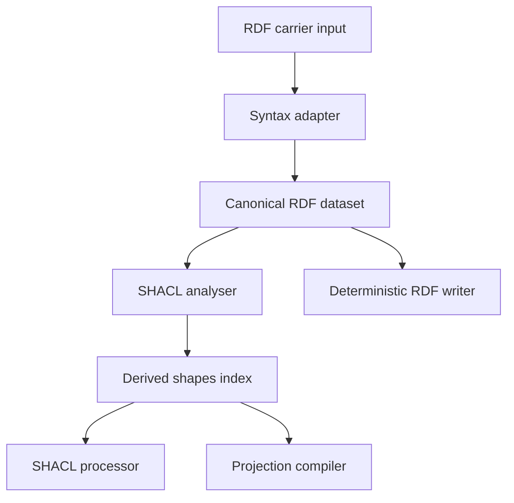
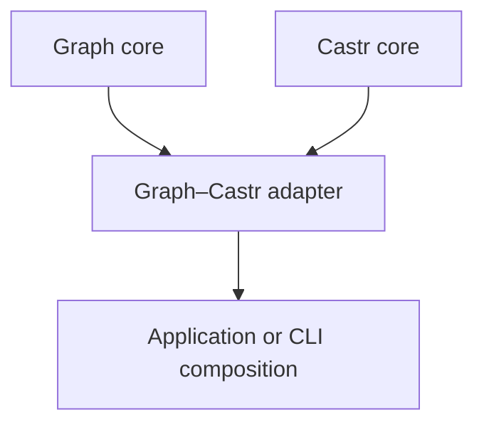
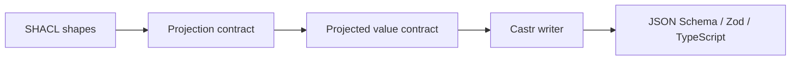

# Future direction for the semantic-graph contract system

**Working title:** Unnamed semantic-graph repository  
**Status:** Strategic direction proposal  
**Date:** 21 August 2026  
**Last updated:** 8 September 2026  
**Relationship:** A sibling to Castr, not a Castr submodule or universal-IR extension  
**Decision posture:** This document defines a candidate product and architectural boundary. It does not select a repository name or authorise implementation.

**Authority update (8 September 2026):** [Castr owner ballot B-07](https://github.com/EngraphCode/castr/blob/f168c177faba0b0e512f2d40f7c9801c9a53b799/.agent/plans/proof-programme/ballot-2026-08-owner-walk.md) ratified the negative boundary on 22 August 2026: native RDF/SHACL/JSON-LD graph semantics remain outside Castr and integration enters through a versioned projected application-value artifact. The sibling graph product's existence/name remains open. This proposal develops that possible sibling; it does not settle those open product decisions.

## Executive summary

The new repository should become a semantics-preserving compiler and processor for **RDF graph definitions, SHACL graph constraints, validation and explicit projections into application data contracts**.

Its semantic centre is the graph:

- globally or locally identified nodes;
- claims expressed as RDF triples;
- multiple and named graphs in RDF datasets;
- relationships traversed through paths;
- constraints applied to selected nodes and graph neighbourhoods;
- validation reports expressed as graphs;
- optional query, entailment, rules and projection capabilities under explicit profiles.

It should initially target RDF 1.1 and SHACL 1.0 Core, with Turtle, N-Triples, TriG and N-Quads carriers. JSON-LD 1.1 processing should follow through an injected, reproducible context resolver; YAML-LD 1.0 is a candidate authoring carrier over that processing boundary. SHACL-SPARQL and entailment remain separately declared capabilities. Design the graph model to accommodate RDF 1.2 terms and directional literals without claiming their implementation; RDF 1.2, SHACL 1.2 and developing JSON-LD/YAML-LD features require independently dated experimental profiles.

The [8 September 2026 standards research](rdf-jsonld-yamlld-standards-and-contract-boundaries-2026-09-08.md) records current Recommendations, drafts and tentative plans. RDF 1.2 Concepts/Semantics are Candidate Recommendations, YAML-LD 1.0 is a Working Draft, and full RDF 1.2 compatibility is a tentative JSON-LD 1.3/YAML-LD 1.1 track. These findings refine this proposal; they do not adopt an ADR or authorise implementation.

The repository should not attempt to absorb Castr's JSON Schema, Zod, TypeScript or OpenAPI semantics. It should instead interoperate through explicit graph-to-application projection contracts. A separate integration adapter can depend on both systems without coupling either core to the other's internal IR.

Candidate product statement:

> **Compile, validate and project semantic graph contracts without losing graph identity or silently changing their meaning.**

## 1. The problem this repository exists to solve

RDF and SHACL are often treated as unfamiliar serializations of ordinary records. That framing loses the concepts that make them useful:

- identity can persist across documents and systems through IRIs;
- multiple subjects may refer to the same node;
- nodes and relationships form arbitrary graphs, including cycles;
- predicates are identified semantic relationships rather than local object keys;
- graphs have no intrinsic root or object boundary;
- a predicate may have zero, one or many values without choosing a JSON container;
- shapes can target nodes by class, identity or graph position;
- property paths can traverse sequences, alternatives, inverses and repetition;
- constraints and reports are themselves RDF graphs and may be extended by new vocabularies.

A graph contract system must preserve those semantics as first-class concepts. It cannot use a JSON-object schema as its canonical representation and recover graph behaviour later.

## 2. Product identity

The repository should combine four related capabilities while keeping their boundaries explicit.

### 2.1 RDF compiler

- Parse supported RDF carrier syntaxes into a canonical dataset IR.
- Validate RDF syntax and data-model invariants.
- Serialize datasets deterministically into supported carriers.
- Preserve graph names, RDF terms, blank-node topology and arbitrary triples.
- Support semantic dataset comparison and canonicalisation.

### 2.2 SHACL format compiler

- Analyse RDF datasets as SHACL shapes graphs.
- Build a typed, derived index of shapes, targets, paths, constraints and dependencies.
- Check SHACL well-formedness under an explicit version/profile.
- Preserve known, custom and unknown triples without source-text dependency.
- Author and transform shapes through checked graph mutations.

### 2.3 SHACL processor

- Validate data graphs against shapes graphs.
- Produce complete RDF validation reports and typed convenience views.
- Distinguish validation failure from graph non-conformance.
- Declare recursion, entailment, import, query and resource-limit behaviour.
- Support SHACL-SPARQL only through a sandboxed and separately enabled profile.

### 2.4 Projection compiler

- Project selected graph structures into bounded application-value contracts.
- Expand application values into RDF graphs when a complete reverse projection exists.
- Report exact, widened, ambiguous, unmapped and rejected semantics.
- Provide stable mappings between graph validation locations and application paths where possible.

These are related products over the same semantic domain. They should not collapse into a single untyped `convert()` function.

## 3. Scope and non-scope

### 3.1 Initial native scope

| Capability           | Initial target                                                          |
| -------------------- | ----------------------------------------------------------------------- |
| RDF model            | RDF 1.1 terms, graphs and datasets                                      |
| RDF carriers         | Turtle, N-Triples, TriG and N-Quads                                     |
| Shape language       | SHACL 1.0 Core                                                          |
| Reports              | SHACL 1.0 validation-report graphs                                      |
| Canonical comparison | RDF Dataset Canonicalization 1.0 for RDF 1.1 profiles                   |
| Execution            | Offline Core validation with explicit recursion and resource policies   |
| Interoperation       | Versioned projection-contract model and integration boundary with Castr |

### 3.2 Follow-up profiles

- JSON-LD 1.1 parsing, expansion, compaction and framing under injected, reproducible context loading, with explicit preservation scope;
- YAML-LD 1.0 as a dated candidate Core authoring profile over the same linked-data processing boundary;
- RDF/XML carrier support;
- SHACL-SPARQL constraints, components and targets;
- selected entailment regimes through injected reasoners;
- custom constraint-component execution;
- SHACL Advanced Features where their status and use justify support;
- RDF 1.2 Basic/Full and dated SHACL 1.2 profiles, with triple-term, reifier and directional-literal coverage declared independently;
- JSON-LD 1.2 development and tentative RDF-1.2-compatible JSON-LD 1.3/YAML-LD 1.1 work, without treating roadmap entries as completed standards;
- graph packaging and profiling conventions.

### 3.3 Explicit non-goals for the initial product

- a persistent triplestore or SPARQL database;
- a general-purpose ontology editor;
- complete OWL reasoning;
- automatic inference of JSON object models from arbitrary graphs;
- arbitrary remote imports or context fetching;
- in-process execution of untrusted JavaScript extensions;
- a universal schema IR shared with Castr;
- source-format-preserving Turtle, JSON-LD or YAML-LD editing;
- silent conversion of graph semantics into weaker application schemas.

Some may become integrations later, but they should not distort the initial architecture.

## 4. Artifact and IR architecture

### 4.1 Canonical RDF dataset

The authoritative IR should be an immutable, deterministic and JSON-serialisable RDF dataset model containing:

- named nodes;
- blank nodes;
- literals with lexical value, datatype, language and version-appropriate direction;
- default graph and named graph identity;
- quads;
- recursive triple terms only in RDF 1.2 Full profiles and only in permitted object positions;
- independently identified reifiers and their `rdf:reifies` relationships;
- explicit RDF version, Basic/Full conformance and canonical ordering policy.

A triple term denotes a proposition without asserting it. Assertion remains membership of the corresponding ordinary triple in the relevant graph. Do not invent an assertion flag on a triple term, collapse different reifiers into one claim, or require a one-to-one reifier/proposition relationship. Earlier RDF-star subject-position and quoted-triple assumptions are not current RDF 1.2 conformance. Any separately admitted historical input format would need an explicit transformation profile and proof; this does not imply retaining an obsolete API or adding a compatibility layer. Directional literals retain lexical form, datatype, language and base direction. [RDF 1.2 Concepts](https://www.w3.org/TR/2026/CR-rdf12-concepts-20260407/)

Provider types such as RDF/JS should remain behind adapters. Public and persisted types should belong to the repository. Deterministic ordering does not imply standardized canonicalization: RDFC-1.0 targets RDF 1.1, so a separate supported algorithm or explicit encoding proof is needed before canonical hashing claims over RDF 1.2 data. [RDFC-1.0](https://www.w3.org/TR/rdf-canon/)

### 4.2 Complete graph preservation

Every triple in an ingested shapes graph must remain in the canonical dataset, including:

- built-in SHACL vocabulary;
- custom constraint components;
- extension vocabularies;
- ontology statements;
- labels and descriptions;
- provenance and packaging metadata;
- unknown future terms.

The repository should not retain raw Turtle text as a semantic escape hatch. Prefixes, comments and formatting may be handled by a separate concrete-syntax feature if ever required.

Dataset preservation is not complete JSON-LD document preservation. Ordinary `@index` information is outside the RDF dataset; context choice and document organisation also need explicit scope. A profile that promises these must model them in a structured linked-data document artifact alongside the dataset, with typed invariants and persistence proofs. A dataset-only profile must diagnose information outside its preservation contract. This is separate from preserving YAML comments, anchors or layout. [JSON-LD 1.1 indexing](https://www.w3.org/TR/json-ld11/#data-indexing)

### 4.3 Derived SHACL semantic index

A typed index should be derived from the dataset and rebuilt after mutation. It may include:

- node and property shapes;
- explicit and implicit targets;
- property-path ASTs;
- constraint-component instances and parameters;
- shape-reference and recursion graphs;
- deactivation, severity, messages and annotations;
- custom-component declarations;
- profile and extension findings;
- well-formedness diagnostics.

The index must not become an independently mutable second source of truth.

### 4.4 Processor artifacts

Validation should use explicit artifacts:

```ts
interface GraphValidationRequest {
  readonly data: RdfDataset;
  readonly shapes: ShaclShapesDocument;
  readonly configuration: ShaclProcessorConfiguration;
}

interface GraphValidationOutcome {
  readonly report: RdfDataset;
  readonly results: readonly ShaclValidationResult[];
  readonly execution: ShaclExecutionMetadata;
}
```

Processor failure—unsupported entailment, malformed shapes, resource exhaustion, cancelled query—must be represented separately from an outcome whose report says the data does not conform.

## 5. Layered system design



Each layer has a distinct responsibility:

1. **Syntax adapters** own bytes, streams, media types, base IRIs and syntax locations.
2. **Dataset IR** owns graph semantics and persistence.
3. **SHACL analysis** owns shape recognition, well-formedness, profile detection and dependency structure.
4. **Writers** render only from dataset IR.
5. **Processors** execute validation under declared configuration.
6. **Projection compilers** translate only under an explicit mapping contract.

This separation allows format support, processor support and interoperation to mature independently without ambiguous product claims.

## 6. Support profiles and honest claims

“Supports SHACL” is too broad. Claims should identify:

- SHACL version;
- Core, SPARQL, Advanced Features, rules or other extension profile;
- RDF version, Basic/Full conformance and dated experimental specification revisions;
- supported carrier syntaxes and declared version announcements;
- linked-data processing version/options, context manifest and stream policy;
- RDF-dataset, linked-data-document and concrete-syntax preservation scope;
- canonicalization algorithm and its admitted data-model domain;
- recursion policy;
- entailment regimes;
- import and remote-resolution policy;
- processor limits;
- preserve-only versus executable extension behaviour.

Example format claim:

> Supports semantic ingest, persistence and deterministic emission of SHACL 1.0 Core shapes graphs over Turtle, N-Triples, TriG and N-Quads.

Example processor claim:

> Validates RDF 1.1 data graphs under SHACL 1.0 Core using the documented recursion, offline-import and resource-limit profile, passing every approved official Core outcome without skips.

These claims should be independently testable and independently versioned.

## 7. Processor and dependency strategy

The repository should define its own processor, report and configuration interfaces. It may initially adapt an established RDF/JS SHACL implementation, but that engine must not define the public IR or product semantics.

The adapter boundary should permit:

- replacing the underlying engine;
- differential testing between engines;
- native implementation of performance-critical Core components;
- optional SPARQL execution without making it a Core dependency;
- explicit entailment and import resolvers;
- browser and Node runtime profiles;
- deterministic report normalisation without discarding required information.

RDF parsing, JSON-LD processing, canonicalisation, SPARQL and validation dependencies should each sit behind narrow provider-neutral adapters.

## 8. Security model

The default system should be deterministic, offline and bounded.

| Risk                           | Required posture                                                                                                                                                       |
| ------------------------------ | ---------------------------------------------------------------------------------------------------------------------------------------------------------------------- |
| Remote contexts and imports    | Disabled by default; injected resolver; allowlists; content/digest, requested/effective identifiers, base, imports and processing options recorded for reproducibility |
| SPARQL federation or `SERVICE` | Rejected unless explicitly authorised                                                                                                                                  |
| Query/path/regex complexity    | Deadlines, cancellation, depth and result limits                                                                                                                       |
| Recursive shapes and rules     | Cycle detection, declared semantics and iteration limits                                                                                                               |
| Canonicalisation poison graphs | Bounded blank-node comparison and typed exhaustion failure                                                                                                             |
| Oversized input                | Streaming backpressure plus byte, quad, literal, list, nested-term and YAML alias-expansion limits                                                                     |
| JavaScript extensions          | Preserve but do not execute initially; future sandbox required                                                                                                         |
| Local files and unsafe schemes | No implicit dereference; all I/O through resolvers                                                                                                                     |

Every validation report should carry enough execution metadata to reproduce the selected profile and policies without embedding secrets or unstable environment state. Context changes must produce an explicit mismatch or a new recorded input profile rather than silently change interpretation. These are project requirements; the W3C context-pinning mechanism remains an open proposal. [Context integrity proposal](https://github.com/w3c/json-ld-syntax/issues/422)

## 9. Projection contracts

Projection is where graph semantics become application-value semantics. It is not ordinary serialization.

A projection contract must define:

| Concern          | Required decision                                                                                                        |
| ---------------- | ------------------------------------------------------------------------------------------------------------------------ |
| Roots            | Which nodes become application values?                                                                                   |
| Identity         | Are IRIs emitted as IDs, links, keys or hidden metadata? How are blank nodes and independent reifier identities handled? |
| Claims           | How are propositions, assertion membership, nested triple terms and claim annotations represented?                       |
| Properties       | Which predicate IRIs map to which application property names?                                                            |
| Multiplicity     | Is a predicate represented as a scalar, array, set or container object?                                                  |
| Ordering         | Is order absent, RDF-list-derived or supplied externally?                                                                |
| Datatypes        | How do RDF lexical/datatype pairs map to application primitives?                                                         |
| Language         | How are language-tagged and directional strings represented?                                                             |
| Nesting          | Are linked nodes embedded, referenced or both?                                                                           |
| Sharing/cycles   | How are repeated and cyclic node identities represented?                                                                 |
| Absence/null     | Does no triple mean omitted, null, defaulted or invalid?                                                                 |
| Openness         | What happens to predicates not listed by the projection?                                                                 |
| Classes          | Are RDF types emitted, consumed or used only for selection?                                                              |
| Entailment       | Which inferred triples, if any, participate?                                                                             |
| Validation paths | Can SHACL result paths map unambiguously to JSON Pointer-like locations?                                                 |

Projection compilation should return structured evidence:

| Outcome    | Required evidence                                                          | Forbidden state                                             |
| ---------- | -------------------------------------------------------------------------- | ----------------------------------------------------------- |
| `exact`    | Projected value contract, location mapping and informational findings only | Loss-bearing finding or missing value contract              |
| `widened`  | Value contract, location mapping and non-empty complete widening delta     | Hidden omission or an empty delta                           |
| `rejected` | Stable diagnostic and structured findings                                  | Value contract, location mapping or downstream Castr output |

The public envelope must be a discriminated union that makes these combinations structural invariants. [Conditional Tranche 09G](https://github.com/EngraphCode/castr/blob/f168c177faba0b0e512f2d40f7c9801c9a53b799/.agent/report/castr-completeness-losslessness-proof-programme-2026-08-21.md#conditional-tranche-09g--projected-application-contract-boundary-and-graph-interoperability) already specifies this envelope and the graph/projection/Castr certificate composition; use that public boundary rather than an optional-value result that admits illegal states. An end-to-end lossless claim requires exact evidence from all three stages over matching channels.

Ambiguity is not permission to guess. It is a diagnostic or a request for a more specific contract.

## 10. Relationship with Castr

Castr and the graph repository have adjacent but distinct semantic ownership:

| Concern              | Graph repository                                     | Castr                                              |
| -------------------- | ---------------------------------------------------- | -------------------------------------------------- |
| Canonical data model | RDF terms, graphs and datasets                       | Application values and contract definitions        |
| Constraint language  | SHACL and declared extensions                        | JSON Schema/Zod-like value constraints             |
| Runtime              | Graph validation and optional query/entailment       | Value parsing, validation and transformation       |
| Interaction model    | Graph packaging and validation requests              | APIs, tools, requests and responses                |
| Primary carriers     | RDF syntaxes, JSON-LD and candidate YAML-LD profiles | JSON Schema, Zod, TypeScript, OpenAPI, MCP         |
| Cross-domain role    | Project graph shapes into application contracts      | Compile projected contracts to application targets |

Neither system should claim the other domain by storing opaque foreign objects in metadata.

## 11. What the repositories should share

The sibling projects should converge on a common engineering constitution:

- semantic IR is authoritative after parsing;
- all valid features in a declared input profile are representable;
- output behaviour is exact, governed widening or rejection;
- silent loss and implementation-gap rejection are prohibited;
- versions and execution profiles are explicit;
- serializers are deterministic;
- network and code execution are injected and disabled by default;
- diagnostics are structured, stable and actionable;
- official conformance fixtures and spec-derived inventories complement one another;
- tests constrain behaviour and semantic outcomes rather than configuration;
- semantic round trips and IR persistence are permanent proof surfaces.

They may also align compatible interfaces for:

- source spans and semantic locations;
- diagnostic codes and severity;
- capability findings;
- version/profile descriptors;
- cancellation, limits and resolver injection;
- proof-manifest reporting.

They should **not initially share**:

- a universal artifact union;
- internal IR types;
- format registries containing both domains;
- writer implementations;
- a monolithic runtime package.

Shared code should be extracted only after two implemented systems demonstrate a stable common abstraction.

## 12. Interoperability architecture

The recommended dependency shape is:



The adapter owns cross-domain transformation. Neither core depends on the other.

### 12.1 Graph to application contract



The graph system validates the projection against graph semantics and produces a versioned projected-value artifact plus findings. Castr imports that public artifact and decides target capabilities within its own domain.

### 12.2 Application contract to graph shape

The reverse direction requires the same projection information. A JSON property name alone does not determine a predicate IRI, target class or node identity policy. The adapter combines a Castr value contract with the projection contract to construct a SHACL shapes graph, rejecting unsupported executable transforms or interaction-only semantics.

### 12.3 Validating application data through SHACL

A valuable composed workflow is:

1. receive an application JSON value;
2. expand it into RDF using the declared projection/JSON-LD contract;
3. validate the resulting data graph against SHACL;
4. retain the RDF validation report;
5. map focus nodes and result paths back to application locations where the projection makes that mapping unambiguous.

This must not pretend that every SHACL result has one JSON Pointer. Shared nodes, inverse paths and graph-global constraints may have several locations or none.

## 13. JSON-LD and YAML-LD ownership

JSON-LD belongs natively to the graph repository's linked-data boundary:

- expansion interprets context mappings into expanded JSON-LD; conversion to RDF is a separate processing operation;
- contexts map terms to IRIs and define containers, typing, language and direction behaviour;
- compaction and framing create document views under explicit processing choices;
- remote contexts are semantic dependencies whose exact content and resolution must be reproducible.

A fixed context and frame do not, alone, establish a complete application-value contract. Castr may compile the resulting value contract after an explicit projection defines roots, constraints, multiplicity, identity, loss policy and validation-location mappings. JSON syntax is not evidence of native Castr semantic support.

### 13.1 Current baseline and emerging profiles

As checked on 8 September 2026, JSON-LD 1.1 is the Recommendation baseline. Its scoped/imported contexts, protected definitions, `@json` and `@direction` are already standardized. JSON-LD 1.2 is chartered development; the safe-mode standard and context-pinning mechanism remain proposals, although `jsonld.js` already exposes safe mode. Full RDF 1.2 compatibility is assigned to tentative JSON-LD 1.3/YAML-LD 1.1 work. Legacy JSON-LD-star syntax is not an agreed substitute. See the [dated standards register and sources](rdf-jsonld-yamlld-standards-and-contract-boundaries-2026-09-08.md).

Require visible loss handling and reproducible context resolution now, with an exact engine/version/options profile. Safe mode helps detect processing loss; it does not establish graph conformance, application contract validity or preservation of every document feature.

### 13.2 YAML-LD candidate profile

YAML-LD 1.0 is a Working Draft dated 26 August 2026; its Core profile should be evaluated for human-authored vocabularies, shapes, fixtures and projections. It shares linked-data processing with JSON-LD while admitting a constrained YAML representation: compatible YAML 1.2 processing, string keys, finite numbers and no alias cycles. Untagged date-like values remain strings. Anchors support reuse without establishing RDF identity; graph cycles remain expressible through identifiers. The `extractAllScripts` option determines multi-document construction and must be explicit. Comment/layout/anchor preservation is a separate capability. The draft's unfinished extended-profile material is not a completed conformance target. [YAML-LD 1.0](https://www.w3.org/TR/yaml-ld-10/)

The charter targets YAML-LD 1.0 for Q1 2027 and JSON-LD 1.2 for Q4 2027; those are planning targets, not availability promises. CBOR-LD is a related binary-carrier track, not a prerequisite for initial work. [JSON-LD charter](https://www.w3.org/2026/01/json-ld-wg-charter.html)

## 14. Proof system

The graph repository needs independent proof at each layer:

### RDF foundation

- official syntax suites for every carrier;
- term and dataset equality;
- base-IRI resolution;
- graph selection;
- semantic cross-carrier round trips;
- canonicalisation and adversarial-complexity tests;
- RDF 1.2 object-position/nesting invariants and Basic/Full admission;
- distinct reifier identities, multiple propositions per reifier and assertion membership preserved by graph;
- literal lexical/datatype/language/direction fidelity;
- legacy RDF-star separation and observable conversion/rejection for unsupported profiles.

### Linked-data processing and authoring

- official JSON-LD and YAML-LD suites for the exact selected profiles;
- dropped/unmapped terms, contextual interpretation changes and typed loss diagnostics;
- resolver content/digest reproducibility, imports, base-IRI handling and unavailable/tampered dependencies;
- `@index` and document-information outcomes distinct from RDF graph equality;
- YAML scalar/key rules, alias cycles and expansion limits, all/first-document policy and unprocessed-content diagnostics;
- `@list` ordering versus unordered graph values;
- comments/layout/anchor outcomes tested only when that preservation capability is claimed.

### SHACL format

- spec-derived inventory of every Core target, path, constraint and report property;
- ingest/persist/emit proofs for every graph in approved official fixtures;
- well-formed and ill-formed shape tests;
- preservation of custom and unknown triples;
- deterministic typed-index rebuilding.

### SHACL processor

- every approved official outcome with no skips for the selected profile;
- differential tests against independent engines;
- complete report-graph comparison with only specification-permitted normalisation;
- recursion, entailment, failure, limit and cancellation tests;
- real graph corpora and performance guardrails.

### Projection

- exact/widen/reject fixtures for every mapping concern;
- graph → application → graph proofs where the projection is reversible;
- negative ambiguity and unmapped-data tests;
- shared-node, cyclic, multilingual, directional, multi-valued and statement-annotation cases;
- validation-location mapping proofs;
- composed tests through Castr targets without inspecting either system's configuration internals.

## 15. Phased roadmap

| Phase                     | Deliverable                                                                                                        | Exit condition                                                                                     |
| ------------------------- | ------------------------------------------------------------------------------------------------------------------ | -------------------------------------------------------------------------------------------------- |
| 0. Charter                | Name-neutral vision, boundaries, profiles, ADRs and threat model                                                   | Product claims and non-goals approved                                                              |
| 1. RDF core               | Provider-neutral dataset IR, persistence, Turtle/N-Triples, canonical equality                                     | Official syntax and semantic round-trip proofs green                                               |
| 2. Dataset carriers       | TriG/N-Quads, graph selectors and streaming limits                                                                 | Named-graph ambiguity and cross-carrier proofs green                                               |
| 3. SHACL Core format      | Complete analyser/index, well-formedness, deterministic writers                                                    | All approved fixture graphs round-trip; spec inventory complete                                    |
| 4. Core processor         | Processor/report API, engine adapter, declared policies                                                            | All approved Core outcomes pass with no skips                                                      |
| 5. Linked-data processing | JSON-LD 1.1, reproducible contexts, document-preservation policy and candidate YAML-LD 1.0 adapter                 | Official profile suites, loss diagnostics, stream policy and security gates green                  |
| 6. Castr interoperation   | Projection-contract schema and separate adapter package                                                            | End-to-end exact/widen/reject proofs across both systems                                           |
| 7. SHACL-SPARQL           | Sandboxed query profile and custom components                                                                      | All approved SPARQL outcomes and resource gates green                                              |
| 8. Advanced profiles      | Entailment, rules, AF, RDF 1.2 Basic/Full, SHACL 1.2, developing JSON-LD 1.2 and tentative JSON-LD 1.3/YAML-LD 1.1 | Each capability independently dated, versioned and proven; no inferred support from roadmap status |

## 16. Definition of success

The new repository has established its intended direction when:

- [ ] Its vision names semantic graphs, graph constraints, validation and projection as its domain.
- [ ] RDF datasets—not JSON object schemas—are the authoritative IR.
- [ ] SHACL's typed model is derived without losing unknown graph content.
- [ ] Format, processor and projection claims are independently versioned.
- [ ] Every stable profile has official fixtures, a spec inventory and semantic round-trip proofs.
- [ ] Validation failure is distinct from data non-conformance.
- [ ] Network, imports, queries, recursion and resource limits are explicit and safe by default.
- [ ] JSON-LD/YAML-LD interpretation is explicit, context-reproducible and separate from ordinary JSON/YAML parsing.
- [ ] Dataset preservation, linked-data document preservation and authoring syntax preservation are separately claimed and proven.
- [ ] Experimental graph profiles preserve assertions, reifier identity and directional literals without implying unsupported canonicalization.
- [ ] Interoperation with Castr requires a complete projection contract.
- [ ] Neither core repository imports or exposes the other's internal IR as universal truth.
- [ ] The integration adapter proves its named interoperation scenarios while preserving exact/widen/reject evidence; adoption and usefulness are not acceptance conditions.

## 17. Naming criteria

The repository remains intentionally unnamed. A future name should suggest several of the following without overclaiming:

- graphs, relationships or linked meaning;
- shaping, constraints or validation;
- transformation or projection;
- semantic fidelity;
- compatibility with the Engraph family without requiring the word “Castr.”

It should avoid implying that the product is:

- only a SHACL validator;
- a hosted graph database;
- a universal ontology/reasoning platform;
- merely an RDF syntax converter;
- subordinate to Castr.

Naming should follow the product boundary, not determine it.

## Final direction

The new repository should be a first-class graph-semantic system, not the place where Castr puts formats that do not fit. Its purpose is to preserve and operate on the distinctive semantics of RDF and SHACL, then make crossings into application representations explicit and inspectable.

Castr and the graph system should share standards of reasoning, proof and safety. They should not share a universal IR. Their interoperability should be a compilation boundary governed by a projection contract—the precise place where graph-shaped meaning becomes application-shaped data.

## Reference basis

- [Dated RDF, JSON-LD and YAML-LD research and ecosystem map](rdf-jsonld-yamlld-standards-and-contract-boundaries-2026-09-08.md)
- [Castr companion direction](castr-future-direction-application-contract-compiler-2026-08-21.md)

- [W3C SHACL Recommendation](https://www.w3.org/TR/shacl/)
- [W3C SHACL 1.2 Core Working Draft](https://www.w3.org/TR/shacl12-core/)
- [W3C SHACL 1.2 SPARQL Extensions Working Draft](https://www.w3.org/TR/shacl12-sparql/)
- [W3C RDF 1.1 Concepts and Abstract Syntax](https://www.w3.org/TR/rdf11-concepts/)
- [W3C RDF 1.2 Concepts and Abstract Data Model](https://www.w3.org/TR/rdf12-concepts/)
- [W3C RDF Dataset Canonicalization 1.0](https://www.w3.org/TR/rdf-canon/)
- [W3C SHACL test-suite repository](https://github.com/w3c/data-shapes/tree/master/data-shapes-test-suite/tests)
- [RDF/JS data-model specification](https://rdf.js.org/data-model-spec/)
